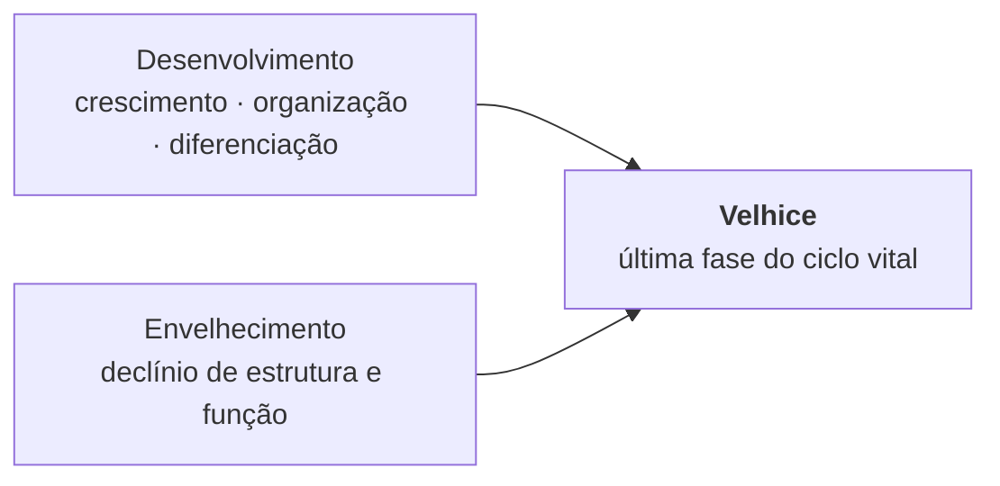
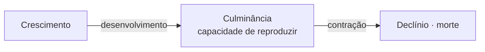
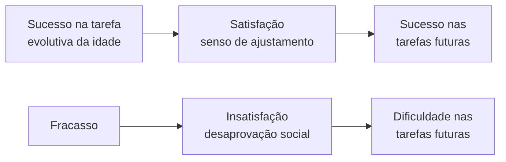
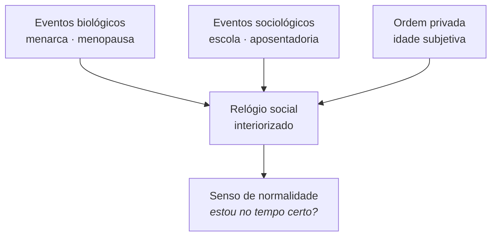
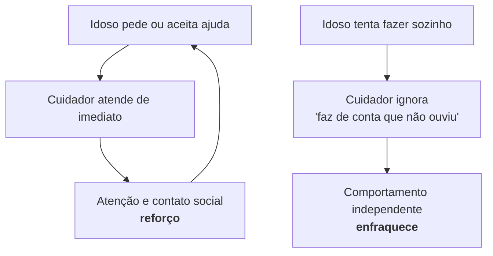

<!--
Aula de 3h. O arco: começamos pelo estereótipo que a turma já traz, mostramos que ele tem história, e só então entramos nas teorias. Terminamos com a virada contemporânea: velhice como desenvolvimento, não só como declínio.
-->

---
layout: agenda
kicker: Aula 01 · 3 horas
title: O caminho de hoje
items:
  - { topic: "Conceitos e história", desc: "idoso, velhice, senescência — e quem inventou a terceira idade" }
  - { topic: "Os três paradigmas", desc: "ciclo de vida, curso de vida, lifespan" }
  - { topic: "Teorias clássicas", desc: "Bühler, Jung, Havighurst, afastamento" }
  - { topic: "Teorias de transição", desc: "Erikson e Neugarten" }
  - { topic: "Teorias contemporâneas", desc: "Baltes, M. Baltes, Carstensen, Heckhausen, Diehl" }
---

<!-- Avise que o intervalo cai depois do bloco das clássicas, por volta de 1h40. -->

---
layout: default
kicker: Aquecimento · 5 min
title: Imagine <em>um idoso</em>. Guarde a imagem — vamos voltar nela três vezes hoje.
---

<v-clicks>

- Quantas descrevem um **corpo**?
- Quantas descrevem uma **posição social**?
- Alguma descreve algo que a pessoa **ganhou** com a idade?

</v-clicks>

<v-click>

<Callout icon="lucide:eye">
A proporção entre essas três colunas é, em miniatura, a história do campo que vamos estudar hoje.
</Callout>

</v-click>

<!--
O ponto: o estereótipo é majoritariamente corporal e deficitário. Isso não é acidente — é o rastro de um paradigma científico que dominou 50 anos.
-->

---
layout: quote
quote: "O objetivo da psicologia do envelhecimento é estudar os padrões de
  mudança comportamental associados ao avanço da idade, <em>distinguindo</em>
  aqueles que são típicos da velhice daqueles que são compartilhados por outras
  idades."
author: Anita Liberalesso Neri (2013)
---

<!--
Leia devagar e pare na palavra 'distinguindo'. É a tarefa mais difícil do campo: nem tudo que acontece com um idoso acontece POR ELE SER idoso.
-->

---
layout: define
kicker: O recorte do campo
term: Psicologia do envelhecimento
definition: A ciência que separa o que é típico da velhice do que é apenas compartilhado com outras idades.
points:
  - "Idade não é causa — é índice de tempo vivido"
  - "Correlação com idade ≠ efeito da idade"
  - "Coorte, contexto e história competem com a biologia como explicação"
---

<!-- Exemplo clássico: idosos têm pior desempenho em testes de velocidade. É a idade? Ou escolaridade, familiaridade com a tarefa, ansiedade de avaliação? O capítulo abre exatamente com esse erro histórico (Yerkes, 1921). -->

---
layout: metric
kicker: A idade do próprio campo
value: "60"
unit: " anos"
label: é todo o período em que se construíram os conceitos e teorias mais
  influentes sobre o envelhecimento. <em>É um campo mais novo que muitos dos
  seus objetos de estudo.</em>
---

---
layout: bigtype
kicker: Por que teoria, e não só dado
title: Conhecer teorias antes de coletar dados não é <em>uma opção</em>. É imperativo.
subtitle: Neri (2013)
---

<!-- Sem teoria você não sabe o que medir, nem o que o resultado significa. A teoria decide quais perguntas são pensáveis. -->

---
layout: section
index: "01"
kicker: Parte um
title: Conceitos e história
subtitle: Quem é 'idoso', o que é 'velhice' — e por que essas respostas mudaram tanto
---

---
layout: define
kicker: Conceito 1
term: Idoso
definition: Uma categoria sociocultural, definida pelas diferenças que a pessoa exibe em aparência, força, funcionalidade, produtividade e desempenho de papéis sociais.
points:
  - "Não é uma categoria biológica pura"
  - "O corte etário (60, 65) vem de demografia, não de fisiologia"
  - "Serve para atribuir direitos e deveres — é uma decisão política"
---

<!-- Pergunte: por que 60 anos no Brasil e 65 na maior parte da Europa? A resposta é previdenciária e demográfica, não neurológica. -->

---
layout: define
kicker: Conceito 2
term: Velhice
definition: A última fase do ciclo vital e produto da ação concorrente de dois processos que acontecem ao mesmo tempo.
points:
  - "Desenvolvimento — crescimento, organização, diferenciação"
  - "Envelhecimento — declínio de estrutura, função e diferenciação"
  - "Os dois correm juntos a vida inteira; a proporção é que muda"
---

---
layout: diagram
kicker: Os dois vetores
title: Velhice não é só o segundo vetor
note: A velhice é o <strong>resultado</strong> dos dois processos, não a chegada de um deles. Reduzi-la ao envelhecimento é o erro que o capítulo inteiro combate.
build: true
---

---
layout: define
kicker: Conceito 3
term: Envelhecimento biológico
definition: A diminuição progressiva da capacidade de adaptação e de sobrevivência.
points:
  - "Também chamado de senescência ou envelhecimento normal"
  - "Universal e determinado geneticamente na espécie"
  - "Começa logo após a maturidade sexual; acelera na 5ª década"
---

<!-- Fonte da definição: Neri (2009), citada no capítulo. Sublinhe 'capacidade de adaptação' — é um conceito funcional, não anatômico. É por isso que ele conversa com neuropsicologia. -->

---
layout: vs
kicker: A mesma biologia, dois desfechos
title: O que decide a trajetória não é só o genoma
label: ou
left:
  title: Senescência acelerada
  items:
    - "Genética + comportamento + acesso desfavoráveis"
    - "Doenças e incapacidades se somam"
    - "Estados finais de forte desorganização"
    - "Perda de diferenciação funcional"
right:
  title: Envelhecer bem
  items:
    - "Condições ótimas de genética, ambiente e comportamento"
    - "Mudanças normativas com pequenas perdas funcionais"
    - "Poucas doenças crônicas, e controladas"
    - "Manutenção da atividade e da participação social"
---

<!-- Note que a lista da direita não exige ausência de doença — exige doença CONTROLADA e participação preservada. É um critério funcional, não médico. -->

---
layout: default
kicker: Cuidado com os rótulos
title: Cinco nomes para o mesmo desfecho
---

<Tags :items="['velhice bem-sucedida', 'velhice ótima', 'velhice ativa', 'velhice saudável', 'velhice produtiva']" />

<v-clicks>

- Todos nomeiam **o mesmo** desfecho positivo
- Todos carregam **forte apelo ideológico**
- Todos foram criados quando envelhecer com saúde ainda era exceção

</v-clicks>

<v-click>

<Callout tone="warn" icon="lucide:triangle-alert">
Quando o bom envelhecimento vira <strong>mérito pessoal</strong>, a conta da desigualdade é transferida para o próprio idoso.
</Callout>

</v-click>

<!-- Este é um bom momento para a crítica: 'envelhecimento ativo' vira exigência moral. Quem não envelhece ativamente falhou? A responsabilização individual apaga determinantes sociais. -->

---
layout: section
index: "01b"
kicker: Parte um · continuação
title: Por que o idoso perdeu status?
subtitle: Duas teorias sociológicas que sustentam o estereótipo
---

---
layout: define
kicker: Teoria sociológica 1
term: Defasagem estrutural
definition: As estruturas sociais não conseguem oferecer aos idosos economicamente improdutivos os mesmos benefícios disponíveis aos membros produtivos.
points:
  - "Ancorada na teoria de estratificação por idade (Riley, Johnson & Foner, 1972)"
  - "A sociedade não acompanha a própria mudança demográfica"
  - "Grande poder explicativo — daí seu trânsito nas ciências sociais"
---

---
layout: statement
kicker: A consequência
title: "Daí nasce o estereótipo: <em> mais idosos = mais custo </em> — saúde, previdência, carga tributária."
---

<!-- Volte à lista de três palavras do início. Quantas eram sobre custo, lentidão, dependência? A defasagem estrutural explica de onde vêm. O estereótipo não é ignorância individual: é um subproduto de como a sociedade se organiza. -->

---
layout: steps
kicker: Teoria sociológica 2 · Cowgill & Holmes (1972)
title: Modernização — quatro processos que rebaixam o status do idoso
ghost: "4"
steps:
  - { title: "Novas tecnologias", desc: "tornam obsoleto o conhecimento acumulado e valorizam os mais jovens", icon: "lucide:cpu" }
  - { title: "Urbanização", desc: "separação geográfica enfraquece laços familiares e o status na comunidade", icon: "lucide:building-2" }
  - { title: "Investimento seletivo", desc: "educação e atualização vão para os jovens; inverte papéis de domínio", icon: "lucide:graduation-cap" }
  - { title: "Tensão por recursos", desc: "cresce a proporção de idosos, cresce a disputa — e a imagem social piora", icon: "lucide:scale" }
---

<!-- Peça exemplos brasileiros de cada um. O primeiro sai fácil (aplicativo de banco, PIX, atendimento só por chat). -->

---
layout: timeline
kicker: Como a velhice virou assunto
title: Um século de mudança sócio-histórica
events:
  - { date: "1900", title: "Expectativa ≈ 45 anos", desc: "sem vacinas, sem antibióticos; para a maioria, envelhecer não era o cenário provável" }
  - { date: "1922", title: "Hall publica Senescence", desc: "o primeiro compêndio sobre a velhice — e teve pouquíssima repercussão" }
  - { date: "1950s", title: "Terceira idade", desc: "Universidade de Toulouse cria o rótulo; velhice associada a lazer e produtividade" }
  - { date: "1960s+", title: "Novas formas de viver", desc: "avanços médicos, urbanização, feminismo, globalização alongam o curso de vida" }
  - { date: "hoje", title: "Quarta idade", desc: "a terceira idade vira transição; o declínio característico é empurrado para mais tarde" }
---

<!-- O contraste Hall 1922 x psicologia da criança é revelador: o mesmo autor fundou a psicologia da adolescência com enorme sucesso e fracassou com a velhice. O tema não polarizava atenções — não havia ganhos evolutivos para narrar. -->

---
layout: statement
kicker: Uma provocação
title: <em>Terceira idade</em> nasceu como marketing acadêmico — um rótulo que soasse melhor aos ouvidos da clientela.
---

<!-- Toulouse queria atrair pessoas para cursos livres. 'Velhice' afastava. Isso não invalida o conceito — mas mostra que categorias etárias são construídas, e por interesses concretos. -->

---
layout: section
index: "02"
kicker: Parte dois
title: Os três paradigmas
subtitle: A moldura decide o que a pesquisa consegue enxergar
---

---
layout: diagram
kicker: Paradigma 1 · o mais antigo
title: Ciclo de vida — a metáfora biológica
note: Emprestado da biologia. O ápice é a <strong>capacidade de reproduzir a espécie</strong>; tudo depois disso é, por definição, contração.
build: true
---

---
layout: statement
kicker: A consequência do paradigma
title: Se o ápice é reproduzir, a velhice <em>só pode</em> ser perda. A conclusão já estava na moldura.
---

<!-- Este é o momento-chave do bloco. O paradigma não descreve o mundo: ele decide o que conta como resultado. Por 50 anos, crescimento-culminância-contração marcou a psicologia, a escola, a criação de filhos e a seleção para emprego. -->

---
layout: columns
kicker: Os três paradigmas
title: Três molduras, três velhices
columns:
  - title: "Ciclos de vida"
    items:
      - "Origem: biologia"
      - "Desenvolvimento é linear"
      - "Ápice = reprodução"
      - "Velhice = contração"
      - "Teorias clássicas"
  - title: "Curso de vida"
    items:
      - "Origem: sociologia"
      - "Trajetórias construídas socialmente"
      - "Coorte, papéis e eventos"
      - "Velhice = posição social"
      - "Neugarten, Diehl"
  - title: "Desenvolvimento ao longo da vida"
    items:
      - "Origem: psicologia (lifespan)"
      - "Ganhos e perdas em todas as idades"
      - "Multidimensional, plástico"
      - "Velhice = desenvolvimento"
      - "Baltes e as contemporâneas"
---

<!-- Fixe isto: é o mapa mental da aula inteira. Toda teoria que vier depois pertence a uma dessas três colunas. -->

---
layout: define
kicker: Conceito de método
term: Coorte
definition: Grupo de pessoas que, por terem nascido no mesmo período histórico, tendem a compartilhar as mesmas experiências sociais ao longo da existência.
points:
  - "Guerras, privação alimentar, qualidade da educação"
  - "Uma coorte cobre em geral 5 a 10 anos"
  - "25 a 30 anos separam uma geração de outra"
  - "Substituiu a idade cronológica como unidade nos estudos longitudinais"
---

<!-- Introduzida pelo Seattle Longitudinal Study (Schaie, 1996; linha de base em 1955). Foi uma inovação metodológica: sem coorte, todo declínio transversal vira 'efeito da idade'. -->

---
layout: default
kicker: O erro que fundou o campo
title: 1,8 milhão de recrutas e uma conclusão errada
aside: "deep dive"
---

<Stat value="1,8" unit=" mi" label="recrutas testados (Yerkes, 1921)"  />

<v-clicks>

- Os mais velhos tiveram **pior desempenho** nos testes de inteligência
- A conclusão da época: **declínio biológico típico do envelhecimento**
- A evidência ignorada: os mais velhos tinham **muito menos escolaridade**
- A hipótese ignorada por 50 anos: o **contexto cultural** explicava o resultado

</v-clicks>

<v-click>

<Callout tone="warn" icon="lucide:alert-triangle">
Diferença entre grupos etários em estudo transversal é <strong>efeito de coorte</strong> até prova em contrário.
</Callout>

</v-click>

<!--
Vale conectar com a prática de vocês: um idoso de 80 anos com 3 anos de escolaridade num teste normatizado é o mesmo problema, em escala clínica. Normas por escolaridade existem exatamente por isso.
-->

---
layout: bigtype
kicker: A virada dos anos 1960
title: Idosos não só conservavam a integridade — <em>continuavam a se desenvolver</em>.
---

<!-- Foi o dado que quebrou o paradigma de ciclo de vida: domínios selecionados da cognição e da personalidade seguiam evoluindo. O paradigma não sustentava mais a realidade observada. -->

---
layout: section
index: "03"
kicker: Parte três
title: Teorias psicológicas clássicas
subtitle: Bühler, Jung, Havighurst, Levinson, afastamento — a era do ciclo de vida
---

---
layout: define
kicker: Clássica 1 · Bühler (1935)
term: Desenvolvimento ao longo da vida
definition: 400 autobiografias vienenses revelaram uma progressão ordenada de mudanças em atitudes, metas e realizações.
points:
  - "Replica crescimento–culminância–contração… mas não linearmente"
  - "Envolve ganhos e perdas concorrentes"
  - "Implica recorrências constantes a condições passadas"
  - "Tem considerável variabilidade intra e interindividual"
---

<!-- Bühler é clássica pelo paradigma, mas já antecipa o lifespan: ganhos e perdas juntos, variabilidade individual. Kühlen (1964) replicou 30 anos depois e achou as mesmas tendências. -->

---
layout: timeline
kicker: Quadro 1.2 · Bühler (1935)
title: Fases do desenvolvimento psicológico
events:
  - { date: "0–15", title: "Dependência", desc: "metas inespecíficas; preparação para definir metas de vida" }
  - { date: "15–25", title: "Especificação", desc: "expansão; as metas são testadas" }
  - { date: "25–45", title: "Culminância", desc: "o ápice do desenvolvimento" }
  - { date: "45–65", title: "Conflito", desc: "expansão × contração; revisão de vida e reelaboração de metas" }
  - { date: "65+", title: "Contração", desc: "senso de realização ou de fracasso; metas de curto prazo" }
---

<!-- Repare que a faixa 45-65 é descrita como CONFLITO, não como declínio. Já há uma ambivalência aqui que as teorias contemporâneas vão desdobrar. -->

---
layout: vs
kicker: Clássica 2 · Jung (1971)
title: A vida dividida em duas metades
label: →
left:
  title: Primeira metade
  items:
    - "Infância, adolescência, vida adulta inicial"
    - "Meta: envolver-se com o mundo externo"
    - "Ser alguém na sociedade"
    - "Temas: crescimento e cultivo de capacidades"
    - "Realização e expansão do <em>self</em>"
right:
  title: Segunda metade (a partir dos ~40)
  items:
    - "Percebe-se que atingiu a segunda metade"
    - "Movimento de contração das metas anteriores"
    - "Revisão de vida, autoconhecimento, autoaceitação"
    - "Diminuição da perspectiva de tempo futuro"
    - "Individuação, interiorização, metanoia"
---

<!-- 'Contração produtiva' é a expressão do capítulo: contrair não é perder, é diferenciar e integrar o self. Vale marcar a palavra metanoia — mudança de mente, conversão de perspectiva. -->

---
layout: default
kicker: Jung · o que a segunda metade pede
title: Transcender a experiência material
---

Investimentos que, segundo Jung, ajudam o idoso a encontrar sentido na vida **e na morte**:

<v-clicks>

- No **sagrado**
- No **belo**
- Na **justiça**
- No **bem-estar da humanidade**
- Na **continuidade cultural** — memórias, sabedoria

</v-clicks>

<v-click>

<Callout icon="lucide:heart-handshake">
Não é misticismo: é a descrição de um <strong>reposicionamento de metas</strong> quando o horizonte temporal encurta.
</Callout>

</v-click>

<!--
Faça a ponte explícita: Jung intuiu clinicamente o que a seletividade socioemocional demonstrou em laboratório. Isso ilustra a natureza cumulativa do conhecimento científico.
-->

---
layout: define
kicker: Clássica 3 · Havighurst (1951)
term: Tarefas evolutivas
definition: Desafios normativos associados à idade cronológica, produzidos pela ação conjunta de três forças.
points:
  - "Maturação biológica"
  - "Pressão cultural da sociedade"
  - "Desejos, aspirações e valores da personalidade"
---

<!-- São habilidades, conhecimentos, funções e atitudes que o indivíduo DEVE adquirir em dado momento. Note o 'deve' — há normatividade embutida, e isso vira problema quando aplicado à velhice. -->

---
layout: feature
kicker: Havighurst · os sete polos
title: Em torno do que as tarefas se organizam
columns: 4
features:
  - { icon: "lucide:activity", title: "Crescimento físico" }
  - { icon: "lucide:brain", title: "Desempenho intelectual" }
  - { icon: "lucide:heart", title: "Ajustamento emocional" }
  - { icon: "lucide:users", title: "Relacionamento social" }
  - { icon: "lucide:user", title: "Atitudes diante do eu" }
  - { icon: "lucide:globe", title: "Atitudes diante da realidade" }
  - { icon: "lucide:compass", title: "Padrões e valores" }
---

---
layout: default
kicker: Havighurst · a lógica do sucesso
title: Sucesso gera sucesso — fracasso gera fracasso
---

<Callout tone="warn" icon="lucide:triangle-alert">
O risco desta lógica: transformar variação de trajetória em <strong>déficit moral</strong>. Quem "falhou" na tarefa fica devendo à sociedade.
</Callout>

<!-- Este slide é a ponte para a teoria da atividade: o conceito organizador das tarefas da velhice é a ATIVIDADE. Idoso exitoso = idoso ativo, satisfeito, saudável e produtivo. -->

---
layout: vs
kicker: Clássicas 4 e 5 · o grande debate dos anos 1950-60
title: Atividade × Afastamento
label: ×
left:
  title: Atividade (Havighurst & Albrecht, 1953)
  items:
    - "Velhice exitosa = alta satisfação, saúde e produtividade"
    - "Declínio de atividade acarreta doença e afastamento"
    - "O idoso deve <em>substituir</em> os papéis sociais perdidos"
    - "Ancorada em: mente sã é fruto de corpo são"
right:
  title: Afastamento (Cummings & Henry, 1961)
  items:
    - "Desengajamento é natural e normal ao envelhecer"
    - "Produto da socialização, não do declínio individual"
    - "Requisito funcional da <em>estabilidade social</em>"
    - "Mutuamente consentido: idoso se prepara, jovens ocupam espaço"
---

<!-- Duas teorias opostas, ambas ancoradas no MESMO valor cultural tradicional. Elas foram estabelecidas em complementaridade, não em contradição — o capítulo diz isso explicitamente. Ambas influenciaram fortemente universidades da terceira idade e cursos de preparação para aposentadoria. -->

---
layout: default
kicker: Veredito
title: A teoria do afastamento <em>não se sustenta</em>
---

<v-clicks>

- **Não há evidências** de que os idosos se afastem voluntária e universalmente
- Não se sabe se os que **não** se afastam têm algum problema — ou são uma elite de bem-sucedidos
- Baseada num único estudo: o **Kansas City Study** (Cummings & Henry, 1961)

</v-clicks>

<v-click>

<Callout icon="lucide:lightbulb">
A <strong>defasagem estrutural</strong> parece explicação mais satisfatória: o idoso não se retira — ele é <em>retirado</em>. O afastamento é gradual e diferencial, não universal.
</Callout>

</v-click>

<!-- Essa correção é politicamente relevante: se o afastamento é natural, não há nada a fazer. Se é estrutural, é objeto de política pública. -->

---
layout: timeline
kicker: Quadro 1.3 · Levinson (1978)
title: Estações da vida adulta e suas tarefas
events:
  - { date: "Transição", title: "Para a vida adulta", desc: "deixar a adolescência; explorar; escolhas preliminares" }
  - { date: "Entrada", title: "No mundo adulto", desc: "criar estrutura de vida; estabelecer vínculos" }
  - { date: "~30", title: "Transição dos 30", desc: "trabalhar a estrutura; avaliar escolhas; corrigir rumos" }
  - { date: "Estabilidade", title: "Produzir", desc: "trabalhar, criar, seguir modelos" }
  - { date: "Meia-idade", title: "Transição", desc: "revisão de vida" }
  - { date: "Velhice", title: "Entrada", desc: "redefinir papéis; atuar como modelo; nova e final estrutura de vida" }
---

<!-- Levinson entrevistou executivos homens, 17-50 anos. Amostra estreitíssima — mas chegou às mesmas conclusões de Bühler. Vale comentar o limite da amostra. -->

---
layout: section
index: "04"
kicker: Parte quatro · 25 min
title: Teorias de transição
subtitle: Erikson e Neugarten — o pé em dois paradigmas
---

---
layout: default
kicker: Por que "transição"
title: Nem clássicas, nem contemporâneas
---

<v-clicks>

- **Erikson (1959)** — decorre do ciclo de vida, mas troca linearidade por uma concepção **dialética** do desenvolvimento
- **Neugarten (1969)** — trajetórias como construção **social e simbólica**, aproximando-se do lifespan

</v-clicks>

<v-click>

<Callout tone="warn" icon="lucide:alert-triangle">
O limite de Neugarten: ao desconsiderar as influências <strong>genético-biológicas</strong>, fica um passo atrás do paradigma lifespan, que integra as duas coisas.
</Callout>

</v-click>

---
layout: define
kicker: Transição 1 · Erikson (1959)
term: Desenvolvimento psicossocial
definition: Sucessão de oito fases, cada uma caracterizada pela emergência de um tema — uma crise evolutiva.
points:
  - "Amplia os estágios psicossexuais de Freud além da adolescência"
  - "Integra conhecimentos antropológicos"
  - "Os estágios avançados estão contidos nos anteriores — como no embrião"
  - "Da tensão entre forças contraditórias nascem as qualidades do ego"
---

<!-- 'Contido nos anteriores' é a metáfora epigenética. Cada crise é sistematicamente relacionada com todas as outras — o desenvolvimento apropriado depende da vivência das crises, uma após a outra. -->

---
layout: reference
kicker: Quadro 1.4 · Erikson (1959)
title: Oito crises, oito qualidades do ego
groups:
  - title: "Primeira metade da vida"
    items:
      - { term: "Bebê", desc: "confiança × desconfiança → Esperança" }
      - { term: "Infância inicial", desc: "autonomia × vergonha → Vontade / domínio" }
      - { term: "Idade do brinquedo", desc: "iniciativa × culpa → Propósito" }
      - { term: "Idade escolar", desc: "trabalho × inferioridade → Competência" }
  - title: "Segunda metade da vida"
    items:
      - { term: "Adolescência", desc: "identidade × difusão → Fidelidade" }
      - { term: "Idade adulta", desc: "intimidade × isolamento → Amor" }
      - { term: "Maturidade", desc: "generatividade × estagnação → Cuidado" }
      - { term: "Velhice", desc: "integridade do ego × desespero → Sabedoria" }
---

<!--
Não leia todas. Foque nas duas últimas, que são o objeto da disciplina.
-->

---
layout: define
kicker: Erikson · a crise da velhice
term: Integridade do ego × desespero
definition: A tarefa é integrar todos os temas anteriores do desenvolvimento — e a qualidade que nasce disso é a sabedoria.
points:
  - "Integração dos temas anteriores do desenvolvimento"
  - "Autoaceitação"
  - "Formação de um ponto de vista sobre a morte"
  - "Preocupação com deixar um legado espiritual e cultural"
---

<!-- Clinicamente: o desespero de Erikson não é depressão. É a percepção de que não há tempo para refazer o que ficou por fazer. A intervenção não é reverter o tempo — é ressignificar o percurso. Revisão de vida como técnica nasce daqui. -->

---
layout: statement
kicker: Erikson · o contraste que importa
title: As tarefas evolutivas das crianças são <em>universais</em>. As dos idosos dependem muito mais da <em>experiência pessoal</em>.
---

<!-- Consequência metodológica pesada: quanto mais velho o sujeito, menos previsível pela idade e mais explicável pela biografia. Isso é exatamente o que a variabilidade interindividual do lifespan vai formalizar. -->

---
layout: define
kicker: Transição 2 · Neugarten (1965; 1969)
term: Relógio social
definition: Uma metáfora para os mecanismos sociais de temporalização do curso de vida — individual e das coortes.
points:
  - "Indivíduos e coortes internalizam esse relógio"
  - "Ele regula senso de normalidade, ajustamento e pertencimento"
  - "Interação social e socialização são os elementos-chave"
---

<!-- Pergunte: 'já é hora de…' — casar, ter filho, se aposentar, parar de dirigir. Todo mundo carrega esse relógio. A pergunta clínica é: de quem é o relógio que o paciente está usando? -->

---
layout: diagram
kicker: Neugarten · como o relógio é acertado
title: Três classes de eventos, um senso de normalidade
build: true
note: O curso de vida é construído por <strong>crenças sociais</strong> sobre
  como devem ser as biografias — sequências institucionalizadas de papéis,
  restrições e permissões.
---

---
layout: vs
kicker: Neugarten · por que umas doem mais
title: Transições normativas × idiossincráticas
label: ×
left:
  title: Normativas
  items:
    - "Têm época esperada de ocorrência"
    - "Prescritas ou reconhecidas pela cultura"
    - "Vividas junto com o grupo de idade"
    - "Permitem socialização antecipatória"
    - "Impacto emocional <em>menor</em>"
right:
  title: Idiossincráticas
  items:
    - "Raras e imprevisíveis"
    - "Fora de qualquer prescrição cultural"
    - "Vividas de forma solitária"
    - "Sem repertório social prévio"
    - "Impacto emocional <em>maior</em>"
---

<!-- Aplicação clínica direta: viuvez aos 78 e viuvez aos 38 são o mesmo evento com pesos completamente diferentes. Não porque o luto seja outro, mas porque um tem roteiro social e o outro não. -->

---
layout: statement
kicker: Neugarten · o critério de boa velhice
title: Idosos bem adaptados são os que <em>criam novos padrões de vida</em> — e mantêm envolvimento vital e satisfação.
---

<!-- Note a diferença em relação à teoria da atividade: não é manter os MESMOS papéis, é criar padrões NOVOS. Isso já é lifespan. -->

---
layout: section
index: "05"
kicker: Parte cinco · 50 min
title: Teorias contemporâneas
subtitle: A tendência dominante na psicologia do envelhecimento internacional
---

---
layout: define
kicker: Contemporânea 1 · Baltes (1987; 1997)
term: Desenvolvimento ao longo de toda a vida
definition: Desenvolvimento como processo interacional, dinâmico e contextualizado — múltiplos níveis e dimensões.
points:
  - "Integra mudanças ontogenéticas (ciclos de vida) e trajetórias sociais (curso de vida)"
  - "Ganhos e perdas coexistem em todas as idades"
  - "Muda a <em>alocação</em> de recursos, não a existência de desenvolvimento"
---

---
layout: columns
kicker: Baltes · três classes de influência
title: O que empurra uma trajetória
columns:
  - { title: "Graduadas por idade", items: ["Mais fortes na infância", "Identificadas com a maturação", "Voltam a pesar na senescência"] }
  - { title: "Graduadas por história", items: ["Afetam quem nasceu no mesmo período", "É o efeito de coorte", "Guerra, inflação, pandemia"] }
  - { title: "Não normativas", items: ["Idiossincráticas", "Época imprevisível", "Demandam mais recursos do indivíduo e da sociedade"] }
---

---
layout: chart
kicker: Baltes · alocação de recursos
title: Para onde vai o desenvolvimento.
note: "Proporções <strong>esquemáticas</strong> (não são dados empíricos): na
  infância a ênfase é o crescimento; na velhice, a manutenção e a regulação de
  perdas."
chart:
  type: area
  height: "280px"
  unit: "%"
  categories: [ Infância, Adolescência, Vida adulta, Velhice, Quarta idade ]
  series:
    - { name: Crescimento, data: [ 70, 55, 32, 15, 8 ] }
    - { name: Manutenção e resiliência, data: [ 25, 35, 48, 50, 42 ] }
    - { name: Regulação de perdas, data: [ 5, 10, 20, 35, 50 ] }
---

<!--
Deixe claro que é um esquema didático, não um gráfico de dados. O ponto: em nenhuma faixa a barra de crescimento chega a zero. Isso é a tese lifespan em uma imagem.
-->

---
layout: steps
kicker: Baltes (1997) · dinâmica biologia-cultura
title: Três princípios gerais
ghost: "3"
steps:
  - { title: "A biologia declina com a idade", desc: "plasticidade biológica e fidelidade genética caem — a natureza privilegia as fases pré-reprodutiva e reprodutiva", icon: "lucide:trending-down" }
  - { title: "A cultura precisa compensar", desc: "estender o desenvolvimento até idades avançadas exige progressos culturais: higiene, imunização, habitação, educação", icon: "lucide:trending-up" }
  - { title: "A cultura tem limite", desc: "os mais velhos são menos responsivos aos recursos culturais — plasticidade e resiliência biológica menores", icon: "lucide:octagon-minus" }
---

<!-- Este é o eixo da neuropsicologia da reabilitação no envelhecimento. Princípio 3 é o que explica por que a mesma intervenção rende menos aos 85 do que aos 65 — e por que ainda assim vale a pena. -->

---
layout: define
kicker: Baltes & Baltes (1990) · a metateoria
term: Seleção · Otimização · Compensação
definition: Como indivíduos de todas as idades alocam e realocam recursos internos e externos visando otimizar ganhos e compensar perdas.
points:
  - "Concebida para explicar a velhice bem-sucedida"
  - "Hoje é considerada útil para adaptação em qualquer idade"
  - "Usada de forma consciente ou inconsciente, sozinho ou com apoio"
---

---
layout: columns
kicker: SOC · os três mecanismos
title: O que cada um faz
columns:
  - { title: "Seleção", items: ["Especificar e reduzir alternativas", "Requisito quando tempo, energia e capacidade são limitados", "Reorganiza a hierarquia e o número de metas"] }
  - { title: "Otimização", items: ["Aquisição, aplicação, coordenação e manutenção de recursos", "Busca níveis mais altos de funcionamento", "Via educação, treino sistemático e suporte social"] }
  - { title: "Compensação", items: ["Adoção de alternativas para manter o funcionamento", "Aparelho auditivo, cadeira de rodas", "Pistas visuais e deixas para auxiliar a memória"] }
---

<!-- Exemplo canônico de Baltes: o pianista Rubinstein aos 80 tocava menos peças (seleção), ensaiava mais cada uma (otimização) e diminuía o andamento antes dos trechos rápidos para criar contraste (compensação). -->

---
layout: diagram
kicker: Figura 1.1 · o modelo completo
title: SOC como <em>mediador</em>, não como resultado
note: "O modelo explica o <strong>paradoxo do bem-estar</strong>: continuidade
  da funcionalidade e da satisfação mesmo <em>na presença</em> de riscos e
  perdas biológicas e sociais."
build: true
---

---
layout: statement
kicker: O paradoxo do bem-estar
title: Perder capacidade e continuar bem não é negação. É <em>mediação</em>.
---

<!-- Este é provavelmente o slide mais importante da aula para a prática clínica. Um paciente com perda funcional documentada que relata boa qualidade de vida não está 'sem crítica' — pode estar compensando muito bem. -->

---
layout: define
kicker: Contemporânea 2 · M. M. Baltes (1996)
term: Dependência comportamental
definition: A dependência não é apenas função de circunstâncias do desenvolvimento ou de déficits — ela é também um padrão de comportamento aprendido.
points:
  - "Função 1 — obter ajuda em domínios prejudicados por doença ou incapacidade"
  - "Função 2 — controle passivo: obter contato social seguro, evitar solidão"
  - "Função 3 — poupar recursos para domínios mais importantes"
---

<!-- Note a função 2: pedir ajuda pode ser a via mais confiável de obter atenção num ambiente onde a independência não produz contato nenhum. -->

---
layout: diagram
kicker: M. Baltes · o script dependência-apoio
title: Por que o padrão dependente <em>prospera</em>
note: Ajuda física e atenção social seguem a dependência. Tentativas de
  independência são <strong>ignoradas</strong> — ou punidas com negativas,
  queixas e críticas.
build: true
---

---
layout: default
kicker: A comparação que denuncia o ambiente
title: A mesma dependência, dois destinos
---

<Grid :data="[['', 'Criança com deficiência', 'Idoso institucionalizado'], ['Dependência é seguida de', 'punição', 'atenção'], ['Independência é seguida de', 'incentivo', 'indiferença'], ['Expectativa do cuidador', 'pode progredir', 'o destino é a morte']]" head highlight="row:4" />

<Callout tone="warn" icon="lucide:triangle-alert">
As <strong>expectativas de resultado</strong> influem sobre como as pessoas reagem à dependência — e acabam produzindo o resultado que esperavam.
</Callout>

<!-- Baltes (1996). Este é o achado mais duro do capítulo: a diferença no tratamento não vem da capacidade do sujeito, vem da expectativa de futuro do cuidador. Profecia autorrealizadora institucionalizada. -->

---
layout: quote
quote: Na velhice, a dependência aprendida tem grande chance de prosperar em ambientes que desestimulam e punem a independência e reforçam a dependência, por meio de práticas superprotetoras e infantilizadoras, consentidas e aceitas como as mais corretas.
author: Neri (2013), sobre M. M. Baltes
---

<!-- 'Consentidas e aceitas como as mais corretas' — é isso que torna o problema invisível. Cuidar com amor virou sinônimo de fazer no lugar de. -->

---
layout: default
kicker: Ponte com a Análise do Comportamento
title: Isto é uma contingência, não um traço
aside: "nossa lente"
---

O comportamento dependente é **mantido pelas mesmas leis** de qualquer outro operante:

<v-clicks>

- É **reforçado** por atenção e ajuda imediata
- O comportamento independente é posto em **extinção**
- Há **contracontrole**: negativas, queixas, acusações, agressões verbais

</v-clicks>

<v-click>

<Callout icon="lucide:target">
A pergunta certa não é <em>"o idoso é dependente?"</em>. É <strong>"o quanto esse padrão é funcional e adaptativo neste ambiente?"</strong> — e o que o ambiente está reforçando.
</Callout>

</v-click>

<!-- Aqui a análise do comportamento entrega a solução prática: a intervenção não é no idoso, é na contingência. Treinar o cuidador a reforçar tentativas, não resultados. -->

---
layout: statement
kicker: A síntese de M. Baltes
title: "A dependência comportamental pode ser <em>funcional</em>: ela ativa reservas latentes e poupa energia para o que importa."
---

<!-- Nuance importante para não sair daqui com 'dependência = ruim'. Ela pode servir para compensar perdas, evitar desgaste, obter afeto e evitar ajuda indevida por excesso de exigência. -->

---
layout: define
kicker: Contemporânea 3 · Carstensen (1991)
term: Seletividade socioemocional
definition: A redução da rede social na velhice não reflete perdas naturais e esperadas — é uma redistribuição de recursos socioemocionais.
points:
  - "O gatilho é a mudança na perspectiva de tempo futuro"
  - "Metas de busca de informação → metas de busca de regulação emocional"
  - "A redução de contatos é uma <em>seleção ativa</em>"
---

<!-- Esta teoria vem responder às clássicas (atividade e afastamento), que tratavam o afastamento como consequência natural. Carstensen mostra que é escolha, não decadência. -->

---
layout: chart
kicker: Carstensen · o que declina e o que fica
title: A rede não encolhe uniformemente
note: "Esquema baseado em estudos longitudinais: <strong>relações periféricas declinam</strong>, parceiros emocionalmente próximos <strong>se mantêm</strong>."
chart:
  type: line
  height: "280px"
  categories: ["20 anos", "40 anos", "60 anos", "80 anos"]
  series:
    - { name: Contatos periféricos, data: [100, 82, 55, 28] }
    - { name: Relações emocionalmente próximas, data: [30, 32, 31, 29] }
---

<!-- O teste engenhoso: jovens em estado terminal, quando perguntados com quem gostariam de se relacionar, escolhem como idosos — poucos parceiros, em busca de conforto emocional. Confirma que a variável é perspectiva temporal, não idade. -->

---
layout: stats
kicker: Carstensen · o efeito de positividade
title: O que muda na experiência emocional
columns: 3
stats:
  - {
      value: "−",
      label: "resposta da amígdala a imagens negativas",
      icon: "lucide:trending-down",
      tone: good
    }
  - {
      value: "=",
      label: "resposta a imagens positivas e neutras",
      icon: "lucide:equal",
      tone: info
    }
  - {
      value: "13",
      unit: " anos",
      label: "sobrevivência superior com mais experiências emocionais positivas",
      icon: "lucide:heart-pulse",
      tone: good
    }
---

<!--
Neuroimagem funcional: nos jovens, imagens negativas causaram maior excitação do que nos idosos; nas positivas e neutras não houve diferença. A experiência emocional foi preditiva de mortalidade, independentemente de gênero, idade e raça.
-->

---
layout: default
kicker: Carstensen · a reinterpretação
title: Longe de significar perda
---

As alterações emocionais do envelhecimento são de **natureza adaptativa** — permitem ao idoso:

<v-clicks>

- **Poupar** recursos já escassos
- **Canalizar** os remanescentes para alvos relevantes
- **Otimizar** o funcionamento cognitivo, afetivo e social

</v-clicks>

<v-click>

<Callout icon="lucide:sparkles">
Resultado: maior capacidade de calibrar a intensidade dos eventos, mais integração entre cognição e afetividade, defesas mais maduras, estratégias proativas e maior satisfação com a vida.
</Callout>

</v-click>

<!-- Ligue de volta ao SOC: selecionar relações significativas é seleção; investir nelas é otimização. Carstensen corporifica o metamodelo de Baltes no domínio socioemocional. -->

---
layout: statement
kicker: A tese de Carstensen
title: Adaptação bem-sucedida na velhice é <em>viver bem com os recursos disponíveis</em> — não dispor de recursos excepcionais.
---

---
layout: vs
kicker: Contemporânea 4 · Heckhausen & Schulz (1995)
title: Dois modos de controlar
label: ×
left:
  title: Controle primário
  items:
    - "Adequação do <em>ambiente</em> aos próprios desejos"
    - "Moldar o mundo para atualizar o potencial"
    - "Estratégia mais comum na vida adulta"
    - "A cultura ocidental o supervaloriza"
right:
  title: Controle secundário
  items:
    - "Adequação de <em>si mesmo</em> ao ambiente"
    - "Minimiza e compensa perdas no controle primário"
    - "Predomina entre os muito idosos"
    - "Serve para manter e ampliar o controle primário"
---

<!-- O erro comum é ler o secundário como resignação. Ele é instrumental: existe para preservar o primário. -->

---
layout: default
kicker: Quadro 1.5 · o critério que importa
title: Funcionalidade vale mais que veracidade
---

<Grid :data="[['', 'Funcional', 'Disfuncional'], ['Verídico', 'Ação eficaz a curto e longo prazo', 'Eficaz agora, enfraquece o controle depois'], ['Ilusório', 'Ação eficaz, ainda que baseada em crença inválida', 'Ação ineficaz baseada em crença inválida']]" head highlight="row:3" />

<Callout icon="lucide:sparkle">
<strong>O amuleto.</strong> A idosa atribui a melhora ao objeto. Não é o amuleto que cura — mas a ansiedade cai, o estado emocional negativo se reduz, e ela volta a se engajar. <em>Crença inválida, efeito funcional.</em>
</Callout>

<!-- A questão central não é a veracidade da atribuição. É saber qual interpretação tem mais chance de promover adaptação. Sob ameaça, ações que primam pela veracidade podem ser disfuncionais: criam desespero e desencorajam tentativas úteis de restabelecer o controle primário. -->

---
layout: bigtype
kicker: A régua de Heckhausen & Schulz
title: O controle secundário é funcional quando <em>aumenta</em> o potencial de controle primário.
---

<!-- Essa é a régua clínica. Reenquadramento que devolve ação = funcional. Reenquadramento que anestesia e paralisa = disfuncional. -->

---
layout: default
kicker: Controle secundário na prática
title: Estratégias que aparecem na clínica
---

<v-clicks>

- **Ajustamento de metas** — "passei da idade de querer isso"
- **Comparação social para baixo** — "tem gente bem pior que eu"
- **Atribuições causais fantasiosas**, mas que aliviam a ansiedade pelo erro
- **Revisão de vida** e redimensionamento de metas

</v-clicks>

<v-click>

<Callout icon="lucide:shield">
Elas amortecem os efeitos da avaliação de erros e fracassos, salvaguardam a autoestima e ajudam a encontrar sentido nas perdas.
</Callout>

</v-click>

<!--
Os muito idosos enfrentam mais incontrolabilidade — saúde, capacidades, ambiente físico, social e familiar. Por isso predominam entre eles as estratégias secundárias. Não é desistência: é economia adaptativa.
-->

---
layout: define
kicker: Contemporânea 5 · Diehl (1999)
term: Eventos críticos do curso de vida
definition: Eventos não normativos e incontroláveis, com alta saliência emocional, que desafiam o ajustamento preexistente entre pessoa e ambiente.
points:
  - "Não são ocorrências isoladas — são processos que se desdobram no tempo"
  - "Propõem desafios maiores à resiliência do que os eventos controláveis"
  - "Sua probabilidade varia fortemente com o <em>status socioeconômico</em>"
---

<!-- Este último ponto é decisivo e frequentemente esquecido: a exposição a eventos críticos não é aleatória. Pobreza, isolamento e discriminação por idade expõem os idosos a mais situações estressantes. -->

---
layout: vs
kicker: Diehl · a novidade da microteoria
title: Participação proativa × reativa
label: ×
left:
  title: Controle proativo
  items:
    - "O indivíduo se envolve em ações"
    - "Objetivo: otimizar o próprio desenvolvimento"
    - "Antecede o evento crítico"
    - "Associado a maior bem-estar subjetivo"
right:
  title: Controle reativo
  items:
    - "Exercido diante do evento crítico"
    - "Ou diante da discrepância percebida entre o <em>status</em> real e o desejado"
    - "Responde, não antecipa"
    - "Mais eficaz em quem já exercia o proativo"
---

<!-- No Brasil, os eventos críticos aparecem também como problemas de moradia, transporte e segurança — vividos como aborrecimentos constantes, mas com grande chance de virar eventos inesperados e incontroláveis. -->

---
layout: statement
kicker: Diehl · o limite honesto
title: Agência pessoal e autodeterminação <em>esbarram</em> nos limites impostos pelas circunstâncias macrossociais.
---

<!-- É a resposta da teoria contemporânea ao risco de culpabilizar o idoso. Sim, há agência. Não, ela não é ilimitada. -->

---
layout: section
index: "06"
kicker: Fechamento
title: Amarrando
subtitle: O que muda na sua prática a partir de hoje
---

---
layout: columns
kicker: O que levar para a prática
title: Cinco perguntas que a aula deixa
columns:
  - title: "Ao avaliar"
    items:
      - "Isto é efeito de idade ou de coorte?"
      - "Escolaridade e familiaridade foram consideradas?"
      - "Que perdas estão sendo compensadas — e como?"
  - title: "Ao intervir"
    items:
      - "O que o ambiente está reforçando?"
      - "Este reenquadramento devolve ação ao paciente ou o paralisa?"
---

---
layout: statement
kicker: A síntese
title: A velhice deixou de ser o fim da curva. Virou uma fase em que ainda se <em>seleciona, otimiza e compensa</em>.
---

<!-- Volte à imagem que eles fizeram no primeiro slide. Pergunte: aquela imagem sobreviveu à aula? -->

---
layout: quote
quote: As grandes teorias que dominaram a cena na primeira metade do século XX cederam espaço a microteorias sobre aspectos particulares do comportamento e do desenvolvimento social, afetivo e cognitivo.
author: Neri (2013), Considerações finais
---

<!-- O campo saiu das grandes narrativas para modelos específicos e testáveis. É por isso que as contemporâneas parecem menos grandiosas — e são muito mais úteis. -->

---
layout: panels
kicker: Para a prova · 1 de 2
title: Glossário mínimo — os <em>conceitos</em>
panels:
  - { icon: "lucide:hourglass", title: "Senescência", items: ["Envelhecimento normal", "Universal e geneticamente determinado"] }
  - { icon: "lucide:users", title: "Coorte", items: ["Nascidos no mesmo período", "Compartilham experiências históricas"] }
  - { icon: "lucide:unlink", title: "Defasagem estrutural", items: ["A estrutura social não acompanha", "a mudança demográfica"] }
  - { icon: "lucide:clock", title: "Relógio social", items: ["Temporalização internalizada", "do curso de vida"] }
---

<!-- Quatro palavras que precisam sair daqui sabidas. Peça um exemplo de cada em vez de repetir a definição. -->

---
layout: panels
kicker: Para a prova · 2 de 2
title: Glossário mínimo — os <em>mecanismos</em>
panels:
  - { icon: "lucide:target", title: "SOC", items: ["Seleção, otimização e compensação", "Baltes & Baltes (1990)"] }
  - { icon: "lucide:repeat", title: "Dependência comportamental", items: ["Padrão aprendido", "Mantido por contingências do ambiente"] }
  - { icon: "lucide:heart-handshake", title: "Seletividade socioemocional", items: ["Redistribuição de recursos", "Horizonte temporal encurtado"] }
  - { icon: "lucide:arrow-left-right", title: "Controle primário / secundário", items: ["Mudar o ambiente", "× mudar a si mesmo"] }
---

<!-- Estes quatro são os que explicam *como* o envelhecimento acontece — os conceitos do slide anterior só nomeiam. -->

---
layout: end
title: Até a próxima
subtitle: "Aula 02 — envelhecimento normal do sistema nervoso: do corpo ao cérebro"
contact: Leitura · Neri, A. L. (2013), cap. 1, em Malloy-Diniz, Fuentes & Cosenza (orgs.)
---
