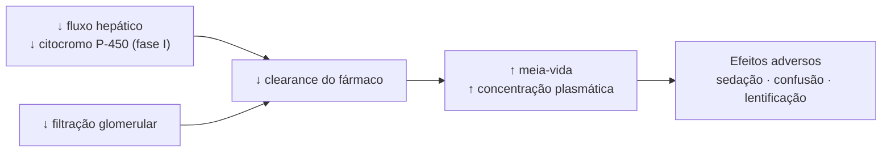
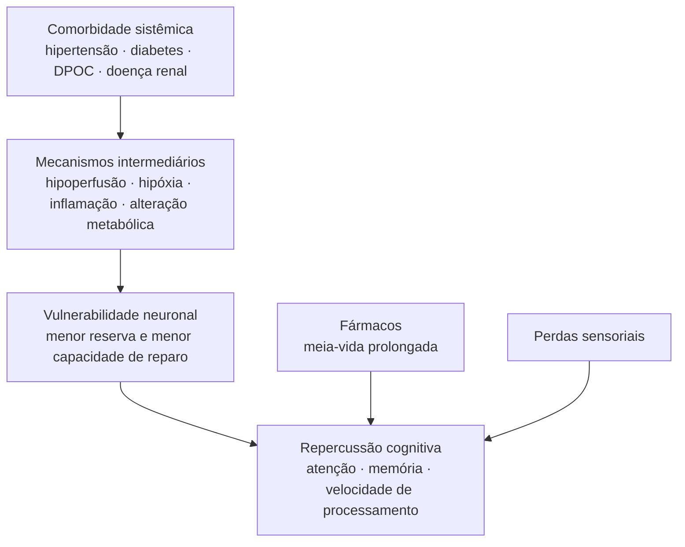
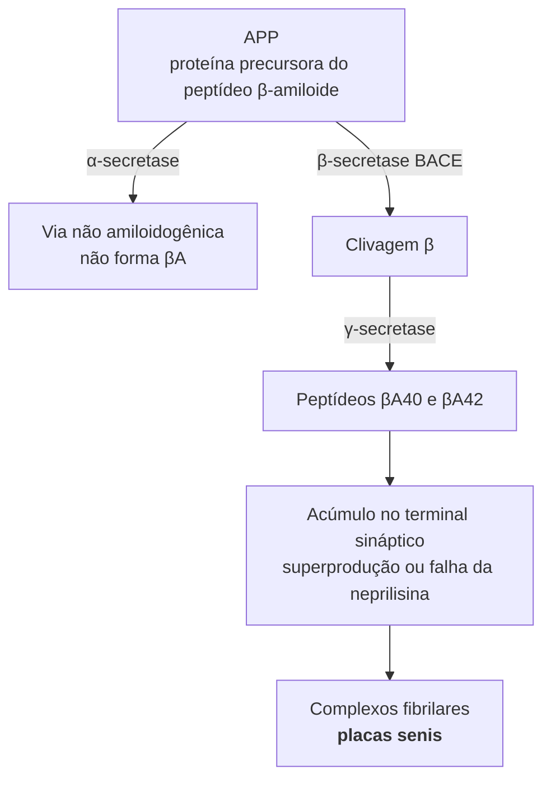
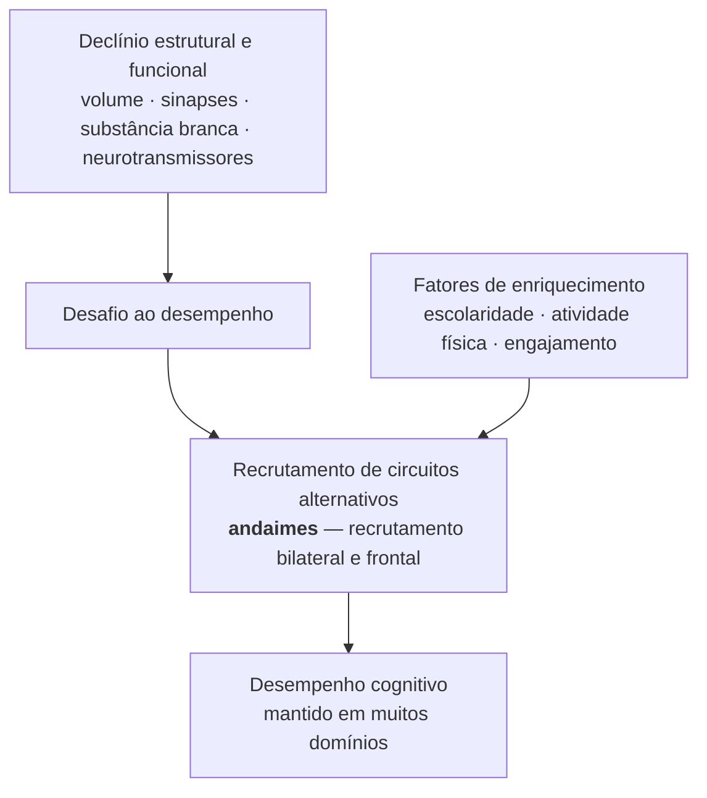

<!--
Aula de 3h, dois capítulos. A primeira metade (cap. 2) descreve o que envelhece no corpo; a segunda (cap. 4) descreve o que envelhece no sistema nervoso. O fio condutor é a reserva funcional: ela cai em todos os sistemas, e é isso que explica por que o idoso responde pior a estressores sem estar doente.
-->

---
layout: agenda
kicker: Aula 02 · 3 horas
title: O caminho de hoje
items:
  - { topic: "Reserva funcional", desc: "o conceito que organiza os dois capítulos" }
  - { topic: "Sistemas do corpo", desc: "cardiovascular, respiratório, renal, hepático, endócrino, imune, musculoesquelético" }
  - { topic: "Fármacos e fragilidade", desc: "por que a farmacologia importa para a neuropsicologia" }
  - { topic: "Sistema nervoso — sensorial e motor", desc: "visão, audição, equilíbrio, motricidade, autonômico" }
  - { topic: "Sistema nervoso — estrutura e bioquímica", desc: "macro, micro, agregação proteica, neurotransmissores" }
  - { topic: "Plasticidade e reserva", desc: "compensação neural e o que a protege" }
---

<!-- Intervalo depois do bloco de fragilidade, por volta de 1h30. A segunda metade é a que responde diretamente pelo título da aula. -->

---
layout: default
kicker: Retomando a aula 01
title: Onde paramos
---

Na aula passada definimos **envelhecimento biológico** — ou senescência — como a diminuição progressiva da capacidade de adaptação e de sobrevivência.

<v-clicks>

- Era uma definição **funcional**, não anatômica
- Universal, determinada geneticamente na espécie
- Começa logo após a maturidade sexual e acelera na 5ª década

</v-clicks>

<v-click>

<Callout icon="lucide:arrow-right">
Hoje damos o próximo passo: <strong>onde</strong>, no corpo e no sistema nervoso, essa capacidade de adaptação diminui — e o que isso significa para a avaliação neuropsicológica.
</Callout>

</v-click>

<!--
A ponte importa: a aula 01 foi conceitual e histórica; esta é descritiva e biológica. Deixe claro que não estamos mudando de assunto, estamos descendo um nível de análise.
-->

---
layout: define
kicker: O conceito que organiza a aula
term: Reserva funcional
definition: A margem entre a capacidade máxima de um órgão e a capacidade que o repouso exige dele.
points:
  - "No repouso, o órgão envelhecido costuma funcionar normalmente"
  - "A diferença aparece sob sobrecarga — esforço, doença aguda, fármaco"
  - "É por isso que envelhecimento normal e doença podem ser difíceis de separar na clínica"
---

<!--
Este é o conceito-âncora do capítulo 2 e vale a pena fixá-lo antes de qualquer sistema específico. O exemplo canônico é cardíaco: a função sistólica de repouso permanece inalterada, mas a tolerância ao esforço cai. O sistema não está doente; está com menos margem.
-->

---
layout: columns
kicker: Três características da senescência sistêmica
title: O que se repete em todos os sistemas
columns:
  - title: "Perda de reserva"
    items:
      - "Cai a capacidade funcional máxima"
      - "O desempenho de repouso costuma se manter"
      - "A margem para sobrecarga encolhe"
  - title: "Vulnerabilidade"
    items:
      - "Maior sensibilidade a estressores"
      - "Doença aguda descompensa mais rápido"
      - "Apresentações clínicas mais inespecíficas"
  - title: "Heterogeneidade"
    items:
      - "O ritmo varia entre órgãos"
      - "E varia muito entre pessoas"
      - "A idade cronológica prediz pouco"
---

<!-- A terceira coluna é a que mais interessa à neuropsicologia: variabilidade interindividual alta significa que normas por idade são um instrumento grosseiro. Ligue com o efeito de coorte da aula 01. -->

---
layout: statement
kicker: Uma distinção que atravessa a aula inteira
title: Alterações fisiológicas do envelhecimento <em>não são</em> doença — mas mudam o terreno em que a doença aparece.
---

<!--
O capítulo é explícito quanto a isso no sistema endócrino: "as alterações fisiológicas desse sistema não constituem doença". Vale repetir a cada bloco. O risco pedagógico aqui é a turma sair medicalizando o envelhecimento normal.
-->

---
layout: section
index: "01"
kicker: Parte um
title: Modificações fisiológicas sistêmicas
subtitle: Capítulo 2 — o corpo que sustenta o cérebro
---

---
layout: define
kicker: Cardiovascular · 1 de 3
term: Remodelamento estrutural
definition: Com o envelhecimento, as camadas íntima e média vasculares triplicam de espessura entre os 20 e os 90 anos.
points:
  - "Fragmentação da elastina e aumento das ligações cruzadas do colágeno"
  - "Depósito de cálcio na parede arterial"
  - "Resultado: enrijecimento vascular"
  - "Aumento do tamanho dos cardiomiócitos e espessamento do miocárdio"
---

<!-- Fonte: Tabela 2.1 do capítulo (Lakatta, 2002; Strait & Lakatta, 2012). Note que o espessamento do miocárdio ocorre sem aumento da massa cardíaca total — é redistribuição, com hipertrofia assimétrica do septo. -->

---
layout: default
kicker: Cardiovascular · 2 de 3
title: O que o enrijecimento arterial produz
---

<v-clicks>

- A **pressão sistólica** sobe com a idade; a diastólica sobe até os 50, estabiliza e **cai** depois dos 60
- A diferença entre as duas — a **pressão de pulso** — se alarga
- No idoso, a pressão de pulso **prediz melhor** eventos cardiovasculares do que a sistólica ou a diastólica isoladas
- O **reflexo barorreceptor** perde sensibilidade

</v-clicks>

<v-click>

<Callout icon="lucide:activity">
Daí a hipotensão ortostática e pós-prandial, especialmente sob anti-hipertensivos. É uma causa frequente de queda — e de <em>desempenho instável</em> ao longo de uma sessão de testagem.
</Callout>

</v-click>

<!-- Peça que reparem: nada disso é doença cardiovascular. É envelhecimento normal do leito arterial. A doença entra quando esse terreno encontra hipertensão, dislipidemia ou diabetes. -->

---
layout: stats
kicker: Cardiovascular · 3 de 3
title: Números do capítulo
columns: 3
stats:
  - { value: "−25", unit: "%", label: "débito cardíaco com o envelhecimento", icon: "lucide:heart", tone: warn }
  - { value: "10", unit: "%", label: "das células marca-passo permanecem aos 75 anos", icon: "lucide:activity", tone: warn }
  - { value: "65", unit: "%", label: "fração de ejeção de repouso, no mínimo — <em>permanece inalterada</em>", icon: "lucide:check", tone: good }
---

<!--
O contraste entre os dois primeiros números e o terceiro é exatamente a tese da reserva: a função de repouso se mantém, a capacidade de resposta ao esforço cai. Os efeitos combinados das alterações da sístole se contrabalançam.
-->

---
layout: define
kicker: Respiratório · 1 de 2
term: Declínio da função pulmonar
definition: O sistema respiratório alcança sua função máxima entre os 20 e 25 anos e declina progressivamente a partir daí.
points:
  - "Redução da retração elástica pulmonar — o pulmão fica mais fácil de expandir"
  - "Enrijecimento da parede torácica, cifose dorsal, calcificação costocondral"
  - "Redução de ~25% na força da musculatura respiratória"
  - "Ainda assim, as trocas gasosas se mantêm adequadas — exceto na doença"
---

<!-- Os dois primeiros pontos se contrabalançam: a perda de retração elástica facilita a expansão, o enrijecimento torácico dificulta. Por isso a capacidade pulmonar total permanece estável. -->

---
layout: default
kicker: Respiratório · 2 de 2
title: Tabela 2.3 — o que muda nos volumes pulmonares
---

<Grid :data="[['Volume', 'O que mede', 'Modificação'], ['Volume residual (VR)', 'ar que permanece após expiração máxima', '↑ 50% dos 20 aos 70 anos'], ['Capacidade vital (CV)', 'maior volume de ar mobilizado', '↓ aproximadamente 75%'], ['Capacidade residual funcional', 'ar ao final de uma expiração espontânea', '↑ — o idoso respira volumes maiores'], ['Capacidade pulmonar total', 'soma de todos os volumes', 'permanece estável'], ['VEF1', 'volume expirado no 1º segundo', '↓ 20 mL/ano até 39 anos; ↓ 38 mL/ano após 65']]" head highlight="row:5" />

<Callout icon="lucide:wind">
O consumo de oxigênio é máximo entre os 20 e 30 anos e depois declina cerca de <strong>9% ao ano</strong>. A sensibilidade dos centros respiratórios à hipoxia e à hipercapnia também cai.
</Callout>

<!-- A linha destacada é a que costuma surpreender: a capacidade pulmonar total não muda. O que muda é a distribuição interna dos volumes — mais ar aprisionado, menos ar mobilizável. -->

---
layout: metric
kicker: Renal
value: "0,8"
unit: " mL/min"
label: é o quanto a taxa de filtração glomerular declina <em>por ano</em>, a partir da quarta década de vida. Comum — mas <em>não inevitável</em>: 35% dos idosos a mantêm estável por 20 anos de seguimento.
---

<!--
O "não inevitável" é do capítulo e vale sublinhar. É o mesmo argumento da variabilidade interindividual: a média descreve a população, não o paciente à sua frente.
-->

---
layout: default
kicker: Renal
title: O rim que envelhece
---

<v-clicks>

- Redução da massa renal — **19%** nos homens e **9%** nas mulheres, comparando as faixas de 70-79 e 20-29 anos
- O fluxo sanguíneo glomerular cai **10% por década** a partir dos 30 anos
- Glomeruloesclerose progressiva reduz o número de glomérulos funcionantes
- Hiporresponsividade do túbulo distal à vasopressina → menor capacidade de concentrar urina
- Somado à ausência de sede sob osmolaridade elevada: **maior risco de desidratação**

</v-clicks>

<v-click>

<Callout tone="warn" icon="lucide:beaker">
A creatinina sérica isolada engana no idoso. O capítulo recomenda calcular o <em>clearance</em> pela fórmula de Cockcroft-Gault; a fórmula MDRD não está validada acima dos 70 anos.
</Callout>

</v-click>

<!-- A desidratação é uma das causas mais banais e mais reversíveis de confusão mental em idosos. Vale citar aqui porque volta no bloco de avaliação. -->

---
layout: diagram
kicker: Fígado e fármacos
title: Por que a farmacologia entra numa aula de neuropsicologia
build: true
note: Menor fluxo hepático e menor atividade do <strong>citocromo P-450</strong> (fase I) reduzem o <em>clearance</em> de vários fármacos — antidepressivos, antipsicóticos, betabloqueadores, antiarrítmicos.
---

<!--
Este slide é a articulação entre o capítulo 2 e a prática de vocês. O mesmo comprimido, na mesma dose, produz uma exposição maior no idoso. O capítulo fala em "iatrofarmacologia" e em "maior risco de interações medicamentosas".
-->

---
layout: steps
kicker: Farmacocinética no idoso
title: Quatro etapas, quatro alterações
ghost: "4"
steps:
  - { title: "Absorção", desc: "redução da acidez gástrica e do trânsito intestinal; efeito em geral pequeno", icon: "lucide:import" }
  - { title: "Distribuição", desc: "mais gordura corporal e menos água: fármacos lipossolúveis se acumulam", icon: "lucide:git-branch" }
  - { title: "Metabolismo", desc: "menor fluxo hepático e menor oxidação de fase I (citocromo P-450)", icon: "lucide:flask-conical" }
  - { title: "Excreção", desc: "menor depuração renal prolonga a meia-vida", icon: "lucide:filter" }
---

<!-- Repare que apenas a absorção é pouco afetada — o capítulo diz que o aparelho gastrintestinal é pouco atingido pela senescência, graças à grande reserva funcional. As três outras etapas somam-se na mesma direção. -->

---
layout: define
kicker: Fora do capítulo · conceito clínico auxiliar
term: Polifarmácia
definition: Uso simultâneo de cinco ou mais medicamentos — situação frequente em idosos com múltiplas comorbidades.
points:
  - "Cascata de prescrição — um efeito adverso é tratado com um novo fármaco"
  - "Anticolinérgicos e sedativos são as classes de maior risco cognitivo"
  - "O resultado pode ser rebaixamento cognitivo iatrogênico"
  - "Fonte: literatura geriátrica; não consta do capítulo 2, que trata do mecanismo farmacocinético"
aside: "fora do capítulo"
---

<!--
Sinalizei explicitamente que este conceito vem de fora do capítulo. O capítulo entrega o mecanismo (metabolismo hepático e renal); a nomenclatura de polifarmácia e cascata de prescrição vem da geriatria clínica. Vale a honestidade sobre a origem de cada ideia.
-->

---
layout: default
kicker: Um caso para pensar
title: A confusão que era o remédio
aside: "vinheta clínica"
---

<v-clicks>

- Paciente de 78 anos, encaminhado para **avaliação de demência**
- Início **súbito** de confusão mental, há três semanas
- A revisão da lista de medicamentos revela **benzodiazepínico** iniciado há um mês
- Suspensão supervisionada do fármaco: o quadro **regride**

</v-clicks>

<v-click>

<Callout icon="lucide:list-checks">
Antes de investigar um quadro demencial, revise a lista de medicamentos. Início súbito e curso flutuante afastam a hipótese de um processo degenerativo.
</Callout>

</v-click>

<!--
Vinheta ilustrativa, não um caso real. O ponto é o raciocínio, não o desfecho: início súbito não combina com demência degenerativa. Aproveite para lembrar que o neuropsicólogo não suspende medicação — ele levanta a hipótese e comunica ao prescritor.
-->

---
layout: reference
kicker: Endócrino-metabólico
title: O que muda nos hormônios
groups:
  - title: "Eixos e hormônios"
    items:
      - { term: "GH e IGF-1", desc: "secreção e níveis séricos reduzidos; declínio das ondas noturnas de liberação" }
      - { term: "Melatonina", desc: "menor liberação noturna — hipótese para a redução do sono" }
      - { term: "Cortisol", desc: "alterações discretas; maior variabilidade em 24h e resposta prolongada ao estresse" }
      - { term: "DHEA", desc: "queda de 80% aos 80 anos em relação aos 20" }
  - title: "Metabolismo e gônadas"
    items:
      - { term: "Insulina", desc: "redução de 50% na sensibilidade periférica; hiperinsulinismo compensatório" }
      - { term: "Tireoide", desc: "T3 reduzido; T4 normal; hipotireoidismo em até 6% dos idosos" }
      - { term: "Gonadal feminina", desc: "única alteração abrupta e universal do envelhecimento endócrino" }
      - { term: "Gonadal masculina", desc: "testosterona total declina 1% ao ano a partir dos 20; a fração livre, 2%" }
---

<!--
Não leia a tabela inteira. Escolha três: a única alteração abrupta e universal (menopausa), a resistência à insulina (porta de entrada da síndrome plurimetabólica e do risco vascular cerebral) e o cortisol (a ponte com estresse, sono e memória).
-->

---
layout: default
kicker: Endócrino · a ponte com a cognição
title: Três vias que chegam ao cérebro
---

<v-clicks>

- **Resistência à insulina** → síndrome plurimetabólica → risco cardiovascular e cerebrovascular
- **Cortisol** com resposta prolongada ao estresse → repercussão sobre sono, humor e memória
- **Melatonina** reduzida → fragmentação do sono → desempenho cognitivo instável ao longo do dia

</v-clicks>

<v-click>

<Callout icon="lucide:link">
Nenhuma dessas vias é específica da velhice. O que muda com a idade é a <strong>frequência</strong> com que elas se acumulam na mesma pessoa.
</Callout>

</v-click>

<!-- Aqui vale um exemplo prático: um paciente diabético mal controlado, com apneia do sono e uso crônico de corticoide tem três razões não degenerativas para um desempenho cognitivo rebaixado. -->

---
layout: define
kicker: Sistema imune
term: Imunossenescência
definition: Conjunto de alterações imunes do idoso que determinam maior suscetibilidade a infecções, neoplasias e doenças autoimunes.
points:
  - "Involução do timo — a maior parte de suas funções se perde aos 60 anos"
  - "Menos células T naïve; expansão de células de memória com baixa proliferação"
  - "Deslocamento de resposta Th1 (inflamatória) para Th2 (anti-inflamatória)"
  - "Capacidade proliferativa das células-tronco hematopoiéticas cai 2 a 4 vezes"
---

<!-- A consequência clínica que mais nos interessa: o idoso responde às infecções com sintomatologia inespecífica e de difícil diagnóstico. Uma infecção urinária pode se apresentar como confusão mental, sem febre. -->

---
layout: default
kicker: Musculoesquelético
title: Sarcopenia, osso e articulação
---

<v-clicks>

- **Perda de força muscular** progressiva, sobretudo na musculatura distal; degeneração de motoneurônios evidente após os 60 anos
- Perda maior nas **fibras rápidas (tipo II)**, que passam a ser menos recrutadas
- Fibras rápidas são **reinervadas por motoneurônios lentos** — o músculo fica mais lento, não só mais fraco
- **Osso**: níveis de paratormônio elevados e deficiência de vitamina D contribuem para a reabsorção óssea
- **Cartilagem**: é o tecido articular mais afetado pelo envelhecimento, e a alteração compromete todos os indivíduos

</v-clicks>

<!--
O terceiro ponto é o mais interessante e o mais esquecido: a lentidão motora do idoso tem um componente de reorganização da unidade motora, não apenas de atrofia. Isso volta quando falarmos de lentificação no capítulo 4.
-->

---
layout: default
kicker: Fora do capítulo · síndrome clínica
title: Fenótipo de fragilidade
aside: "fora do capítulo"
---

<Tags :items="['perda de peso involuntária', 'exaustão autorreferida', 'fraqueza de preensão', 'lentidão da marcha', 'baixa atividade física']" />

<v-clicks>

- **3 ou mais** critérios — fragilidade
- **1 ou 2** critérios — pré-fragilidade
- Nenhum — robustez

</v-clicks>

<v-click>

<Callout icon="lucide:git-merge">
A fragilidade é o nome clínico daquilo que o capítulo descreve fisiologicamente: a <strong>perda de reserva</strong> deixou de ser um achado de laboratório e passou a ser visível no consultório.
</Callout>

</v-click>

<!--
Fried e colaboradores (2001), Cardiovascular Health Study — não está no capítulo 2. Trouxe porque dá nome à síndrome que o capítulo descreve por partes. A fragilidade cognitiva, conceito emergente, combina esse fenótipo com declínio cognitivo leve sem demência estabelecida, e associa-se a maior risco de progressão para demência.
-->

---
layout: diagram
kicker: Fechando a primeira parte
title: Do sistêmico ao cérebro
build: true
highlight: [Comorb, Mec, Vuln, Cog]
note: A cadeia não é obrigatória — é <strong>probabilística</strong>. Cada seta é um ponto de intervenção possível.
---

<!-- Este é o slide que amarra a primeira metade e abre a segunda. As duas entradas laterais — fármacos e perdas sensoriais — chegam à cognição sem passar pela vulnerabilidade neuronal. São, por isso, as mais reversíveis. -->

---
layout: section
index: "02"
kicker: Parte dois
title: Envelhecimento normal do sistema nervoso
subtitle: Capítulo 4 — Angela Maria Ribeiro e Ramon M. Cosenza
---

---
layout: quote
quote: "Mudanças no sistema nervoso que ocorrem no processo de envelhecimento levam a alterações na forma como os indivíduos <em>sentem e percebem o mundo</em> e, portanto, nas suas interações com ele."
author: Ribeiro & Cosenza (2013), cap. 4
---

<!--
Repare na ordem escolhida pelos autores: eles começam pelo sensorial, não pelo cortical. A tese implícita é que a interface com o mundo muda antes e mais do que a maquinaria central — e que isso contamina qualquer medida cognitiva.
-->

---
layout: agenda
kicker: A estrutura do capítulo 4
title: Cinco níveis de descrição
items:
  - { topic: "Processos sensoriais", desc: "visão, audição, equilíbrio, tato, olfação e gustação" }
  - { topic: "Processos motores e autonômicos", desc: "unidade motora, junção neuromuscular, simpático e parassimpático" }
  - { topic: "Alterações morfológicas", desc: "macro e microestrutura" }
  - { topic: "Alterações bioquímicas", desc: "agregação proteica, estresse oxidativo, apoptose" }
  - { topic: "Sistemas neurotransmissores", desc: "colinérgico, serotonérgico, glutamatérgico e dopaminérgico" }
---

<!-- Anuncie que o bloco de plasticidade e reserva, no fim da aula, vem de fora deste recorte do capítulo — é a moldura que dá sentido a tudo que veremos. -->

---
layout: default
kicker: Processos sensoriais · abertura
title: Um achado que muda como se lê um teste
---

<v-clicks>

- Idosos têm desempenho **pior** em tarefas de identificar sinais sensório-emocionais **unimodais** — face ou prosódia isoladas
- Mas o desempenho é **semelhante** ao de adultos jovens quando os estímulos de face e voz são **congruentes**
- E volta a ser pior quando os estímulos são **incongruentes**

</v-clicks>

<v-click>

<Callout icon="lucide:layers">
Idosos se beneficiam mais do que jovens de informação <strong>multissensorial congruente</strong>. Os autores dizem explicitamente: isso importa no planejamento da reabilitação e na interpretação de dados obtidos com instrumentos neuropsicológicos.
</Callout>

</v-click>

<!-- Hunter, Phillips & MacPherson (2010); Laurienti e colaboradores (2006). Aplicação direta: instruções faladas e escritas ao mesmo tempo não são redundância inútil, são compensação. -->

---
layout: vs
kicker: Os dois sentidos mais relevantes para a testagem
title: Visão e audição
label: e
left:
  title: Visão
  items:
    - "<strong>Presbiopia</strong> na quinta década — perda de elasticidade do cristalino"
    - "Cristalino e córnea mais densos, amarelados e espessos"
    - "Pupila mais estreita: menos luz chega ao interior do olho"
    - "Bastonetes diminuem cerca de 30% entre os 35 e os 90 anos"
    - "Adaptação ao escuro mais lenta após os 60"
right:
  title: Audição
  items:
    - "<strong>Presbiacusia</strong> — deterioração bilateral lentamente progressiva"
    - "Perda maior nas frequências altas (4.000 a 6.000 Hz)"
    - "Degeneração nas porções basais da cóclea e no gânglio espiral"
    - "Perda de elasticidade da membrana basilar"
    - "Um pouco mais frequente em homens"
---

<!-- As duas são compensáveis: correção óptica e prótese auditiva. O capítulo registra que apenas uma minoria dos idosos com perda auditiva usa prótese, e que, no levantamento brasileiro, poucos dos que têm perda a percebem. -->

---
layout: stats
kicker: Audição · a escala do problema
title: Prevalência da presbiacusia
columns: 3
stats:
  - { value: "44", unit: "%", label: "dos indivíduos aos 60 anos", icon: "lucide:ear", tone: warn }
  - { value: "66", unit: "%", label: "entre 70 e 79 anos", icon: "lucide:ear", tone: warn }
  - { value: "90", unit: "%", label: "após os 80 anos", icon: "lucide:ear", tone: bad }
---

<!--
Dados de Pedrão (2011), citados no capítulo 2. No levantamento brasileiro de 2009 (Souza & Russo), 62,5% dos idosos apresentavam perda auditiva. O capítulo 4 é direto: a perda da audição pode estar associada a funcionamento cognitivo empobrecido e mesmo à demência (Lin, 2012).
-->

---
layout: default
kicker: Visão · o que aparece na sala de testagem
title: Quatro efeitos práticos
---

<v-clicks>

- **Iluminação** — a necessidade aumenta em um fator de 10% a cada década de idade
- **Contraste** — a sensibilidade cai, e com ela a percepção de bordas
- **Velocidade de processamento visual** — mais tempo para identificar e discriminar objetos
- **Cores** — detecção de azul e amarelo é a mais afetada, pelo amarelamento do cristalino

</v-clicks>

<v-click>

<Callout tone="warn" icon="lucide:eye">
Cartelas com estímulos pequenos, de baixo contraste ou impressas em azul penalizam o idoso por razões <strong>ópticas</strong>, não cognitivas.
</Callout>

</v-click>

<!-- Um dado do capítulo que vale citar: o envelhecimento afeta os componentes do sistema visual de forma hierárquica — V2 e temporal medial são mais afetados do que V1, e o núcleo geniculado lateral, menos ainda. Quanto mais alto o nível de processamento, maior o efeito da idade. -->

---
layout: panels
kicker: Os demais sentidos
title: O que o capítulo registra
panels:
  - { icon: "lucide:footprints", title: "Equilíbrio", items: ["Degeneração do epitélio sensorial dos canais semicirculares", "Problemas vestibulares respondem por metade das queixas de vertigem", "Visão e propriocepção também contribuem para a estabilidade postural"] }
  - { icon: "lucide:hand", title: "Tato e temperatura", items: ["Menor densidade de corpúsculos de Paccini e Meissner", "Limiar tátil e térmico aumentado", "A sensibilidade dolorosa tende a ser preservada"] }
  - { icon: "lucide:flower", title: "Olfação", items: ["Perdas se acentuam na sexta década", "Mais de 60% dos indivíduos entre 80 e 90 anos têm deficiência olfatória", "Perdas olfatórias marcadas podem servir ao diagnóstico precoce de Alzheimer e Parkinson"] }
  - { icon: "lucide:utensils", title: "Gustação", items: ["Perdas muito menores e variáveis entre sabores", "Boa parte da queixa gustativa se explica pela olfação", "Aumento do limiar para alguns sabores"] }
---

<!-- A olfação é a mais clinicamente carregada: a habilidade de identificar odores depende do lobo temporal, e há associação entre anosmia e doença de Alzheimer, demência vascular e comprometimento cognitivo leve. -->

---
layout: bigtype
kicker: Uma regra de trabalho
title: Antes de atribuir um resultado à cognição, verifique se o paciente <em>viu</em> e <em>ouviu</em> a tarefa.
---

<!--
Dito de forma sóbria: privação sensorial produz, na folha de respostas, o mesmo padrão que déficit cognitivo. A diferença é que uma se corrige com óculos e aparelho auditivo. Pergunte à turma como registrariam isso no laudo.
-->

---
layout: define
kicker: Processos motores
term: Perda de unidades motoras
definition: A perda de um motoneurônio leva junto as fibras musculares que ele inervava — e, ao contrário do que ocorre no jovem, não há regeneração por brotamento nos terminais intactos.
points:
  - "Perda significativa de unidades motoras, mais evidente após os 60 anos"
  - "Fibras rápidas convertidas em lentas pela reinervação — respostas motoras mais vagarosas"
  - "Junções neuromusculares sofrem remodelação e fragmentação"
  - "Alterações nas placas motoras, possivelmente por estresse oxidativo acumulado"
---

<!-- Este é o substrato periférico da lentificação. Quando falarmos de dopamina e lentificação central, lembre que parte da lentidão observada em tarefas motoras já nasce fora do cérebro. -->

---
layout: default
kicker: Processos autonômicos
title: O que muda no controle visceral
---

<v-clicks>

- **Aumento** da atividade basal do sistema simpático em muitos órgãos viscerais, com elevação da noradrenalina plasmática
- Mas a resposta ao **estresse agudo** é semelhante à do jovem — dado recente, que corrigiu a hipótese de hiperatividade
- **Redução** da secreção basal de adrenalina pela medula suprarrenal
- Evidência de **diminuição da atividade do nervo vago** no coração
- Menor capacidade de **regulação do fluxo sanguíneo cerebral**

</v-clicks>

<v-click>

<Callout icon="lucide:footprints">
O capítulo registra um contraponto: o exercício físico, como caminhadas, pode <strong>aumentar</strong> o fluxo sanguíneo cerebral nos idosos.
</Callout>

</v-click>

<!-- O penúltimo ponto é o mais importante para nós: a regulação deficiente do fluxo cerebral contribui para os acidentes vasculares e para as doenças neurodegenerativas mais comuns no envelhecimento. É onde o capítulo 2 e o capítulo 4 se encontram. -->

---
layout: section
index: "03"
kicker: Parte três
title: Morfologia
subtitle: O que muda no tamanho, na forma e nas células
---

---
layout: chart
kicker: Macroestrutura · o ritmo da perda
title: Redução do volume cerebral por década
note: "Traçado <strong>esquemático</strong> a partir das taxas do capítulo: 0,1 a 0,2% ao ano até os 50 anos; 0,3 a 0,5% ao ano depois dos 70. Não são dados de um estudo único."
chart:
  type: line
  height: "280px"
  unit: "%"
  categories: ["30 anos", "40 anos", "50 anos", "60 anos", "70 anos", "80 anos"]
  series:
    - { name: "Volume cerebral (relativo)", data: [100, 98, 96, 93, 90, 86] }
---

<!--
Deixe claro que é um esquema didático. O ponto do slide não é a curva, é a inflexão: a perda existe desde cedo, mas acelera. O peso cerebral se altera pouco até os 60 anos, com decréscimo mais rápido nos anos posteriores. Paralelamente, há aumento compensatório do volume dos ventrículos.
-->

---
layout: vs
kicker: Macroestrutura · o que se vê na imagem
title: Adulto jovem e pessoa idosa sem doença
label: →
left:
  title: Adulto jovem
  items:
    - "Volume encefálico preservado"
    - "Sulcos corticais estreitos"
    - "Ventrículos de pequeno calibre"
    - "Espessura cortical maior"
right:
  title: Pessoa idosa — envelhecimento normal
  items:
    - "Redução do volume encefálico"
    - "Alargamento dos sulcos"
    - "Aumento compensatório dos ventrículos"
    - "Diminuição da espessura cortical, mesmo sem perda neuronal"
---

<!-- Insista no "sem doença". Este padrão é esperado. O erro clínico frequente é ler atrofia compatível com a idade como evidência de processo degenerativo. -->

---
layout: statement
kicker: Um resultado que exige cautela
title: A diminuição do volume cerebral <em>não</em> se correlaciona com o desempenho em tarefas de memória de trabalho.
---

<!--
Steffener, Habeck & Stern (2012). O que explicou parcialmente as diferenças relacionadas à idade foi a força e a distribuição da conectividade funcional entre regiões — não o volume. É um bom momento para lembrar que estrutura e função não são a mesma medida.
-->

---
layout: columns
kicker: Macroestrutura · distribuição
title: Onde a perda se concentra
columns:
  - title: "Mais vulnerável"
    items:
      - "Córtex pré-frontal — perdas neuronais mais evidentes"
      - "Hipocampo"
      - "Córtex cerebelar"
  - title: "Mais preservado"
    items:
      - "Córtices sensoriais primários"
      - "Núcleo geniculado lateral"
      - "Estruturas de processamento de baixo nível"
  - title: "Ressalvas do capítulo"
    items:
      - "Alguns autores não encontram variação no número de neurônios nem nessas regiões"
      - "Estudos antigos incluíam cérebros com doença de Alzheimer"
      - "As perdas neuronais são <em>moderadas</em> com técnicas atuais"
---

<!--
A terceira coluna é a mais importante intelectualmente. Os primeiros estudos falavam em perda de até 60% de neurônios. Métodos estereológicos corrigiram isso — e a correção veio junto com a separação entre Alzheimer e envelhecimento fisiológico. A ciência mudou de resposta porque mudou de método.
-->

---
layout: define
kicker: Microestrutura
term: A sinapse antes do neurônio
definition: O que o envelhecimento normal reduz de forma mais consistente não é o número de neurônios — é a densidade de conexões entre eles.
points:
  - "Redução do tamanho dos neurônios, correlacionada com a extensão da arborização dendrítica e axonal"
  - "Mais de 40% de redução no número de espículas dendríticas no córtex cerebral humano após os 50 anos"
  - "Mas o dado é variável: pode haver <em>aumento</em> da ramificação dendrítica em regiões hipocampais"
  - "O número de sinapses se modifica de forma variável entre regiões"
---

<!-- O terceiro ponto é deliberadamente desconfortável. O capítulo é honesto quanto à inconsistência dos dados. Resista à tentação de simplificar isso numa regra limpa — a variabilidade regional é o achado. -->

---
layout: default
kicker: Microestrutura · outros achados
title: O tecido em volta do neurônio
---

<v-clicks>

- **Astrócitos e micróglia** aumentam em número e em tamanho
- Acúmulo de **lipofuscina** nos neurônios — material da degradação dos lisossomos, relacionado à autofagia
- **Substância branca**: declínio da anisotropia na difusão, sobretudo na região frontal e no corpo caloso anterior
- Indica menor integridade dos circuitos pré-frontais e da **transferência inter-hemisférica** da informação

</v-clicks>

<v-click>

<Callout icon="lucide:cable">
Guarde este último ponto. Ele volta quando falarmos de compensação neural e de recrutamento bilateral.
</Callout>

</v-click>

<!-- Sullivan & Pfefferbaum (2006). A perda de integridade calosa é o substrato anatômico mais provável do que veremos como HAROLD. -->

---
layout: vs
kicker: Microestrutura · trajetórias
title: Substância cinzenta e substância branca
label: ×
left:
  title: Substância cinzenta
  items:
    - "Corpos neuronais e sinapses"
    - "Declínio mais gradual e progressivo"
    - "Acompanha toda a vida adulta"
    - "Trajetória aproximadamente linear"
right:
  title: Substância branca
  items:
    - "Fibras mielinizadas"
    - "Padrão em U invertido"
    - "Cresce até a meia-idade e declina depois"
    - "Trajetória não linear"
---

<!--
Esta distinção não está formulada assim no trecho do capítulo que temos — é a síntese corrente na literatura de neuroimagem do envelhecimento. Ela é útil porque explica por que a velocidade de processamento, que depende de mielinização, tem um perfil de declínio diferente de outras funções.
-->

---
layout: section
index: "04"
kicker: Parte quatro
title: Bioquímica
subtitle: Agregação de proteínas, estresse oxidativo e neurotransmissores
---

---
layout: steps
kicker: A organização do capítulo
title: Três famílias de processos bioquímicos
ghost: "3"
steps:
  - { title: "Degradação e agregação de proteínas", desc: "placas senis, proteína príon, emaranhados neurofibrilares, corpos de Lewy", icon: "lucide:boxes" }
  - { title: "Mecanismos oxidativos e neurotransmissão", desc: "morte celular, espécies reativas de oxigênio, fatores neurotróficos", icon: "lucide:flame" }
  - { title: "Aspectos genéticos", desc: "expressão gênica, sirtuínas, restrição calórica", icon: "lucide:dna" }
---

<!-- Os autores avisam que essa separação é uma simplificação: há interfaces entre os sistemas moleculares envolvidos nesses eventos. Não são vias independentes. -->

---
layout: statement
kicker: A frase que orienta todo este bloco
title: Muitas das características histológicas do Alzheimer e do Parkinson aparecem, <em>em menor proporção</em>, no envelhecimento normal.
---

<!--
Esta é talvez a afirmação mais importante do capítulo para a formação de vocês. O perfil de alterações neurotransmissoras nessas doenças parece representar uma exacerbação daquele encontrado no envelhecimento — não um fenômeno de outra natureza. É uma questão de grau, não de tipo. Isso tem consequências para o diagnóstico diferencial e para a interpretação de biomarcadores.
-->

---
layout: diagram
kicker: Agregação proteica · 1 de 2
title: Como se forma uma placa senil
build: true
note: A via <strong>amiloidogênica</strong> produz peptídeos βA de 40 a 42 aminoácidos. A via não amiloidogênica, mediada pela α-secretase, cliva a APP <em>dentro</em> do domínio β-amiloide e não gera o peptídeo.
---

<!--
Note a função fisiológica da APP: neuroproteção, crescimento de neuritos e plasticidade sináptica. Ela não é uma proteína "do Alzheimer" — é uma proteína do desenvolvimento cerebral cuja via de degradação pode falhar.
-->

---
layout: define
kicker: Agregação proteica · 2 de 2
term: Emaranhados neurofibrilares
definition: Agregados intraneuronais de proteína Tau hiperfosforilada e insolúvel, organizados em filamentos helicoidais pareados.
points:
  - "Tau é abundante no SNC, predominante nos axônios, e participa da estrutura dos microtúbulos"
  - "As placas senis são extracelulares; os emaranhados, intracelulares"
  - "A distribuição das placas é heterogênea e aleatória"
  - "A dos emaranhados é previsível: córtex entorrinal → hipocampo → sistema límbico → neocórtex"
---

<!-- A progressão previsível dos emaranhados é o que sustenta o estadiamento de Braak. Vale mencionar que essa mesma sequência começa no envelhecimento fisiológico, em intensidade menor. -->

---
layout: vs
kicker: Uma controvérsia em aberto
title: Duas hipóteses sobre a ordem dos eventos
label: ou
left:
  title: Hipótese da cascata amiloide
  items:
    - "O acúmulo de βA vem primeiro"
    - "Ele desencadeia a hiperfosforilação da Tau"
    - "<strong>A maioria das evidências favorece esta</strong>"
right:
  title: Hipótese da Tau
  items:
    - "A disfunção da proteína Tau vem primeiro"
    - "Ela leva ao acúmulo do peptídeo βA"
    - "Menos apoiada, mas não descartada"
---

<!--
O capítulo é explícito: "pouco se sabe de como essas duas lesões se relacionam". Ambas as lesões exercem efeitos neurotóxicos diretos e indiretos e promovem morte neuronal por estresse oxidativo e inflamação. Este é um bom momento para falar sobre convivência com incerteza na ciência.
-->

---
layout: default
kicker: Estresse oxidativo
title: Por que o SNC é especialmente vulnerável às ROS
---

<v-clicks>

- Alta taxa de **atividade metabólica oxidativa**
- Alta concentração de **substratos prontamente oxidáveis** — os ácidos graxos insaturados das membranas
- **Baixo nível** de enzimas antioxidantes: catalases e glutationa peroxidase
- Produção **endógena** de ROS por reações neuroquímicas específicas
- Condução nervosa e transmissão sináptica dependem da **integridade das membranas**, alvo dos radicais livres
- Rede anatômica vulnerável a um rompimento funcional

</v-clicks>

<!--
São seis razões, todas do capítulo. O conjunto explica por que o mesmo mecanismo oxidativo que atinge todos os tecidos tem consequências desproporcionais no tecido nervoso.
-->

---
layout: default
kicker: Estresse oxidativo · a pergunta em aberto
title: Causa ou consequência?
---

O capítulo formula o problema com honestidade:

<v-clicks>

- A neurodegeneração implica acúmulo de agregados insolúveis, o que **também** diminui a capacidade de manter a homeostase
- Torna-se impossível separar o excesso de radicais livres do aumento que é **consequência** do distúrbio da homeostase
- Como as lesões atingem regiões específicas, a hipótese de que os radicais livres sejam **consequência** é mais aceitável
- Mas o conhecimento atual **não permite decidir** qual processo se origina primeiro

</v-clicks>

<v-click>

<Callout icon="lucide:circle-help">
Uma pista adjacente: dietas antioxidantes podem interferir na expressão gênica, reduzir declínios cognitivos e prevenir danos oxidativos — em cérebro de ratos.
</Callout>

</v-click>

<!-- A ressalva "em ratos" é do capítulo e deve ser mantida. É exatamente o tipo de achado que vira manchete sem a ressalva. -->

---
layout: panels
kicker: Outros mecanismos celulares
title: Três processos que o capítulo destaca
panels:
  - { icon: "lucide:scissors", title: "Apoptose", items: ["Morte celular programada — fisiológica no desenvolvimento", "Perda de 20 a 80% dos neurônios durante o desenvolvimento", "Em condições patológicas, parece ser o mecanismo da neurodegeneração"] }
  - { icon: "lucide:calculator", title: "Cálcio e calpaínas", items: ["Elevação do cálcio é a característica mais geral da morte celular", "Ativa cisteínas-proteases dependentes de cálcio", "Enzimas proteolíticas como via final comum"] }
  - { icon: "lucide:battery-charging", title: "Sirtuínas e mitocôndria", items: ["Enzimas dependentes de NAD+, reguladoras do metabolismo energético", "A mitocôndria participa do envelhecimento e da regulação do lifespan", "Efeitos da restrição calórica parecem ligados à expressão de sirtuínas"] }
---

<!-- Não se prenda aos detalhes moleculares. O que a turma precisa levar é que existe uma via final comum de neurotoxicidade, e que a pesquisa sobre neuroproteção mira exatamente nela. -->

---
layout: reference
kicker: Sistemas neurotransmissores
title: O que muda em cada sistema
groups:
  - title: "Os mais estudados no envelhecimento"
    items:
      - { term: "Colinérgico", desc: "perda de neurônios colinérgicos e de receptores nicotínicos; hipofunção colinérgica associada a alterações cognitivas" }
      - { term: "Serotonérgico", desc: "níveis alterados em humanos e animais; redução de fibras serotonérgicas na formação hipocampal" }
  - title: "Também alterados"
    items:
      - { term: "Glutamatérgico", desc: "alterações em parâmetros glutamatérgicos; risco de neurotoxicidade por remoção deficiente da fenda" }
      - { term: "Catecolaminérgico e gabaérgico", desc: "alterações descritas; a formação hipocampal é inervada por fibras dos quatro sistemas" }
---

<!--
A "hipótese colinérgica" nasce daqui: relação entre lesões colinérgicas seletivas e perdas cognitivas no início do processo. Indivíduos com comprometimento cognitivo leve tratados com galantamina — inibidor da acetilcolinesterase e modulador do receptor nicotínico — melhoraram em memória espacial de trabalho.
-->

---
layout: default
kicker: Neurotransmissores · a leitura clínica
title: Três alvos, três perfis de queixa
---

<Grid :data="[['Sistema', 'Domínio associado', 'Como aparece na queixa'], ['Dopaminérgico', 'velocidade e iniciativa', 'lentificação motora e cognitiva'], ['Colinérgico', 'memória e atenção', 'esquecimentos e falhas de codificação'], ['Serotonérgico e noradrenérgico', 'humor e regulação do estresse', 'irritabilidade, ansiedade, humor deprimido']]" head />

<Callout tone="warn" icon="lucide:triangle-alert">
A correspondência é <strong>aproximada</strong>. Nenhum desses sistemas responde por um domínio isolado, e há interação documentada entre o colinérgico e o serotonérgico na modulação de aprendizado e memória.
</Callout>

<!-- Coloquei o alerta porque o mapa "um neurotransmissor, uma função" é didático e falso. Use-o como organizador de estudo, não como modelo explicativo. -->

---
layout: bigtype
kicker: Uma síntese parcial
title: O substrato muda de forma mensurável. O desempenho, em muitos domínios, <em>se mantém</em>.
---

<!--
Fecha a parte descritiva e abre a última. A pergunta que resta é: como um substrato que perde volume, sinapses e neurotransmissores sustenta desempenho preservado? A resposta é o conceito de reserva.
-->

---
layout: section
index: "05"
kicker: Parte cinco
title: Plasticidade e reserva
subtitle: Como o cérebro compensa — e o que faz alguns compensarem melhor
---

---
layout: default
kicker: Nota de método
title: De onde vem esta última parte
aside: "fora do capítulo"
---

Os conceitos a seguir **não estão** no trecho do capítulo 4 que estamos usando. Vêm de uma literatura própria, que cito nominalmente:

<v-clicks>

- **Reserva cerebral e cognitiva** — Stern (2002; 2009)
- **HAROLD** — Cabeza (2002)
- **PASA** — Davis e colaboradores (2008)
- **STAC** e **STAC-r** — Park & Reuter-Lorenz (2009); Reuter-Lorenz & Park (2014)

</v-clicks>

<v-click>

<Callout icon="lucide:bookmark">
O capítulo dá o material: perda sináptica, redução de neurotransmissores, achados de conectividade funcional. Estes modelos oferecem a <strong>moldura</strong> que explica por que esse material nem sempre produz déficit.
</Callout>

</v-click>

<!--
Vale ser explícito sobre a procedência. A turma precisa aprender a distinguir o que está na bibliografia obrigatória do que o professor traz de fora — e por quê.
-->

---
layout: columns
kicker: Três conceitos que se confundem
title: Reserva cerebral, reserva cognitiva e manutenção
columns:
  - title: "Reserva cerebral"
    items:
      - "Recurso <em>anatômico</em>"
      - "Número de neurônios, sinapses, volume disponível"
      - "Modelo passivo: importa quanto há antes da lesão"
      - "Explica limiares diferentes para o mesmo dano"
  - title: "Reserva cognitiva"
    items:
      - "Recurso <em>funcional</em>"
      - "Eficiência e flexibilidade no uso das redes"
      - "Modelo ativo: importa como se usa o que há"
      - "Permite redes alternativas para a mesma tarefa"
  - title: "Manutenção cerebral"
    items:
      - "Grau de <em>preservação</em> da estrutura com a idade"
      - "Menos patologia acumulada, não melhor compensação"
      - "Explica quem envelhece com pouca alteração estrutural"
      - "Complementa, não substitui, os dois anteriores"
---

<!-- A distinção entre reserva e manutenção é sutil e cai em prova. Reserva explica desempenho preservado apesar da patologia; manutenção explica ausência de patologia. São respostas diferentes para a mesma observação. -->

---
layout: vs
kicker: Dois padrões de compensação observados em neuroimagem
title: HAROLD e PASA
label: e
left:
  title: HAROLD
  items:
    - "<em>Hemispheric asymmetry reduction in older adults</em>"
    - "Redução da assimetria hemisférica"
    - "Tarefas que no jovem ativam um hemisfério passam a ativar os dois"
    - "Mais evidente em tarefas pré-frontais"
    - "Cabeza (2002)"
right:
  title: PASA
  items:
    - "<em>Posterior-to-anterior shift in aging</em>"
    - "Deslocamento póstero-anterior da ativação"
    - "Menos ativação occipital, mais ativação frontal"
    - "Associado a processamento visual de nível superior"
    - "Davis e colaboradores (2008)"
---

<!--
Conecte com o capítulo: a perda de integridade do corpo caloso anterior e dos circuitos pré-frontais é justamente o que o recrutamento bilateral precisaria contornar. E a maior vulnerabilidade das áreas visuais de alto nível hierárquico dialoga com o PASA.
-->

---
layout: diagram
kicker: O modelo que integra os dois
title: STAC — andaimes para a cognição envelhecida
build: true
note: "Park & Reuter-Lorenz (2009). O <em>scaffolding</em> não é um sinal de patologia: é a resposta adaptativa padrão de um cérebro que continua plástico."
---

<!--
A revisão de 2014, o STAC-r, acrescentou explicitamente as variáveis de vida — escolaridade, exercício, engajamento — como moduladoras da capacidade de construir andaimes. É a versão neurocognitiva do argumento de plasticidade que vimos com Baltes na aula 01.
-->

---
layout: feature
kicker: O que a literatura associa a maior reserva
title: Fatores de enriquecimento ao longo da vida
columns: 3
features:
  - { icon: "lucide:graduation-cap", title: "Escolaridade", desc: "anos de estudo formal — o preditor mais consistente" }
  - { icon: "lucide:briefcase", title: "Complexidade ocupacional", desc: "demanda cognitiva sustentada ao longo da vida laboral" }
  - { icon: "lucide:footprints", title: "Atividade física", desc: "efeito vascular e neurotrófico; o capítulo cita aumento do fluxo cerebral" }
  - { icon: "lucide:users", title: "Engajamento social", desc: "redes de relação e participação em atividades" }
  - { icon: "lucide:languages", title: "Bilinguismo", desc: "exercício sustentado de controle cognitivo; evidência mais debatida" }
  - { icon: "lucide:book-open", title: "Atividades de lazer cognitivo", desc: "leitura, música, jogos — medida por índices compostos" }
---

<!--
Uma ressalva metodológica que a turma precisa ouvir: quase todos esses fatores são medidos em estudos observacionais. Causalidade reversa é uma explicação concorrente plausível — quem tem melhor cognição estuda mais, trabalha em ocupações mais complexas e se mantém mais engajado.
-->

---
layout: default
kicker: A observação que o conceito de reserva explica
title: Discrepância entre imagem e função
---

<v-clicks>

- Exame de imagem revela **múltiplas lesões** vasculares ou marcada atrofia
- A avaliação neuropsicológica **não** encontra prejuízo funcional relevante
- O paciente mantém **autonomia** nas atividades de vida diária

</v-clicks>

<v-click>

<Callout icon="lucide:scale">
Reserva cognitiva elevada é a explicação mais parcimoniosa. E a contrapartida é desconfortável: quando o declínio finalmente aparece nessas pessoas, ele tende a ser <strong>mais rápido</strong>, porque a patologia já está avançada.
</Callout>

</v-click>

<!--
A contrapartida é bem documentada e frequentemente omitida quando se fala de reserva de forma otimista. Reserva adia a manifestação clínica; não impede a patologia. Vale dizer isso com clareza.
-->

---
layout: section
index: "06"
kicker: Fechamento
title: O que muda na prática
subtitle: Da fisiologia à sala de avaliação
---

---
layout: steps
kicker: Implicações para a avaliação neuropsicológica
title: Quatro decisões que a aula de hoje justifica
ghost: "4"
steps:
  - { title: "Agendar no horário de melhor disposição", desc: "fragmentação do sono e variação circadiana do cortisol tornam o desempenho instável ao longo do dia", icon: "lucide:clock" }
  - { title: "Prever pausas e sessões mais curtas", desc: "menor reserva cardiorrespiratória e muscular significa fadiga mais precoce sob demanda sustentada", icon: "lucide:pause" }
  - { title: "Garantir a correção sensorial", desc: "óculos e aparelho auditivo em uso durante toda a testagem; verificar iluminação e contraste do material", icon: "lucide:glasses" }
  - { title: "Revisar a lista de medicamentos", desc: "meia-vida prolongada, anticolinérgicos e sedativos produzem rebaixamento que imita quadro degenerativo", icon: "lucide:pill" }
---

<!-- Peça que anotem estas quatro. São operacionais: cabem num roteiro de anamnese e num item de checklist antes de qualquer bateria. -->

---
layout: default
kicker: Recapitulando
title: Sistema, mecanismo, repercussão
---

<Grid :data="[['Sistema', 'Mecanismo principal', 'Repercussão cognitiva'], ['Cardiovascular', 'enrijecimento arterial e queda do débito', 'perfusão cerebral reduzida; instabilidade postural'], ['Respiratório', 'menor reserva ventilatória e sensibilidade à hipoxia', 'hipoxemia sob doença aguda'], ['Renal e hepático', 'menor depuração de fármacos', 'rebaixamento iatrogênico'], ['Endócrino', 'resistência insulínica, cortisol, melatonina', 'risco vascular, sono e humor'], ['Musculoesquelético', 'sarcopenia e perda de unidades motoras', 'lentificação e risco de queda'], ['Sensorial', 'presbiopia e presbiacusia', 'contaminação direta da medida cognitiva']]" head highlight="row:7" />

<!-- A linha destacada é a única em que a repercussão não é sobre a cognição, mas sobre a medida da cognição. Essa distinção é o ponto mais fino da aula. -->

---
layout: reference
kicker: Recapitulando · o sistema nervoso
title: Os cinco níveis do capítulo 4
items:
  - { term: "Sensorial e motor", desc: "presbiopia, presbiacusia, perda de unidades motoras, alteração autonômica" }
  - { term: "Macroestrutura", desc: "↓ volume, alargamento de sulcos, ↑ ventrículos; pré-frontal e hipocampo mais vulneráveis" }
  - { term: "Microestrutura", desc: "perda sináptica e dendrítica maior que a perda neuronal; ↓ integridade da substância branca" }
  - { term: "Bioquímica", desc: "agregação proteica (βA e Tau), estresse oxidativo, apoptose — em menor grau que na doença" }
  - { term: "Neuroquímica", desc: "hipofunção colinérgica, alterações serotonérgicas, glutamatérgicas e catecolaminérgicas" }
---

<!-- Se a turma sair sabendo nomear os cinco níveis e dar um exemplo de cada, a aula cumpriu o objetivo descritivo. -->

---
layout: panels
kicker: Para a prova
title: Glossário mínimo
panels:
  - { icon: "lucide:gauge", title: "Reserva funcional", items: ["Margem entre capacidade máxima e demanda de repouso", "Cai em todos os sistemas"] }
  - { icon: "lucide:ear", title: "Presbiacusia", items: ["Perda auditiva progressiva de altas frequências", "44% aos 60; 90% após os 80"] }
  - { icon: "lucide:pill", title: "Iatrofarmacologia", items: ["Efeito adverso por meia-vida prolongada", "Metabolismo hepático e renal reduzidos"] }
  - { icon: "lucide:brain", title: "Reserva cognitiva", items: ["Uso eficiente e flexível das redes", "Explica discrepância imagem × função"] }
---

<!-- Quatro termos. Peça um exemplo de cada, não a definição de volta. -->

---
layout: statement
kicker: A síntese da aula
title: O corpo e o cérebro envelhecem juntos — e quase toda perda funcional tem <em>mais de uma</em> explicação possível.
---

<!--
Fecha com o que interessa clinicamente: a tarefa do neuropsicólogo não é constatar o declínio, é discriminar suas fontes. Sensorial, farmacológica, sistêmica, degenerativa — cada uma tem uma conduta diferente.
-->

---
layout: end
title: Até a próxima
subtitle: "Aula 03 — cognição no envelhecimento normal: atenção, memória e funções executivas"
contact: Leitura · Malloy-Diniz, Fuentes & Cosenza (orgs.), caps. 2 e 4
---
