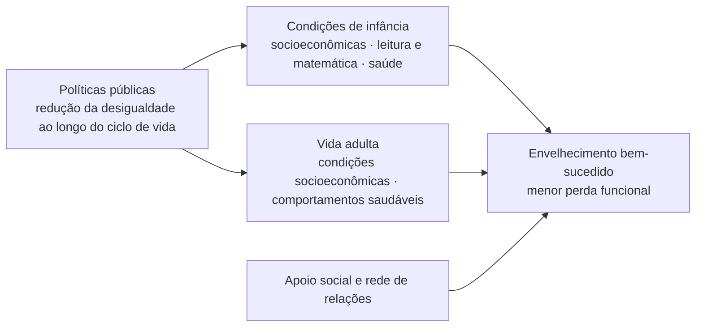

---
layout: agenda
kicker: Aula 02 · capítulos 2, 3 e 4
title: O caminho de hoje
items:
  - {
      topic: "O corpo",
      desc: "as alterações sistêmicas e o que elas cobram da sessão"
    }
  - {
      topic: "Processos sensoriais",
      desc: "a interface que contamina toda medida cognitiva"
    }
  - {
      topic: "O cérebro que envelhece",
      desc: "o essencial da estrutura e da neuroquímica"
    }
  - {
      topic: "Cognição no envelhecimento normal",
      desc: "o que declina, o que se preserva e onde fica a fronteira do
        patológico"
    }
  - {
      topic: "O terreno psicológico e social",
      desc: "humor, personalidade, estereótipo e reserva"
    }
---

---
layout: default
kicker: Retomando a aula 01
title: Onde paramos
---

Na aula passada definimos **envelhecimento biológico** — ou senescência — como a diminuição progressiva da capacidade de adaptação e de sobrevivência.

<v-clicks>

- Era uma definição **funcional**, não anatômica
- Universal, determinada geneticamente na espécie
- Começa logo após a maturidade sexual e acelera na 5ª década

</v-clicks>

<v-click>

<Callout icon="lucide:arrow-right">
Hoje damos o próximo passo: <strong>onde</strong> essa capacidade de adaptação diminui — e, sobretudo, o que disso aparece na folha de respostas de uma avaliação neuropsicológica.
</Callout>

</v-click>

---
layout: define
kicker: O conceito que organiza a aula
term: Reserva funcional
definition: A margem entre a capacidade máxima de
  um órgão e a capacidade que o repouso exige dele.
points:
  - "No repouso, o órgão envelhecido costuma funcionar normalmente"
  - "A diferença aparece sob sobrecarga — esforço, doença aguda, fármaco"
  - "É por isso que envelhecimento normal e doença podem ser difíceis de separar
    na clínica"
  - "Uma bateria neuropsicológica é, ela mesma, uma sobrecarga sustentada"
---

<!--
O exemplo canônico é cardíaco: a função sistólica de repouso permanece inalterada, mas a tolerância ao esforço cai. O sistema não está doente; está com menos margem.

O quarto ponto é a ponte com a prática. Duas horas de testagem cobram atenção sustentada, postura, audição e visão de perto sob fadiga crescente. É exatamente o tipo de demanda que revela perda de reserva.
-->

---
layout: statement
kicker: Uma distinção que atravessa a aula inteira
title: Alterações fisiológicas do envelhecimento <em>não são</em> doença — mas
  mudam o terreno em que a doença aparece.
---

---
layout: section
index: "01"
kicker: Parte um
title: As alterações no corpo
---

---
layout: default
title: Sete sistemas, uma lógica só
---

<Grid :data="[['Sistema', 'Principal alteração', 'O que isso produz na sessão'], ['Cardiovascular', 'enrijecimento arterial, alargamento da pressão de pulso, barorreflexo menos sensível', 'hipotensão ortostática e pós-prandial; queda; desempenho instável'], ['Respiratório', 'menor força muscular, mais volume residual, menor resposta à hipoxia', 'fadiga precoce sob demanda sustentada'], ['Renal e hepático', 'queda da filtração glomerular e da oxidação de fase I', 'fármaco com meia-vida prolongada — rebaixamento iatrogênico'], ['Endócrino', 'resistência à insulina, menos melatonina, cortisol mais reativo', 'risco vascular, sono fragmentado, variação do rendimento no dia'], ['Imune', 'imunossenescência', 'infecção sem febre, que se apresenta como confusão aguda'], ['Musculoesquelético', 'sarcopenia e perda de unidades motoras', 'lentidão motora — contamina toda tarefa cronometrada']]" head highlight="row:4" />

<!--
Este é o único slide do capítulo 2, e é de propósito. Percorra a coluna da direita, não a do meio: o que vocês precisam levar não são as taxas de declínio, é o conjunto de razões não neurológicas para um desempenho rebaixado.

Se a turma quiser os números, eles estão no capítulo: TFG caindo 0,8 mL/min por ano a partir da quarta década (mas estável em 35% dos idosos ao longo de 20 anos); volume residual subindo 50% dos 20 aos 70; DHEA caindo 80% dos 20 aos 80; VEF1 caindo 38 mL/ano depois dos 65. A linha destacada é a que mais muda conduta.
-->

---
layout: define
kicker: A consequência clínica que mais importa
term: Polifarmácia
definition: Uso simultâneo de cinco ou mais
  medicamentos — situação frequente em idosos com múltiplas comorbidades.
points:
  - "Menor depuração hepática e renal prolonga a meia-vida de quase tudo"
  - "Cascata de prescrição — um efeito adverso é tratado com um novo fármaco"
  - "Anticolinérgicos e sedativos são as classes de maior risco cognitivo"
  - "O resultado pode ser um rebaixamento que imita quadro degenerativo"
aside: "aprofundando"
---

<!--
Sinalizei que o conceito vem de fora do capítulo: o capítulo entrega o mecanismo (metabolismo hepático e renal); a nomenclatura de polifarmácia e cascata de prescrição vem da geriatria clínica. O capítulo usa o termo "iatrofarmacologia" para o mesmo fenômeno.

Vale a honestidade sobre a origem de cada ideia — é parte do que se ensina numa aula de pós.
-->

---
layout: default
kicker: Um caso para pensar
title: A confusão que era o remédio
aside: "vinheta clínica"
---

<v-clicks>

- Paciente de 78 anos, encaminhado para **avaliação de demência**
- Início **súbito** de confusão mental, há três semanas
- A revisão da lista de medicamentos revela **benzodiazepínico** iniciado há um mês
- Suspensão supervisionada do fármaco: o quadro **regride**

</v-clicks>

<v-click>

<Callout icon="lucide:list-checks">
Antes de investigar um quadro demencial, revise a lista de medicamentos. Início súbito e curso flutuante afastam a hipótese de um processo degenerativo.
</Callout>

</v-click>

<!--
Vinheta ilustrativa, não um caso real. O ponto é o raciocínio, não o desfecho: início súbito não combina com demência degenerativa. Aproveite para lembrar que o neuropsicólogo não suspende medicação — ele levanta a hipótese e comunica ao prescritor.

E encerre o capítulo 2 aqui: das sete linhas da tabela anterior, esta é a que vocês vão encontrar toda semana.
-->

---
layout: section
index: "02"
kicker: Parte dois
title: Processos sensoriais
subtitle: A interface que contamina toda medida cognitiva
---

---
layout: quote
quote: "Mudanças no sistema nervoso que ocorrem no processo de envelhecimento
  levam a alterações na forma como os indivíduos <em>sentem e percebem o
  mundo</em> e, portanto, nas suas interações com ele."
author: Ribeiro & Cosenza (2013), cap. 4
---

<!--
Repare na ordem escolhida pelos autores: eles começam pelo sensorial, não pelo cortical. A tese implícita é que a interface com o mundo muda antes e mais do que a maquinaria central — e que isso contamina qualquer medida cognitiva. É a mesma razão pela qual esta parte da aula cresceu.
-->

---
layout: vs
kicker: Os dois sentidos mais relevantes para a testagem
title: Visão e audição
label: e
left:
  title: Visão
  items:
    - "<strong>Presbiopia</strong> na quinta década — perda de elasticidade do
      cristalino"
    - "Cristalino e córnea mais densos, amarelados e espessos"
    - "Pupila mais estreita: menos luz chega ao interior do olho"
    - "Bastonetes diminuem cerca de 30% entre os 35 e os 90 anos"
    - "Adaptação ao escuro mais lenta após os 60"
right:
  title: Audição
  items:
    - "<strong>Presbiacusia</strong> — deterioração bilateral lentamente
      progressiva"
    - "Perda maior nas frequências altas (4.000 a 6.000 Hz)"
    - "Degeneração nas porções basais da cóclea e no gânglio espiral"
    - "Perda de elasticidade da membrana basilar"
    - "Um pouco mais frequente em homens"
---

<!--
As duas são compensáveis: correção óptica e prótese auditiva. O capítulo registra que apenas uma minoria dos idosos com perda auditiva usa prótese, e que, no levantamento brasileiro, poucos dos que têm perda a percebem.

A perda em frequências altas é a que derruba consoantes — /s/, /f/, /t/, /p/. O paciente ouve que você falou; não distingue o que você falou. E é exatamente o material de uma instrução de teste.
-->

---
layout: stats
kicker: Audição · a escala do problema
title: Prevalência da presbiacusia
columns: 3
stats:
  - {
      value: "44",
      unit: "%",
      label: "dos indivíduos aos 60 anos",
      icon: "lucide:ear",
      tone: warn
    }
  - {
      value: "66",
      unit: "%",
      label: "entre 70 e 79 anos",
      icon: "lucide:ear",
      tone: warn
    }
  - {
      value: "90",
      unit: "%",
      label: "após os 80 anos",
      icon: "lucide:ear",
      tone: bad
    }
---

<!--
Dados de Pedrão (2011), citados no capítulo 2. No levantamento brasileiro de 2009 (Souza & Russo), 62,5% dos idosos apresentavam perda auditiva.

Traduza a estatística em rotina: se nove em cada dez pacientes acima de 80 anos têm perda auditiva, a pergunta sobre audição deixa de ser triagem e passa a ser procedimento padrão.
-->

---
layout: default
kicker: Visão · o que aparece na sala de testagem
title: Quatro efeitos práticos
---

<v-clicks>

- **Iluminação** — a necessidade aumenta em um fator de 10% a cada década de idade
- **Contraste** — a sensibilidade cai, e com ela a percepção de bordas
- **Velocidade de processamento visual** — mais tempo para identificar e discriminar objetos
- **Cores** — detecção de azul e amarelo é a mais afetada, pelo amarelamento do cristalino

</v-clicks>

<v-click>

<Callout tone="warn" icon="lucide:eye">
Cartelas com estímulos pequenos, de baixo contraste ou impressas em azul penalizam o idoso por razões <strong>ópticas</strong>, não cognitivas.
</Callout>

</v-click>

<!--
Um dado do capítulo que vale citar: o envelhecimento afeta os componentes do sistema visual de forma hierárquica — V2 e temporal medial são mais afetados do que V1, e o núcleo geniculado lateral, menos ainda. Quanto mais alto o nível de processamento, maior o efeito da idade.

Peça que pensem nos materiais que já usaram: figuras sobrepostas, cópia de figuras complexas, cancelamento de símbolos pequenos. Todos são testes de visão disfarçados de testes de cognição.
-->

---
layout: columns
kicker: Audição e cognição
title: Por que perda auditiva e declínio cognitivo andam juntos
aside: "aprofundando"
columns:
  - title: "Causa comum"
    items:
      - "Um mesmo processo degenerativo atinge cóclea e SNC"
      - "A correlação existe, mas nenhuma causa a outra"
      - "Corrigir a audição não mudaria a trajetória"
  - title: "Carga cognitiva"
    items:
      - "Ouvir mal exige <em>esforço de escuta</em>"
      - "Recursos gastos em decodificar faltam para codificar"
      - "O déficit aparece em memória, não em audição"
  - title: "Privação e desengajamento"
    items:
      - "Menos estímulo auditivo, menos conversa, menos rede social"
      - "Desuso e isolamento aceleram o declínio"
      - "Aqui a prótese teria efeito protetor real"
---

<!--
Lin & Albert (2014) organizam assim o debate. Existe uma quarta possibilidade, puramente metodológica e a mais imediata para nós: **superdiagnóstico**. Boa parte dos testes é aplicada oralmente; quem não ouve a instrução erra a tarefa, e a folha de respostas não distingue as duas coisas.

Nenhuma das três hipóteses está descartada, e provavelmente todas contribuem. O que muda a conduta é a mesma em qualquer uma delas: corrigir e registrar.
-->

---
layout: metric
kicker: Audição · por que virou prioridade de saúde pública
value: "8"
unit: "%"
label: "é a fração de risco de demência na população atribuída à <strong>perda
  auditiva</strong> não corrigida — o maior peso isolado entre os doze fatores
  modificáveis levantados pela <em>Lancet Commission</em> (2020)."
---

<!--
Livingston e colaboradores (2020). Fração atribuível populacional de 8,2%, na meia-idade — à frente de escolaridade baixa, tabagismo, depressão e isolamento social.

A ressalva metodológica importa: fração atribuível pressupõe causalidade, e a evidência é majoritariamente observacional. O ensaio ACHIEVE (Lin e colaboradores, 2023) testou isso diretamente: no conjunto da amostra, o aparelho auditivo não alterou o ritmo do declínio cognitivo em três anos; no subgrupo de maior risco, alterou — cerca de 48% mais lento. Ou seja: provavelmente ajuda quem já está vulnerável. É honesto apresentar assim.
-->

---
layout: panels
kicker: Os demais sentidos
title:
panels:
  - {
      icon: "lucide:footprints",
      title: "Equilíbrio",
      items:
        [
          "Degeneração do epitélio sensorial dos canais semicirculares",
          "Problemas vestibulares respondem por metade das queixas de vertigem",
          "Visão e propriocepção também sustentam a estabilidade postural"
        ]
    }
  - {
      icon: "lucide:hand",
      title: "Tato e temperatura",
      items:
        [
          "Menor densidade de corpúsculos de Paccini e Meissner",
          "Limiar tátil e térmico aumentado",
          "A sensibilidade dolorosa tende a ser preservada"
        ]
    }
  - {
      icon: "lucide:flower",
      title: "Olfação",
      items:
        [
          "Perdas se acentuam na sexta década",
          "Mais de 60% dos indivíduos entre 80 e 90 anos têm deficiência
            olfatória",
          "Perdas marcadas podem servir ao diagnóstico precoce de Alzheimer e
            Parkinson"
        ]
    }
  - {
      icon: "lucide:utensils",
      title: "Gustação",
      items:
        [
          "Perdas muito menores e variáveis entre sabores",
          "Boa parte da queixa gustativa se explica pela olfação",
          "Aumento do limiar para alguns sabores"
        ]
    }
---

<!--
A olfação é a mais clinicamente carregada: a habilidade de identificar odores depende do lobo temporal, e há associação entre anosmia e doença de Alzheimer, demência vascular e comprometimento cognitivo leve. É um dos poucos marcadores baratos e precoces disponíveis.

O equilíbrio interessa por outro motivo: queda é o desfecho funcional mais temido no idoso, e ela integra três sistemas sensoriais mais o motor. Uma queixa de tontura raramente tem uma causa só.
-->

---
layout: default
kicker: Processos sensoriais · um achado que muda como se lê um teste
title: Congruência multissensorial
---

<v-clicks>

- Idosos têm desempenho **pior** em tarefas de identificar sinais sensório-emocionais **unimodais** — face ou prosódia isoladas
- Mas o desempenho é **semelhante** ao de adultos jovens quando os estímulos de face e voz são **congruentes**
- E volta a ser pior quando os estímulos são **incongruentes**

</v-clicks>

<v-click>

<Callout icon="lucide:layers">
Idosos se beneficiam mais do que jovens de informação <strong>multissensorial congruente</strong>. Os autores dizem explicitamente: isso importa no planejamento da reabilitação e na interpretação de dados obtidos com instrumentos neuropsicológicos.
</Callout>

</v-click>

<!--
Hunter, Phillips & MacPherson (2010); Laurienti e colaboradores (2006). Aplicação direta: instruções faladas e escritas ao mesmo tempo não são redundância inútil, são compensação — e não invalidam a testagem, desde que registradas.

O inverso também vale: material incongruente penaliza mais o idoso. Vale pensar nisso antes de escolher tarefas com interferência intermodal.
-->

---
layout: steps
kicker: Antes de aplicar qualquer bateria
title: Triagem sensorial em cinco passos
ghost: "5"
steps:
  - {
      title: "Confirme os dispositivos",
      desc: "óculos de perto e aparelho auditivo presentes, ligados e com pilha — não
        basta perguntar se ele tem",
      icon: "lucide:glasses"
    }
  - {
      title: "Cheque a visão funcional",
      desc: "peça que leia em voz alta uma instrução impressa do próprio material que
        você vai usar",
      icon: "lucide:eye"
    }
  - {
      title: "Cheque a audição funcional",
      desc: "teste do sussurro, ou uma pergunta feita sem contato visual, a distância
        de conversa",
      icon: "lucide:ear"
    }
  - {
      title: "Ajuste o ambiente",
      desc: "luz sobre a mesa e não atrás de você; rosto visível; ruído de fundo
        desligado",
      icon: "lucide:sun"
    }
  - {
      title: "Registre no laudo",
      desc: "o que foi corrigido, o que não foi, e como isso limita a interpretação
        dos escores",
      icon: "lucide:clipboard-list"
    }
---

<!--
Os cinco cabem em três minutos e mudam a validade de tudo o que vem depois. O quinto é o mais
-->

---
layout: bigtype
kicker: Uma regra de trabalho
title: Antes de atribuir um resultado à cognição, verifique se o paciente
  <em>viu</em> e <em>ouviu</em> a tarefa.
---

<!--
Dito de forma sóbria: privação sensorial produz, na folha de respostas, o mesmo padrão que déficit cognitivo. A diferença é que uma se corrige com óculos e aparelho auditivo.

Se a turma levar uma frase só desta aula, que seja esta.
-->

---
layout: section
index: "03"
kicker: Parte três
title: O cérebro que envelhece
subtitle: O essencial da estrutura e da neuroquímica
---

---
layout: vs
kicker: Macroestrutura · o que se vê na imagem
title: Adulto jovem e pessoa idosa sem doença
label: →
left:
  title: Adulto jovem
  items:
    - "Volume encefálico preservado"
    - "Sulcos corticais estreitos"
    - "Ventrículos de pequeno calibre"
    - "Espessura cortical maior"
right:
  title: Pessoa idosa — envelhecimento normal
  items:
    - "Redução do volume encefálico — 0,3 a 0,5% ao ano depois dos 70"
    - "Alargamento dos sulcos"
    - "Aumento compensatório dos ventrículos"
    - "Diminuição da espessura cortical, mesmo sem perda neuronal"
---

<!--
Insista no "sem doença". Este padrão é esperado. O erro clínico frequente é ler "atrofia compatível com a idade" num laudo de imagem como evidência de processo degenerativo — e depois procurar, na avaliação, o déficit que justifique a imagem.

As taxas do capítulo: 0,1 a 0,2% ao ano até os 50; 0,3 a 0,5% depois dos 70. A perda existe desde cedo, mas acelera. Córtex pré-frontal, hipocampo e cerebelo são os mais vulneráveis; os córtices sensoriais primários, os mais preservados.
-->

---
layout: statement
kicker: Um resultado que exige cautela
title: A diminuição do volume cerebral <em>não</em> se correlaciona com o
  desempenho em tarefas de memória de trabalho.
---

---
layout: define
kicker: Microestrutura
term: A sinapse antes do neurônio
definition: O que o envelhecimento normal reduz não é o número de neurônios — é
  a densidade de conexões entre eles.
points:
  - "Retração da arborização dendrítica"
  - "Neurônios menores, acompanhando essa retração"
---

---
layout: metric
kicker: Espículas dendríticas · córtex cerebral humano
value: 40
unit: "%"
label: de redução no número de espículas após os 50
  anos — com o número de neurônios praticamente preservado
---

---
layout: default
kicker: Substância branca
title: Desconexão antes de perda
---

<v-clicks>

- Declínio da anisotropia na difusão, sobretudo na região **frontal** e no **corpo caloso anterior**
- Indica menor integridade dos circuitos pré-frontais e da transferência inter-hemisférica
- A substância branca segue um **U invertido**: cresce até a meia-idade e declina depois
- A cinzenta declina de forma mais gradual e contínua ao longo da vida adulta

</v-clicks>

<v-click>

<Callout icon="lucide:cable">
Este é o substrato mais provável da <strong>lentificação</strong> e do padrão disexecutivo do envelhecimento normal — e volta já já, quando falarmos de recrutamento bilateral.
</Callout>

</v-click>

<!--
Sullivan & Pfefferbaum (2006). A distinção cinzenta/branca não está formulada assim no capítulo — é a síntese corrente na literatura de neuroimagem do envelhecimento, e ela explica por que a velocidade de processamento tem um perfil de declínio diferente do de outras funções.

Guarde a expressão "desconexão": ela descreve melhor o cérebro idoso do que "atrofia".
-->

---
layout: default
kicker: Neurotransmissores · a leitura clínica
title: Três alvos, três perfis de queixa
---

<Grid :data="[['Sistema', 'Domínio associado', 'Como aparece na queixa'], ['Dopaminérgico', 'velocidade e iniciativa', 'lentificação motora e cognitiva'], ['Colinérgico', 'memória e atenção', 'esquecimentos e falhas de codificação'], ['Serotonérgico e noradrenérgico', 'humor e regulação do estresse', 'irritabilidade, ansiedade, humor deprimido']]" head />

<Callout tone="warn" icon="lucide:triangle-alert">
A correspondência é <strong>aproximada</strong>. Nenhum desses sistemas responde por um domínio isolado, e há interação documentada entre o colinérgico e o serotonérgico na modulação de aprendizado e memória.
</Callout>

<!--
A "hipótese colinérgica" nasce daqui: relação entre lesões colinérgicas seletivas e perdas cognitivas no início do processo. Indivíduos com comprometimento cognitivo leve tratados com galantamina — inibidor da acetilcolinesterase — melhoraram em memória espacial de trabalho.

Coloquei o alerta porque o mapa "um neurotransmissor, uma função" é didático e falso. Use-o como organizador de estudo, não como modelo explicativo.
-->

---
layout: statement
kicker: A frase que fecha esta parte
title: Muitas das características histológicas do Alzheimer e do Parkinson aparecem, <em>em menor proporção</em>, no envelhecimento normal.
---

<!--
Talvez a afirmação mais importante do capítulo 4 para a formação de vocês. Placas senis, emaranhados neurofibrilares e o próprio perfil de alteração neurotransmissora aparecem no envelhecimento fisiológico — e a progressão dos emaranhados segue a mesma sequência previsível (córtex entorrinal, hipocampo, sistema límbico, neocórtex).

O perfil da doença parece ser uma exacerbação do perfil do envelhecimento: é questão de grau, não de tipo. Isso tem consequências diretas para o diagnóstico diferencial e para a interpretação de biomarcadores — nenhum achado isolado fecha diagnóstico.
-->

---
layout: bigtype
kicker: Uma síntese parcial
title: O substrato muda de forma mensurável. O desempenho, em muitos domínios, <em>se mantém</em>.
---

<!--
Fecha a parte descritiva e abre a que interessa. A pergunta que resta: como um substrato que perde sinapses, substância branca e neurotransmissores sustenta desempenho preservado?

A resposta tem duas metades — o que exatamente declina (e o que não declina) e o conceito de reserva. É a parte quatro inteira.
-->

---
layout: section
index: "04"
kicker: Parte quatro
title: Cognição no envelhecimento normal
subtitle: O que declina, o que se preserva e onde fica a fronteira
---

---
layout: vs
kicker: O mapa geral
title: Duas listas que todo laudo deveria ter na cabeça
label: ×
left:
  title: Sensível à idade
  items:
    - "<strong>Velocidade de processamento</strong> — o declínio mais precoce e mais geral"
    - "Memória episódica, sobretudo a <em>recuperação livre</em>"
    - "Memória de trabalho, quando exige manipulação"
    - "Atenção dividida e alternância entre tarefas"
    - "Flexibilidade cognitiva e controle da interferência"
right:
  title: Resistente à idade
  items:
    - "Vocabulário e conhecimento semântico — podem <em>crescer</em>"
    - "Memória de reconhecimento e evocação com pistas"
    - "Memória procedural e habilidades automatizadas"
    - "Memória emocional e regulação afetiva"
    - "Competência em tarefas cotidianas familiares"
---

<!--
Este slide é o organizador da parte quatro inteira; os próximos quatro o detalham. Peça que copiem.

Duas leituras que a turma costuma fazer errado. Primeira: a coluna da esquerda não é uma lista de déficits — é uma lista de efeitos de idade esperados, que a norma já incorpora. Segunda: a coluna da direita é o que sustenta a funcionalidade, e é por isso que uma pessoa com escores rebaixados em velocidade pode viver com autonomia completa.
-->

---
layout: define
term: Velocidade de processamento
definition: Boa parte da diferença de idade em tarefas cognitivas deixa de aparecer quando se controla estatisticamente a
  velocidade de processamento.
points:

  - "E parte dessa lentidão nasce <em>fora</em> do cérebro: visão, audição e
    unidade motora"
---

<!--
Salthouse (1996), a teoria da velocidade de processamento. Não é consenso que a velocidade seja a causa — pode ser um marcador comum da integridade da substância branca, o que conversa diretamente com o slide da desconexão.

O uso clínico é imediato: quando um perfil mostra rebaixamento em tudo o que é cronometrado e desempenho normal no que não é, isso não são cinco déficits. É um só.
-->

---
layout: default
kicker: Memória episódica · onde exatamente a falha acontece
title: Recuperação, não armazenamento
---

<v-clicks>

- A **codificação** é menos profunda e menos espontaneamente estratégica
- A **recuperação livre** é a operação mais afetada — e a mais cobrada nos testes
- **Reconhecimento** e **evocação com pistas** melhoram muito o desempenho
- Aumentam os erros de **fonte** — o quê se lembra, o quando e o de quem não

</v-clicks>

<v-click>

<Callout icon="lucide:key-round">
Um perfil que <strong>melhora com pista</strong> aponta falha de recuperação — o padrão do envelhecimento normal e dos quadros disexecutivos. Um perfil que <strong>não melhora com pista</strong> aponta falha de armazenamento, e é aí que se pensa em hipocampo.
</Callout>

</v-click>

<!--
Este callout é a coisa mais operacional da aula. É a lógica dos testes de evocação seletiva com pista controlada (Grober & Buschke; no Brasil, a versão da BCB-Edu e o RAVLT com reconhecimento): a pista não é gentileza com o paciente, é uma manipulação experimental que separa duas hipóteses.

Peça que verbalizem a inferência: "não lembrou sozinho, lembrou com pista" significa que a informação entrou. Isso muda o diagnóstico.
-->

---
layout: panels
kicker: Memória · o plural importa
title: Quatro sistemas que não envelhecem juntos
panels:
  - {
      icon: "lucide:library",
      title: "Semântica",
      items:
        [
          "Conhecimento de mundo e vocabulário",
          "Estável ou crescente até idades avançadas",
          "Quando falha, falha o <em>acesso</em> — não o conteúdo"
        ]
    }
  - {
      icon: "lucide:bike",
      title: "Procedural",
      items:
        [
          "Habilidades motoras e cognitivas automatizadas",
          "Amplamente preservada",
          "Base das intervenções por aprendizagem sem erro"
        ]
    }
  - {
      icon: "lucide:calendar-clock",
      title: "Prospectiva",
      items:
        [
          "Lembrar de fazer algo no momento certo",
          "Pior no laboratório, semelhante ou melhor no cotidiano",
          "Apoio externo — agenda, alarme — compensa bem"
        ]
    }
  - {
      icon: "lucide:layers",
      title: "Curto Prazo",
      items:
        [
          "Armazenar por segundos é pouco afetado",
          "<em>Manipular</em> o que está armazenado é o que declina",
          "É o componente executivo que envelhece"
        ]
    }
---

<!--
O paradoxo da memória prospectiva (Rendell & Craik, 2000) merece meio minuto: idosos vão pior em tarefas prospectivas de laboratório e iguais ou melhores em tarefas da vida real. A explicação mais aceita é que, no cotidiano, eles usam mais apoios externos e rotinas. Isso é compensação — e é o que a reabilitação tenta ensinar.

O contraste semântica/operacional também dissolve uma confusão comum da turma: "memória" não é uma coisa só, e um paciente pode ter as duas em estados opostos.
-->

---
layout: default
kicker: Atenção e funções executivas
title: O padrão que parece frontal
---

<v-clicks>

- Atenção **sustentada** e **seletiva simples**: relativamente preservadas
- Atenção **dividida** e **alternância** entre tarefas: claramente sensíveis à idade
- Maior dificuldade em **inibir o irrelevante** — o filtro fica menos eficiente
- Flexibilidade e formação de conceitos declinam; o conhecimento acumulado compensa quando o problema é familiar

</v-clicks>

<v-click>

<Callout tone="warn" icon="lucide:triangle-alert">
"Parece frontal" não é "é frontal". O mesmo perfil aparece na depressão, na privação de sono, na dor crônica, no efeito de fármaco e na perda auditiva não corrigida.
</Callout>

</v-click>

<!--
A hipótese frontal do envelhecimento (West, 1996) descreve bem o padrão e explica mal a causa: o gradiente pré-frontal é real, mas o desempenho executivo é o mais inespecífico de todos os domínios — é o primeiro a cair sob qualquer condição adversa.

Daí a regra: achado executivo isolado é hipótese, nunca conclusão. Ele obriga a revisar humor, sono, dor, fármaco e audição antes de qualquer outra coisa.
-->

---
layout: default
kicker: Linguagem e cognição social
title: O que muda na conversa — e o que isso significa
---

<v-clicks>

- O vocabulário cresce; o que falha é o **acesso** — anomia leve e fenômeno da ponta da língua
- O discurso fica mais extenso e menos direto — é estilo, não desorganização
- O **reconhecimento de emoções** em faces piora, sobretudo raiva, medo e tristeza
- Mantém-se o **efeito de positividade** que vimos na aula 01 — atenção e memória enviesadas para o material positivo

</v-clicks>

<v-click>

<Callout icon="lucide:message-square">
O viés de positividade é adaptativo — e é também uma razão para <strong>ouvir o informante</strong>: o paciente tende a lembrar melhor do que deu certo.
</Callout>

</v-click>

<!--
Burke e colaboradores (1991) para a ponta da língua; Carstensen para o efeito de positividade, que já apareceu na aula 01 dentro da teoria da seletividade socioemocional.

A distinção do segundo ponto vale um exemplo: verbosidade fora do tópico em idoso saudável é diferente de discurso tangencial em quadro frontal. A primeira mantém coerência global e volta ao ponto se solicitado; a segunda, não.

O terceiro ponto tem consequência para a bateria: tarefas de reconhecimento de emoções precisam de norma por idade — e as faces precisam ser vistas com nitidez, o que nos devolve à parte dois.
-->

---
layout: columns
kicker: Três conceitos que se confundem
title: Reserva cerebral, reserva cognitiva e manutenção
columns:
  - title: "Reserva cerebral"
    items:
      - "Recurso <em>anatômico</em>"
      - "Número de neurônios, sinapses, volume disponível"
      - "Modelo passivo: importa quanto há antes da lesão"
      - "Explica limiares diferentes para o mesmo dano"
  - title: "Reserva cognitiva"
    items:
      - "Recurso <em>funcional</em>"
      - "Eficiência e flexibilidade no uso das redes"
      - "Modelo ativo: importa como se usa o que há"
      - "Permite redes alternativas para a mesma tarefa"
  - title: "Manutenção cerebral"
    items:
      - "Grau de <em>preservação</em> da estrutura com a idade"
      - "Menos patologia acumulada, não melhor compensação"
      - "Explica quem envelhece com pouca alteração estrutural"
      - "Complementa, não substitui, os dois anteriores"
---

<!--
Stern (2002; 2009). A distinção entre reserva e manutenção é sutil e cai em prova: reserva explica desempenho preservado apesar da patologia; manutenção explica ausência de patologia. São respostas diferentes para a mesma observação.

Vale dizer que nada disto está no capítulo 4 — é a moldura que dá sentido ao material que ele descreve.
-->

---
layout: vs
kicker: Dois padrões de compensação observados em neuroimagem
title: HAROLD e PASA
label: e
left:
  title: HAROLD
  items:
    - "<em>Hemispheric asymmetry reduction in older adults</em>"
    - "Redução da assimetria hemisférica"
    - "Tarefas que no jovem ativam um hemisfério passam a ativar os dois"
    - "Mais evidente em tarefas pré-frontais"
    - "Cabeza (2002)"
right:
  title: PASA
  items:
    - "<em>Posterior-to-anterior shift in aging</em>"
    - "Deslocamento póstero-anterior da ativação"
    - "Menos ativação occipital, mais ativação frontal"
    - "Associado a processamento visual de nível superior"
    - "Davis e colaboradores (2008)"
---

---
layout: feature
kicker: O que a literatura associa a maior reserva
title: Fatores de enriquecimento ao longo da vida
columns: 3
features:
  - { icon: "lucide:graduation-cap", title: "Escolaridade", desc: "anos de estudo formal — o preditor mais consistente" }
  - { icon: "lucide:briefcase", title: "Complexidade ocupacional", desc: "demanda cognitiva sustentada ao longo da vida laboral" }
  - { icon: "lucide:footprints", title: "Atividade física", desc: "efeito vascular e neurotrófico; o capítulo cita aumento do fluxo cerebral" }
  - { icon: "lucide:users", title: "Engajamento social", desc: "redes de relação e participação em atividades" }
  - { icon: "lucide:languages", title: "Bilinguismo", desc: "exercício sustentado de controle cognitivo; evidência mais debatida" }
  - { icon: "lucide:book-open", title: "Atividades de lazer cognitivo", desc: "leitura, música, jogos — medida por índices compostos" }
---

<!--
Uma ressalva metodológica que a turma precisa ouvir: quase todos esses fatores são medidos em estudos observacionais. Causalidade reversa é uma explicação concorrente plausível — quem tem melhor cognição estuda mais, trabalha em ocupações mais complexas e se mantém mais engajado.

Para a prática, o que importa é outra coisa: escolaridade não é só um preditor, é uma variável de correção. Aplicar norma inadequada à escolaridade do paciente é a fonte de erro mais comum na neuropsicologia do idoso no Brasil.
-->

---
layout: default
kicker: A observação que o conceito de reserva explica
title: Discrepância entre imagem e função
---

<v-clicks>

- Exame de imagem revela **múltiplas lesões** vasculares ou marcada atrofia
- A avaliação neuropsicológica **não** encontra prejuízo funcional relevante
- O paciente mantém **autonomia** nas atividades de vida diária

</v-clicks>

<v-click>

<Callout icon="lucide:scale">
Reserva cognitiva elevada é a explicação mais parcimoniosa. E a contrapartida é desconfortável: quando o declínio finalmente aparece nessas pessoas, ele tende a ser <strong>mais rápido</strong>, porque a patologia já está avançada.
</Callout>

</v-click>

<!--
A contrapartida é bem documentada e frequentemente omitida quando se fala de reserva de forma otimista. Reserva adia a manifestação clínica; não impede a patologia. Vale dizer isso com clareza — inclusive porque muda o prognóstico que se comunica à família.
-->

---
layout: default
title: Normal, comprometimento cognitivo leve e demência
---

<Grid :data="[['', 'Envelhecimento normal', 'Comprometimento cognitivo leve', 'Demência'], ['Queixa', 'comum, sem repercussão', 'presente — do paciente ou do informante', 'em geral trazida pelo informante'], ['Testes', 'dentro do esperado para idade e escolaridade', 'abaixo do esperado em um ou mais domínios', 'prejuízo em dois ou mais domínios'], ['Vida diária', 'preservada', 'preservada — instrumentais com mais esforço', 'comprometida'], ['Curso', 'estável ou muito lento', 'pode progredir, estabilizar ou reverter', 'progressivo']]" head highlight="row:4" />

<Callout icon="lucide:scale">
A linha que decide o diagnóstico não é o escore — é a <strong>funcionalidade</strong>. É por isso que nenhuma bateria fecha diagnóstico sem entrevista de atividades de vida diária, de preferência com informante.
</Callout>

<!--
Petersen e colaboradores para os critérios de CCL; o DSM-5 renomeou o par como transtorno neurocognitivo leve e maior, mantendo a funcionalidade como divisor.

Dois pontos para insistir. Primeiro: "abaixo do esperado" precisa de norma — por idade e por escolaridade, e no Brasil isso é uma restrição séria de instrumentos. Segundo: CCL não é pré-demência; parte dos casos estabiliza e parte reverte, sobretudo quando a causa era depressão, fármaco ou distúrbio do sono. Comunicar CCL como "início de Alzheimer" é erro clínico e é dano.
-->

---
layout: default
kicker: O que a idade não explica
title: Bandeiras vermelhas
---

<v-clicks>

- Perda de autonomia em atividades instrumentais — contas, medicação, transporte
- Desorientação em ambiente **familiar**
- Falha de linguagem além do acesso lexical — parafasias, prejuízo de compreensão
- Mudança marcada de personalidade ou de conduta social
- Início **súbito** ou curso **flutuante** — pense em delirium, fármaco, causa clínica
- Queixa do informante mais intensa que a do paciente

</v-clicks>

<v-click>

<Callout tone="bad" icon="lucide:triangle-alert">
Nenhum destes é envelhecimento normal. A idade explica lentidão e falha de recuperação; ela <strong>não</strong> explica perda de autonomia.
</Callout>

</v-click>

<!--
Esta é a lista que separa "esquecimento do idoso" de sinal clínico. Peça exemplos concretos de cada uma — sobretudo da primeira, que é a que mais aparece na anamnese com a família e a que mais se subestima ("ele só se atrapalhou com o banco").

O quinto item merece destaque: início súbito e curso flutuante são, antes de tudo, delirium — e delirium é emergência médica, não achado neuropsicológico.
-->

---
layout: define
kicker: A queixa mais comum do ambulatório
term: Declínio cognitivo subjetivo
definition: A queixa de piora da própria memória sem alteração objetiva nos testes.
points:
  - "Muito frequente — e associada, em média, a maior risco de progressão"
  - "Mas a autoqueixa se correlaciona mais com humor e ansiedade do que com desempenho"
  - "A queixa do <em>informante</em> prediz melhor a evolução do que a do próprio paciente"
  - "Conduta: nem descartar nem diagnosticar — acompanhar, e tratar humor e sono"
aside: "aprofundando"
---

<!--
Jessen e colaboradores (2014) para a definição de conceito. O ponto clínico: "seus testes estão normais" não é devolutiva suficiente para quem procurou ajuda por sentir que piorou. A queixa é um dado, ainda que os escores não sejam.

E ela abre a porta para a parte cinco: boa parte do que sustenta ou derruba a queixa não está no cérebro — está no humor, na expectativa e no que a pessoa acredita sobre a própria velhice.
-->

---
layout: section
index: "05"
kicker: Parte cinco
title: O terreno psicológico e social
subtitle: Capítulo 3 — o que sustenta e o que derruba o desempenho
---

---
layout: vs
kicker: Estudos longitudinais · BASE e Seattle
title: Duas inteligências, duas trajetórias
label: ×
left:
  title: Mecânica — inteligência fluida
  items:
    - "Determinada pela <strong>biologia</strong> do indivíduo"
    - "Declina assim que o aparato neurológico começa a declinar"
    - "É o que os testes de desempenho medem melhor"
    - "Foi o que sustentou a leitura da velhice como perda"
right:
  title: Pragmática — inteligência cristalizada
  items:
    - "Determinada pela exposição à <strong>cultura</strong>"
    - "Tende a <em>aumentar</em> durante o envelhecimento"
    - "Vocabulário, conhecimento e julgamento sobre a vida"
    - "É a base sobre a qual se desenvolve a sabedoria"
---

<!--
Baltes (1997); Schaie (1996). O BASE (Berlim, iniciado em 1990, pessoas de 70 a 100 anos) e o de Seattle (iniciado em 1956) — ambos ainda coletando dados. Foi o desenho longitudinal que permitiu ver os dois padrões separados; o transversal os confundia, porque somava efeito de idade e efeito de coorte.

Note que este slide é a versão psicométrica das duas colunas da parte quatro: a mecânica é a coluna sensível à idade; a pragmática, a resistente.
-->

---
layout: define
kicker: Da pragmática à sabedoria
term: Sabedoria
definition: Conhecimento especializado sobre fatos
  ocorridos na vida das pessoas, procedimentos e capacidade de julgamento em
  relação à vida.
---

<!--
Baltes & Baltes (1986); Baltes & Smith (1995); Gerstorf, Smith & Baltes (2006). O último ponto é o que amarra esta parte às anteriores: sabedoria é uma conquista que depende de um cérebro preservado. Não é consolo poético — é um desfecho que a patologia interrompe.
-->

---
layout: default
kicker: Erikson · retomada da aula 01
title: A tarefa psicológica da velhice
aside: "retomada"
---

<v-clicks>

- Na velhice o conflito é a **integridade**; não resolvido, gera o **desespero**
- O grande desafio é encontrar **significado na rotina do dia a dia**
- Os valores a reconhecer como próprios: dignidade, prudência, sabedoria prática, aceitação do modo de viver
- Não percebidos, o desespero se alimenta de raiva, amargura, depressão e inadequação

</v-clicks>

<v-click>

<Callout icon="lucide:compass">
"Significado na rotina do dia a dia" é uma pergunta de anamnese, não uma abstração: o que estrutura o dia deste paciente? O que ele ainda decide sozinho?
</Callout>

</v-click>

<!--
Erikson (1963; 1964). A aula 01 apresentou o quadro dos oito estágios; aqui o foco é operacional. O desespero de Erikson não é sinônimo de depressão — mas convive com ela, e a fronteira interessa à conduta.
-->

---
layout: default
kicker: Personalidade e cognição · Schaie, Willis & Caskie (2004)
title: Traços que predizem desempenho
---

<Grid :data="[['Traço de personalidade', 'Correlação observada com habilidades cognitivas'], ['Abertura para experiências', 'positiva e alta com <b>todas</b> as habilidades, exceto a numérica'], ['Extroversão', 'raciocínio indutivo, velocidade perceptual, habilidade numérica e memória verbal'], ['Escrupulosidade', 'orientação espacial'], ['Sociabilidade', 'negativa com raciocínio indutivo; positiva com orientação espacial']]" head highlight="row:2" />

<Callout icon="lucide:users">
1.761 participantes, de <strong>22 a 88 anos</strong>. E a personalidade, no conjunto dos estudos longitudinais, é <em>estável</em> como regra — não como exceção.
</Callout>

<!--
A linha destacada é a que mais interessa: abertura a experiências é o traço que mais se aproxima, no plano da personalidade, do que a literatura de reserva chama de engajamento. Cuidado com a leitura causal — são correlações.

Sobre a estabilidade (Schaie & Parham, 1976): o que se mantém mais estável são as variáveis dependentes de fatores biológicos ou de experiências precoces de sociabilidade; o que muda mais são traços ligados a gasto energético e envolvimento social. Consequência clínica direta: mudança marcada de personalidade na velhice é sinal, não é "coisa da idade" — e já apareceu na lista de bandeiras vermelhas.
-->

---
layout: default
kicker: O que o paciente pensa da velhice
title: A expectativa entra no escore
---

<v-clicks>

- Autopercepções **negativas** do envelhecimento predizem pior desempenho de memória e menor longevidade (Levy)
- Ativar o estereótipo antes da tarefa piora o desempenho de idosos — **ameaça do estereótipo** (Hess)
- O efeito é maior justamente em quem mais **valoriza** a própria memória
- Basta apresentar a tarefa como "um teste de memória para idosos" para produzi-lo

</v-clicks>

<v-click>

<Callout icon="lucide:message-square">
Como você apresenta a bateria <strong>faz parte</strong> da bateria. Enquadrar a sessão como aprendizagem e mapeamento, e não como rastreio de demência, reduz o efeito.
</Callout>

</v-click>

<!--
Levy (1996; 2002); Hess e colaboradores (2003). Este slide não está em nenhum dos capítulos, e é dos mais úteis da aula: é uma variável de erro sob controle direto do examinador, ao lado da correção sensorial.

Conecte com a aula 01: o estereótipo que discutimos como fenômeno sócio-histórico reaparece aqui como fonte de variância no dado que vocês vão interpretar. Ele não é só injusto — é metodologicamente relevante.
-->

---
layout: default
kicker: O diferencial que mais aparece na prática
title: Depressão e demência
aside: "diferencial clínico"
---

<Grid :data="[['', 'Depressão — quadro pseudodemencial', 'Demência degenerativa'], ['Início', 'relativamente demarcado no tempo', 'insidioso, difícil de datar'], ['Queixa', 'o paciente enfatiza e detalha as falhas', 'o paciente minimiza; o informante enfatiza'], ['Postura no teste', 'desiste cedo, responde não sei', 'tenta, erra, justifica ou confabula'], ['Memória', 'melhora com pista; atenção e velocidade mais afetadas', 'não melhora com pista; falha de armazenamento'], ['Afeto', 'humor, sono e apetite alterados desde antes', 'sintomas afetivos surgem ao longo do curso']]" head highlight="row:5" />

<!--
A linha destacada é a mesma lógica da pista que vimos na parte quatro: é o achado que mais discrimina, e é barato de obter.

Cuidado com o termo "pseudodemência": ele sugere que o quadro é falso, e não é — o prejuízo cognitivo é real e mensurável, só que reversível com o tratamento do humor. Alguns autores preferem "síndrome demencial da depressão". Vale também lembrar a apatia, que não é depressão e é frequentemente confundida com ela: sem tristeza, sem culpa, sem alteração de sono — só ausência de iniciativa.
-->

---
layout: define
kicker: O pilar das intervenções não farmacológicas
term: Autoeficácia
definition: A crença na própria capacidade de organizar e
  executar o curso de ação necessário para alcançar determinado
  resultado.
---

<!--
Bandura (1986; 1997); Denkinger e colaboradores (2010). Aplicação direta na devolutiva: a forma como se comunica um resultado de avaliação altera a autoeficácia do paciente, e portanto o resultado da reabilitação. Um laudo que só enumera déficits trabalha contra a própria intervenção que recomenda.

Note o encadeamento desta parte: estereótipo, humor e autoeficácia são três variáveis psicológicas que mexem no mesmo lugar — o quanto o paciente se engaja na tarefa. Nenhuma delas é medida pela bateria, e todas contaminam o que a bateria mede.
-->

---
layout: stats
kicker: Demografia do envelhecimento
title: A escala da mudança
columns: 3
stats:
  - {
      value: "2",
      unit: " bi",
      label: "pessoas com 60 anos ou mais no mundo em 2050 — eram 600 milhões em 2000",
      icon: "lucide:users",
      tone: info
    }
  - {
      value: "4,9",
      unit: "×",
      label: "o crescimento do grupo de <strong>80 anos ou mais</strong> entre 2000 e
        2050",
      icon: "lucide:trending-up",
      tone: warn
    }
  - {
      value: "172,7",
      unit: "",
      label: "idosos por <em>100 crianças</em> no Brasil em 2050 — a razão era 24,7 em
        2008",
      icon: "lucide:globe",
      tone: warn
    }
---

<!--
OMS (2005) e IBGE (2008), citados no capítulo 3. Outros números do capítulo, se houver tempo: em 2000, 12 pessoas em idade ativa para cada idoso no Brasil; em 2050, menos de 3. A população idosa brasileira cresce 3,3% ao ano, e entre os mais velhos, 5,4% — uma das taxas mais altas do mundo. O capítulo atribui parte desse ritmo à universalização da atenção pública à saúde a partir do SUS.

O ponto para a turma não é demográfico, é profissional: a faixa que mais cresce é a de maior prevalência de doença neurodegenerativa. A demanda por avaliação de vocês vem daí.
-->

---
layout: panels
kicker: Estatuto do Idoso · Lei 10.741/2003
title: O que a norma garante
panels:
  - { icon: "lucide:scale", title: "Princípio da igualdade", items: ["Atendimento prioritário em serviços públicos e privados", "Preferência na formulação de políticas sociais", "Compensa a condição de hipossuficiência"] }
  - { icon: "lucide:bus", title: "Aplicação imediata", items: ["Gratuidade no transporte coletivo urbano aos maiores de 65 anos", "Reserva de vagas e assentos preferenciais", "Desconto mínimo de 50% em eventos culturais e esportivos"] }
  - { icon: "lucide:gavel", title: "Proteção penal", items: ["Criminaliza condutas praticadas contra idosos", "Aumenta penas para qualificar esses crimes", "Regulamenta os artigos 229 e 230 da Constituição"] }
  - { icon: "lucide:banknote", title: "Previdência", items: ["Preserva o valor real dos salários no cálculo de aposentadorias", "Protege a qualidade de vida de oscilações macroeconômicas"] }
---

<!--
Os artigos 229 e 230 da Constituição estabelecem o dever dos filhos maiores de amparar os pais na velhice e o dever da família, da sociedade e do Estado de assegurar participação, dignidade e bem-estar. O Estatuto os regulamenta — transforma princípio em procedimento.

A ressalva do capítulo, que vale dizer em voz alta: não basta normatizar o direito; só a prática reiterada e políticas públicas efetivas o convertem em ganho. As garantias de aplicação imediata funcionam sozinhas; proteção, seguridade e assistência dependem de política pública complexa — e é aí que o Estatuto trava. Pergunte à turma quais garantias eles já viram funcionar.

Por que isto está numa aula de neuropsicologia: o laudo de vocês é, com frequência, o documento que aciona esses direitos — curatela, benefício, isenção, apoio domiciliar.
-->

---
layout: columns
kicker: Rowe & Kahn (1987; 1997); Birren & Schroots (1996)
title: Três trajetórias — e o que define a boa
columns:
  - title: "Habitual (primário)"
    items:
      - "Não patológico"
      - "Mas de <em>alto risco</em>"
      - "É o padrão mais frequente"
  - title: "Bem-sucedido"
    items:
      - "Baixo risco e alto nível de funcionalidade"
      - "Não é ausência de mudança — é mudança sem incapacidade"
      - "Prevenção · manutenção · engajamento"
  - title: "Terciário"
    items:
      - "Grande aumento das perdas cognitivas e físicas"
      - "Em período curto, ao cabo do qual a pessoa morre"
      - "Soma envelhecimento normal <em>e</em> patológico"
---

<!--
A distinção primário/secundário/terciário é a que permite conversar com a medicina sem medicalizar tudo. O terciário é o que a geriatria chama de declínio terminal.

Os três componentes do envelhecimento bem-sucedido (Rowe & Kahn, 1997) são cumulativos, não alternativos, e o capítulo os associa ao modelo de seleção, otimização e compensação que vimos na aula 01.

E a crítica que fizemos lá continua valendo: "envelhecimento bem-sucedido" vira exigência moral quando se esquece que a OMS ancora qualidade de vida na percepção do próprio sujeito e no seu contexto cultural — não num checklist de atividades.
-->

---
layout: diagram
kicker: O que prediz um envelhecimento bem-sucedido
title: A reserva começa cedo — e fora do indivíduo
build: true
---

<!--
Este é o slide que fecha o argumento da aula. Escolaridade, ocupação complexa e engajamento — os fatores de reserva da parte quatro — não são atributos individuais: são adquiridos, e dependem de quando e onde a pessoa nasceu.

O achado de Brandt e colaboradores é o mais forte: habilidades de leitura e matemática na infância predizem funcionalidade sessenta anos depois. Se a turma sair achando que reserva cognitiva é mérito pessoal, a aula falhou.
-->

---
layout: section
index: "06"
kicker: Fechamento
title: O que muda na prática
subtitle: Da fisiologia à sala de avaliação
---

---
layout: steps
kicker: Implicações para a avaliação neuropsicológica
title: Seis decisões que a aula de hoje justifica
ghost: "6"
steps:
  - {
      title: "Corrija o sensorial antes de medir o cognitivo",
      desc: "óculos e aparelho em uso; iluminação, contraste e ruído verificados; tudo
        registrado no laudo",
      icon: "lucide:glasses"
    }
  - {
      title: "Revise a lista de medicamentos",
      desc: "meia-vida prolongada, anticolinérgicos e sedativos produzem rebaixamento
        que imita quadro degenerativo",
      icon: "lucide:pill"
    }
  - {
      title: "Separe velocidade de conteúdo",
      desc: "um perfil rebaixado só no que é cronometrado costuma ser um achado unico",
      icon: "lucide:timer"
    }
  - {
      title: "Use pista antes de concluir falha de memória",
      desc: "melhora com pista aponta recuperação; ausência de melhora aponta
        armazenamento",
      icon: "lucide:key-round"
    }
  - {
      title: "Investigue humor, sono e dor",
      desc: "os três produzem o mesmo perfil disexecutivo — e os três são tratáveis",
      icon: "lucide:moon"
    }
  - {
      title: "Cuide do enquadre e da biografia",
      desc: "escolaridade e autopercepção do envelhecimento mudam a norma esperada e o
        próprio desempenho",
      icon: "lucide:users"
    }
---

<!--
Peça que anotem as seis. São operacionais: cabem num roteiro de anamnese e num checklist antes de qualquer bateria. A sexta é a que costuma ficar de fora — e é a que sustenta a interpretação de todas as outras.
-->

---
layout: default
kicker: Recapitulando
title: Seis camadas, uma conduta cada
---

<Grid :data="[['Camada', 'O que muda', 'O que fazer com isso'], ['Corpo', 'perda de reserva em todos os sistemas', 'sessões mais curtas, pausas, atenção aos fármacos'], ['Sensorial', 'presbiopia e presbiacusia, quase universais', 'corrigir e registrar antes de interpretar qualquer escore'], ['Cérebro', 'menos sinapse e menos substância branca — não menos neurônio', 'esperar lentificação e desconexão, não perda de conhecimento'], ['Cognição', 'velocidade, recuperação e executivo; semântica preservada', 'usar pista, controlar o tempo, comparar por escolaridade'], ['Psicológico', 'humor, autoeficácia e estereótipo afetam o desempenho', 'cuidar do enquadre da sessão e da devolutiva'], ['Social', 'escolaridade e condições de vida distribuem a reserva', 'ler o escore contra a biografia, nunca sozinho']]" head highlight="row:3" />

<!--
A linha destacada é a única em que a repercussão não é sobre a cognição, mas sobre a medida da cognição. Essa distinção é o ponto mais fino da aula — e a razão pela qual a parte dois cresceu.
-->

---
layout: panels
kicker: Para a prova
title: Glossário mínimo
panels:
  - { icon: "lucide:gauge", title: "Reserva funcional", items: ["Margem entre capacidade máxima e demanda de repouso", "Cai em todos os sistemas"] }
  - { icon: "lucide:brain", title: "Reserva cognitiva", items: ["Uso eficiente e flexível das redes", "Explica a discrepância imagem × função"] }
  - { icon: "lucide:key-round", title: "Recuperação × armazenamento", items: ["Melhora com pista: falha de recuperação", "Sem melhora com pista: falha de armazenamento"] }
  - { icon: "lucide:scale", title: "Comprometimento cognitivo leve", items: ["Alteração objetiva com funcionalidade preservada", "Pode progredir, estabilizar ou reverter"] }
---

<!--
Quatro termos. Peça um exemplo de cada, não a definição de volta. Se sobrar tempo, acrescente ameaça do estereótipo e velocidade de processamento — são os dois conceitos novos desta versão da aula que mais mudam conduta.
-->

---
layout: statement
kicker: A síntese da aula
title: O corpo, o cérebro e a biografia envelhecem juntos — e quase toda perda funcional tem <em>mais de uma</em> explicação possível.
---

<!--
Fecha com o que interessa clinicamente: a tarefa do neuropsicólogo não é constatar o declínio, é discriminar suas fontes. Sensorial, farmacológica, sistêmica, afetiva, degenerativa, social — cada uma tem uma conduta diferente, e só uma delas é irreversível.
-->

---
layout: end
title: Até a próxima
subtitle: "Aula 03 — Saúde Mental e envelhecimento."
---
