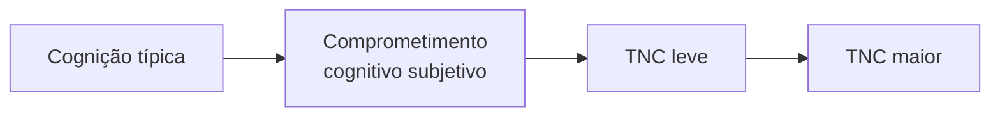

<!--
- **TNC** — transtorno neurocognitivo.
- **DSM-5** — Manual Diagnóstico e Estatístico de Transtornos Mentais, 5ª edição (APA).
- **Capítulo de referência** — Transtornos Neurocognitivos, na edição brasileira (Porto Alegre: Artmed).
-->

---
layout: agenda
kicker: Aula 04 · o caminho de hoje
title: Cinco blocos
items:
  - {
      topic: "Conceito e classificação",
      desc: "o que faz de um transtorno um transtorno neurocognitivo"
    }
  - {
      topic: "Critérios diagnósticos",
      desc: "delirium, TNC maior e TNC leve — e o critério que separa os dois"
    }
  - {
      topic: "Etiologias",
      desc: "a mesma síndrome, cinco causas com assinaturas diferentes"
    }
  - {
      topic: "Domínios cognitivos",
      desc: "o que se mede, com o quê, e por que o resultado é um perfil"
    }
  - {
      topic: "Avaliação neuropsicológica",
      desc: "cognição e funcionalidade: as duas metades do critério"
    }
---

<!--
Os cinco blocos reaparecem adiante como slides de seção, numerados de 01 a 05. A trilha de
progresso no topo dos slides mostra em qual deles a turma está.
-->

---
layout: section
index: "01"
kicker: Parte um
title: Conceito e classificação
subtitle: Déficits cognitivos existem em quase todo transtorno mental. Três
  características separam os que entram nesta categoria.
---

---
layout: define
kicker: O que o manual define
term: Transtorno neurocognitivo
definition: Déficit clínico <em>primário</em> na função cognitiva, e
  <em>adquirido</em> — um declínio a partir de um nível de funcionamento antes
  alcançado.
points:
  - "<strong>Primário</strong> exclui esquizofrenia e transtorno bipolar: neles há
    déficit cognitivo, mas a característica central é outra"
  - "<strong>Adquirido</strong> exclui deficiência intelectual e transtorno
    específico da aprendizagem: ali a função nunca esteve preservada"
  - "Fonte: APA, <em>DSM-5</em>, capítulo Transtornos Neurocognitivos"
---

<!--
- Deficiência intelectual e transtorno de aprendizagem são **transtornos do neurodesenvolvimento** — capítulo próprio do DSM-5.
- Texto do manual, para quem quiser a formulação inteira: "grupo de transtornos em que o déficit clínico primário está na função cognitiva e em que a cognição prejudicada não estava presente ao nascimento ou muito no início da vida — representando, portanto, um declínio a partir de um nível de funcionamento alcançado anteriormente".
-->

---
layout: diagram
kicker: Bloco 1 · em uma figura
title: Três marcas separam o TNC
note: A terceira é a mais incomum no manual — em nenhuma outra categoria do
  DSM-5 a investigação da patologia subjacente faz parte da estrutura do
  diagnóstico.
---

<Figure src="/tnc-tres-marcas.svg" alt="As três marcas do transtorno neurocognitivo: déficit primário na cognição, caráter adquirido e etiologia determinável" />

<!--
- **Patologia subjacente** — a alteração de tecido ou de circuito que produz o quadro: placas e emaranhados na doença de Alzheimer, infartos na doença vascular, corpos de Lewy, príons.
-->

---
layout: default
kicker: Bloco 1 · o diferencial de partida
title: A mesma queixa, três lugares diferentes do manual
---

<Grid head :data="[
  ['', 'TNC', 'Neurodesenvolvimento', 'Outro transtorno mental'],
  ['Déficit central', 'cognitivo', 'cognitivo', 'afetivo, psicótico ou ansioso'],
  ['Curso de vida', 'existiu e se perdeu', 'nunca se instalou', 'oscila com o quadro'],
  ['Etiologia', 'frequentemente determinável', 'multifatorial', 'não determinada'],
  ['Exemplo', 'perde o cálculo aos 70', 'deficiência intelectual', 'depressão com queixa de memória'],
]" />

<!--
- "Queixa de memória" é comum às três colunas — daí a do meio e a da direita serem os dois **diagnósticos diferenciais** que mais aparecem na prática.
- A coluna do meio se resolve pela história de desenvolvimento; a da direita, pelo exame do humor e da psicose.
-->

---
layout: section
index: "02"
kicker: Parte dois
title: Critérios diagnósticos
subtitle: Delirium, TNC maior e TNC leve
---

---
layout: steps
kicker: Critérios A a E · APA, DSM-5
title: Delirium
steps:
  - {
      icon: "lucide:eye",
      title: "Atenção e consciência",
      desc: "Perturbação da capacidade de dirigir, focalizar, manter e mudar o foco,
        e da orientação para o ambiente"
    }
  - {
      icon: "lucide:timer",
      title: "Horas a dias, e oscila",
      desc: "Instala-se de forma aguda e a gravidade muda dentro do mesmo dia"
    }
  - {
      icon: "lucide:layers",
      title: "Alteração cognitiva adicional",
      desc: "Memória, orientação, linguagem, capacidade visuoespacial ou percepção"
    }
  - {
      icon: "lucide:split",
      title: "Não é outro TNC, e não é coma",
      desc: "Não se explica por transtorno neurocognitivo preexistente"
    }
  - {
      icon: "lucide:pill",
      title: "Tem causa fisiológica",
      desc: "Condição médica, intoxicação, abstinência, toxina ou múltiplas etiologias"
    }
---

<!--
- **Basal** — o estado habitual da pessoa antes do episódio.
- **Abstinência** — quadro produzido pela retirada de uma substância de uso continuado.
- O delirium é o único quadro deste capítulo em que a **atenção** é a marca obrigatória.
-->

---
layout: diagram
kicker: Bloco 2 · em uma figura
title: O que o tempo mostra
note: O delirium é o único quadro do capítulo cuja gravidade muda entre a visita
  da manhã e a da noite.
---

<Figure src="/curso-delirium-tnc.svg" alt="À esquerda o delirium oscilando ao longo de um único dia; à direita o transtorno neurocognitivo declinando ao longo de anos" />

<!--
- **Delirium sobreposto a TNC** é frequente na internação: os dois diagnósticos coexistem, e o critério C do TNC exige apenas que os déficits não ocorram EXCLUSIVAMENTE no delirium.
- Por isso, na enfermaria, a pergunta não é "é delirium ou é demência?" — é "há delirium sobre o que já existia?".
-->

---
layout: steps
kicker: Critérios A a D · APA, DSM-5
title: TNC maior
steps:
  - {
      icon: "lucide:trending-down",
      title: "Declínio importante",
      desc: "Em um ou mais domínios, com as <strong>duas</strong> evidências: queixa
        (do próprio, de informante ou do clínico) e prejuízo no teste"
    }
  - {
      icon: "lucide:list-checks",
      title: "Interfere na independência",
      desc: "Nas atividades instrumentais da vida diária — a pessoa passa a
        precisar de assistência"
    }
  - {
      icon: "lucide:waves",
      title: "Não ocorre só no delirium",
      desc: "Os déficits persistem fora do episódio agudo"
    }
  - {
      icon: "lucide:split",
      title: "Não é outro transtorno mental",
      desc: "Exclui, entre outros, depressão maior e esquizofrenia"
    }
---

<Callout tone="muted" icon="lucide:info">
<strong>TNC maior</strong> é o que se chama de demência — mas é um termo mais amplo: abrange
também quem declinou em <strong>um só domínio</strong>.
</Callout>

<!--
- Declínio em **um só domínio**: o que o DSM-IV chamava de *transtorno amnéstico*, categoria para o prejuízo isolado de memória. No DSM-5 passou a ser codificado como TNC maior devido a outra condição médica — e nesse caso não se usa a palavra demência.
- **DSM-IV** — a edição anterior do manual, de 1994.
- **Atividades instrumentais** — as tarefas complexas do dia a dia, listadas no bloco 5.
-->

---
layout: default
kicker: Bloco 2 · o critério que decide
title: Maior e leve — o que muda é o B
---

<Grid head highlight="row:3" :data="[
  ['', 'TNC leve (o CCL)', 'TNC maior (a demência)'],
  ['A · declínio', '<b>pequeno</b> — prejuízo modesto no teste', '<b>importante</b> — prejuízo substancial'],
  ['B · independência', '<b>preservada</b>, com mais esforço ou estratégia', '<b>comprometida</b> — precisa de assistência'],
  ['Exemplo', 'passa a anotar o que antes lembrava', 'erra a dose do próprio remédio'],
]" />

<Callout tone="warn" icon="lucide:triangle-alert">
Os critérios C e D são <strong>idênticos</strong> nos dois níveis. O que separa um do outro é a
funcionalidade — e ela não sai da tabela normativa.
</Callout>

<!--
- **C** (não ocorre exclusivamente durante um delirium) e **D** (não é mais bem explicado por outro transtorno mental) valem, com a mesma redação, para o leve e para o maior.
- A funcionalidade sai da **história e do informante**, não do escore.
- **CCL** — comprometimento cognitivo leve, nome consagrado na literatura para o TNC leve.
- **AIVD** — atividades instrumentais da vida diária: dinheiro, medicação, transporte, telefone, compras, preparo de refeição.
-->

---
layout: diagram
kicker: Bloco 2 · em uma figura
title: Uma linha, não três caixas
note: O corte entre uma faixa e a seguinte é uma <em>convenção clínica</em> —
  existe porque a conduta muda, não porque a natureza mude ali.
highlight: ["Leve"]
---

<!--
- O **comprometimento cognitivo subjetivo** não é categoria do DSM-5; entra aqui porque é o que costuma chegar primeiro ao consultório. O próximo slide o define.
- A faixa acesa é o TNC leve: é onde a avaliação neuropsicológica muda mais a conduta.
-->

---
layout: define
kicker: Não é categoria do DSM-5
term: Comprometimento cognitivo subjetivo
definition: Declínio <em>percebido pela própria pessoa</em>, persistente, e com
  desempenho <em>normal</em> nos testes.
points:
  - "Pode ser a <strong>primeira manifestação sintomática</strong> da doença de
    Alzheimer, anterior ao comprometimento cognitivo leve"
  - "Ainda assim a maior parte <strong>não evolui</strong> — o que o quadro pede é
    acompanhamento, não diagnóstico"
  - "Fonte: Jessen et al., <em>Alzheimer&rsquo;s &amp; Dementia</em>, 2014"
---

<!--
- A **Subjective Cognitive Decline Initiative** descreve o CCS como possível primeira manifestação sintomática da doença de Alzheimer, anterior ao CCL.
- **SCD** — *subjective cognitive decline*, a sigla em inglês.
- **Fase pré-clínica** — aquela em que a patologia já existe mas ainda não produz alteração mensurável.
- Queixa não é diagnóstico: sem alteração no teste, não há critério A.
-->

---
layout: section
index: "03"
kicker: Parte três
title: Etiologias
subtitle: O declínio vem primeiro. A etiologia é acrescentada depois.
---

---
layout: diagram
kicker: Bloco 3 · em uma figura
title: Primeiro a síndrome, depois a causa
note: 'O diagnóstico completo tem três partes — <em>nível</em> (leve ou maior),
  <em>etiologia</em> e <em>grau de certeza</em>. Por exemplo: "TNC maior devido a
  provável doença de Alzheimer".'
---

<Figure src="/sindrome-e-etiologia.svg" alt="A síndrome de TNC no centro, as etiologias em ramos e o par provável ou possível" />

<!--
- **Provável** e **possível**: no DSM-5 o grau depende de evidência genética, de neuroimagem ou do perfil clínico característico. Sem nenhuma delas, o subtipo fica como "possível".
- **TCE** — traumatismo cranioencefálico.
-->

---
layout: feature
kicker: Subtipos etiológicos do DSM-5
title: As etiologias que mais aparecem
columns: 3
features:
  - {
      icon: "lucide:brain",
      title: "Doença de Alzheimer",
      desc: "Início insidioso, progressão gradual. Apresentação <strong>amnéstica</strong>"
    }
  - {
      icon: "lucide:heart-pulse",
      title: "Doença vascular",
      desc: "Ligada a evento cerebrovascular. Declínio <strong>atencional e
        executivo</strong>"
    }
  - {
      icon: "lucide:messages-square",
      title: "Frontotemporal",
      desc: "Variante <strong>comportamental</strong> ou <strong>linguística</strong>.
        Memória poupada"
    }
  - {
      icon: "lucide:eye",
      title: "Corpos de Lewy",
      desc: "Cognição <strong>oscilante</strong>, alucinações visuais, parkinsonismo.
        Perfil <strong>visuoperceptivo</strong>"
    }
  - {
      icon: "lucide:zap",
      title: "Doença do príon",
      desc: "<strong>Rara</strong> e <strong>rápida</strong> — meses. Mioclonia ou
        ataxia"
    }
  - {
      icon: "lucide:ellipsis",
      title: "E ainda",
      desc: "Parkinson, TCE, HIV, Huntington, substância, e múltiplas etiologias
        ao mesmo tempo"
    }
---

<!--
- **Alzheimer** — memória e aprendizagem primeiro.
- **Vascular** — ligada no tempo a um evento cerebrovascular, ou declínio em atenção complexa e função executiva frontal.
- **Frontotemporal comportamental** — desinibição, apatia, cognição social e executivas. **Linguística** — afasia.
- **Corpos de Lewy** — perfil visuoperceptivo e atencional, memória menos afetada (Mori et al., 2000; Calderón et al., 2001).
- **Príon** — 1 a 2 casos por milhão ao ano.
- **Insidioso** — de início lento e sem marco identificável. **Mioclonia** — contração muscular breve e involuntária. **Ataxia** — incoordenação do movimento. **Afasia** — perda adquirida da linguagem. **Parkinsonismo** — rigidez, bradicinesia e tremor.
-->

---
layout: image
kicker: Bloco 3 · o grau de certeza
title: Uma causa nomeada não muda a síndrome
image: /alois-alzheimer.jpg
side: left
alt: Retrato de Alois Alzheimer, 1864-1915
---

O diagnóstico de base continua sendo **TNC leve** ou **TNC maior**.

<Callout tone="info" icon="lucide:search">
<strong>Provável</strong> exige evidência forte: mutação, neuroimagem ou o perfil clínico
completo. <strong>Possível</strong> é o que resta quando a clínica é compatível mas a
confirmação não existe.
</Callout>

<!--
- Alois Alzheimer (1864-1915). Em 1906 descreveu o caso de **Auguste Deter**, 51 anos. Retrato em domínio público, Wikimedia Commons.
- Alzheimer descreveu, na necropsia de Auguste Deter, a alteração do tecido cerebral que hoje leva seu nome.
- **Necropsia** — exame do corpo após a morte. Até hoje a confirmação definitiva de várias dessas etiologias — a doença do príon inclusive — só é possível por biópsia ou necropsia.
- No TNC leve a confirmação costuma faltar: o DSM-5 observa que, nesse nível, com frequência o mais apropriado é o subtipo "não especificado".
-->

---
layout: image
kicker: Alzheimer · a lesão
title: Duas lesões, dois compartimentos
image: /hist-alzheimer.jpg
side: right
alt: Hipocampo em hematoxilina-eosina; no painel grande a placa neurítica entre
  as setas, e abaixo à esquerda o emaranhado neurofibrilar em chama dentro do
  neurônio
---

- **Fora** do neurônio — placas de **beta-amiloide**
- **Dentro** do neurônio — emaranhados de proteína **tau** hiperfosforilada
- Perda neuronal e atrofia cortical, a começar pelo **hipocampo**

<Callout tone="muted" icon="lucide:info">
É a distribuição dos <strong>emaranhados</strong> que acompanha o declínio cognitivo
(Trejo-Lopez et al., 2021).
</Callout>

<!--
- Imagem: hipocampo, hematoxilina-eosina. No painel grande, a **placa neurítica** entre as setas; abaixo, à esquerda, o **emaranhado neurofibrilar** em chama, dentro do neurônio. Mikael Häggström e brainmaps.org, CC BY 3.0, Wikimedia Commons.
- **A ordem das duas** — o amiloide se deposita antes e se espalha por fases; os emaranhados vêm depois, em estágios.
- **Beta-amiloide (Aβ)** — peptídeo derivado da clivagem da proteína precursora do amiloide (APP).
- **Tau** — proteína que estabiliza os microtúbulos do neurônio; hiperfosforilada, solta-se deles e se agrega em filamentos. **Hiperfosforilada** — com excesso de grupos fosfato ligados à molécula.
- **Placa neurítica** — depósito extracelular de amiloide cercado de prolongamentos neuronais doentes.
- **Fases de Thal** (amiloide) e **estágios de Braak** (emaranhados) — as duas escalas de distribuição usadas na necropsia.
-->

---
layout: columns
kicker: Alzheimer · a assinatura
title: Onde a lesão se instala, e o que cai
columns:
  - {
      title: "Onde",
      items: [
        "<strong>Córtex entorrinal</strong> e <strong>hipocampo</strong>, primeiro",
        "<strong>Associação temporoparietal</strong>, em seguida",
        "<strong>Neocórtex</strong> difuso, na fase maior"
      ]
    }
  - {
      title: "O que cai, nesta ordem",
      items: [
        "<strong>Aprendizagem e memória</strong> — a apresentação amnéstica",
        "<strong>Função executiva</strong>, já na fase leve",
        "<strong>Visuoconstrutiva</strong> e <strong>linguagem</strong>, na fase maior",
        "<strong>Cognição social</strong> poupada até tarde"
      ]
    }
---

<!--
- Fonte: APA, *DSM-5* — TNC maior ou leve devido à doença de Alzheimer.
- **Córtex entorrinal** — a porta de entrada do hipocampo, no lobo temporal medial.
- **Amnéstica** — a apresentação em que a perda de memória é o achado principal. Há apresentações não amnésticas, mais raras: a visuoespacial e a afásica logopênica.
- **Visuoconstrutiva** — a capacidade de copiar ou montar uma figura.
- **Cognição social** — reconhecer emoção no outro, ajustar o comportamento ao contexto.
-->

---
layout: image
kicker: Alzheimer · os marcadores
title: O que se vê antes da necropsia
image: /pet-amiloide-alzheimer.jpg
side: left
alt: PET com composto B de Pittsburgh; à esquerda doença de Alzheimer, à direita
  controle cognitivamente saudável
---

- **PET de amiloide** — o depósito aparece cedo na cascata
- No líquido cerebrospinal, **beta-amiloide 42 baixa** e **tau alta**
- **Ressonância** — atrofia do hipocampo e do temporoparietal
- **PET com FDG** — hipometabolismo temporoparietal

<!--
- Imagem: PET com composto B de Pittsburgh. À esquerda, doença de Alzheimer; à direita, controle cognitivamente saudável. Vermelho e amarelo marcam alta ligação ao beta-amiloide. Klunk e Mathis, University of Pittsburgh, CC BY-SA 3.0, Wikimedia Commons.
- **PET** — tomografia por emissão de pósitrons. **FDG** — fluordesoxiglicose, o marcador que mede consumo de glicose e, por ele, a atividade do tecido.
- **Composto B de Pittsburgh (PiB)** — o primeiro traçador que se liga ao amiloide no cérebro vivo.
- **Líquido cerebrospinal (LCS)** — o líquido que banha o encéfalo e a medula, colhido por punção lombar.
- **Beta-amiloide 42** — a fração de 42 aminoácidos, a que se agrega com mais facilidade. Cai no LCS porque fica retida no cérebro.
- **APOE4** não é marcador diagnóstico: é fator de risco, nem necessário nem suficiente.
-->

---
layout: image
kicker: Frontotemporal · a lesão
title: Uma síndrome, três proteínas
image: /rm-frontotemporal.png
side: right
alt: Ressonância em T2, T1 e FLAIR na doença de Pick, com sulcos frontais
  alargados e cornos frontais dilatados
---

- A patologia se chama **degeneração lobar frontotemporal** (DLFT)
- Três grupos moleculares: **tau**, **TDP-43** e **FET**
- Mutações conhecidas: **MAPT**, **GRN**, **C9ORF72**

<Callout tone="info" icon="lucide:users">
Cerca de <strong>40%</strong> têm história familiar de TNC precoce. É causa comum de TNC
<strong>antes dos 65 anos</strong>.
</Callout>

<!--
- Imagem: ressonância em T2, T1 e FLAIR na doença de Pick. Os sulcos frontais estão alargados e os cornos frontais dilatados — a atrofia é anterior e poupa o território posterior. Mikhail Kalinin, CC BY-SA 3.0, Wikimedia Commons.
- Classificação molecular: Neumann e Mackenzie, 2019. Cerca de **10%** têm padrão autossômico dominante.
- **DLFT** — degeneração lobar frontotemporal, o achado de necropsia. **TNC frontotemporal** é a síndrome clínica.
- **TDP-43** — proteína de resposta transativa de ligação ao DNA de 43 kDa. **FET** — a família que reúne FUS, EWS e TAF15.
- **MAPT** — gene da proteína tau associada aos microtúbulos. **GRN** — gene da granulina. **C9ORF72** — expansão repetida no cromossomo 9, ligada também à esclerose lateral amiotrófica.
- **Autossômico dominante** — basta uma cópia alterada do gene para a doença aparecer.
- **FLAIR** — sequência de ressonância que apaga o sinal do líquido e realça a lesão.
-->

---
layout: columns
kicker: Frontotemporal · a assinatura
title: Onde a atrofia aparece, e o que cai
columns:
  - {
      title: "Onde",
      items: [
        "<strong>Frontal medial</strong> e <strong>temporal anterior</strong> — variante comportamental",
        "<strong>Temporal anterior esquerdo</strong> — variante semântica",
        "<strong>Insular-frontal posterior esquerdo</strong> — variante não fluente"
      ]
    }
  - {
      title: "O que cai",
      items: [
        "<strong>Cognição social</strong> — desinibição, perda de empatia, apatia",
        "<strong>Função executiva</strong> — planejar, inibir, alternar",
        "<strong>Linguagem</strong>, nas variantes linguísticas",
        "<strong>Memória</strong> e <strong>perceptomotor</strong> relativamente poupados"
      ]
    }
---

<!--
- Fonte: APA, *DSM-5* — TNC frontotemporal maior ou leve.
- **Variante comportamental** — mudança de personalidade e conduta, com relativa preservação cognitiva no início.
- **Variante semântica** — perda do significado das palavras e dos objetos, com fala fluente.
- **Variante não fluente** — fala esforçada e agramatical, com compreensão de palavra preservada.
- **Variante logopênica** — pausas para encontrar a palavra e falha na repetição; costuma ser, na verdade, doença de Alzheimer.
- **Insular** — relativo à ínsula, o córtex escondido no fundo da fissura de Sylvius.
- **Perceptomotor** — o domínio que reúne percepção visual, práxis e coordenação visuomotora.
-->

---
layout: image
kicker: Vascular · a lesão
title: A lesão aqui é tecido perdido
image: /rm-vascular-leucoaraiose.jpg
side: right
alt: Ressonância em FLAIR, corte coronal, com setas marcando a leucoaraiose —
  hipersinal confluente da substância branca periventricular
---

- **Grande vaso** — o território arterial inteiro
- **Infarto estratégico** — tálamo, giro angular, prosencéfalo basal
- **Pequenos vasos** — lacunas e substância branca confluente

<Callout tone="warn" icon="lucide:scan-line">
Sem neuroimagem o infarto silencioso passa despercebido. O DSM-5 só chama de
<strong>provável</strong> com lesão documentada ou evento cerebrovascular datado.
</Callout>

<!--
- Imagem: ressonância em FLAIR, corte coronal. As setas marcam a leucoaraiose — o hipersinal confluente da substância branca periventricular — em paciente com atrofia associada. Jmarchn, CC BY-SA 3.0, Wikimedia Commons.
- **Leucoaraiose** — rarefação da substância branca, vista como hipersinal difuso na ressonância. Também chamada de doença de pequenos vasos ou alteração isquêmica subcortical.
- **Lacuna** — infarto pequeno e profundo, de um ramo arterial terminal.
- **Infarto estratégico** — lesão única que, pela posição, basta para o quadro cognitivo.
- **Prosencéfalo basal** — região da base do cérebro, origem da inervação colinérgica do córtex.
- **CADASIL** — arteriopatia cerebral autossômica dominante com infartos subcorticais e leucoencefalopatia: a forma hereditária.
- **Angiopatia amiloide cerebral** — depósito de amiloide na parede dos vasos.
-->

---
layout: columns
kicker: Vascular · a assinatura
title: Onde a lesão se instala, e o que cai
columns:
  - {
      title: "Onde",
      items: [
        "<strong>Substância branca</strong> frontal e periventricular",
        "<strong>Núcleos da base</strong> e <strong>tálamo</strong>",
        "O que se rompe é o <strong>circuito córtico-subcortical</strong>"
      ]
    }
  - {
      title: "O que cai",
      items: [
        "<strong>Velocidade de processamento</strong> — o critério B do DSM-5",
        "<strong>Atenção complexa</strong>",
        "<strong>Função executiva</strong> frontal",
        "Memória responde melhor à <strong>pista</strong> que no Alzheimer"
      ]
    }
---

<!--
- Fonte: APA, *DSM-5* — TNC vascular maior ou leve; subtipos em Sachdev et al., 2014.
- **Circuito córtico-subcortical** — as alças que ligam o córtex pré-frontal aos núcleos da base e ao tálamo, e voltam ao córtex. A lesão da substância branca as interrompe.
- **Velocidade de processamento** — quanto tempo se leva para executar uma tarefa cognitiva simples; mede-se cronometrando.
- **Depressão vascular** — sintomas depressivos tardios com lentificação e disfunção executiva, em idosos com doença isquêmica de pequenos vasos. Voltamos a ela da aula 03.
-->

---
layout: image
kicker: Corpos de Lewy · a lesão
title: Uma sinucleinopatia
image: /hist-lewy-sinucleina.jpg
side: left
alt: Neocórtex em imuno-histoquímica para alfa-sinucleína, com corpos de Lewy
  arredondados e neuritas de Lewy filamentosas em castanho
---

- Agregados de **alfa-sinucleína** mal enovelada dentro do neurônio
- No TNC com corpos de Lewy eles são sobretudo **corticais**
- Na doença de Parkinson, sobretudo nos **núcleos da base**

<!--
- Imagem: neocórtex, imuno-histoquímica para alfa-sinucleína. Em castanho, os corpos de Lewy — os grumos arredondados — e as neuritas de Lewy, os filamentos finos. Movalley, CC0, Wikimedia Commons.
- **Alfa-sinucleína** — proteína pré-sináptica que, mal enovelada, se agrega em corpos e neuritas.
- **Sinucleinopatia** — a família de doenças definidas por esses agregados.
- **Imuno-histoquímica** — técnica que marca uma proteína específica com anticorpo, e a revela em castanho no tecido.
- **Corpo de Lewy** — inclusão arredondada no corpo do neurônio. **Neurita de Lewy** — a mesma proteína agregada dentro do prolongamento.
- **Mal enovelada** — com a forma tridimensional errada, o que a torna insolúvel e propensa a agregar.
-->

---
layout: columns
kicker: Corpos de Lewy · a assinatura
title: Onde a lesão se instala, e o que cai
columns:
  - {
      title: "Onde",
      items: [
        "<strong>Córtex occipital</strong> — hipometabolismo em PET e SPECT",
        "<strong>Via nigroestriatal</strong> — captação reduzida do transportador de dopamina",
        "<strong>Temporal medial</strong> relativamente preservado"
      ]
    }
  - {
      title: "O que cai",
      items: [
        "<strong>Atenção complexa</strong> — e ela <strong>oscila</strong> ao longo do dia",
        "<strong>Função executiva</strong>",
        "<strong>Visuoperceptivo</strong> e <strong>visuoconstrutivo</strong>",
        "<strong>Memória</strong> menos afetada no começo"
      ]
    }
---

<!--
- Fonte: APA, *DSM-5*; marcadores em McKeith et al., 2017.
- **SPECT** — tomografia computadorizada por emissão de fóton único.
- **Via nigroestriatal** — o feixe dopaminérgico que liga a substância negra ao estriado.
- **Transportador de dopamina (DAT)** — a proteína que recolhe a dopamina da fenda sináptica; a captação baixa indica perda dos terminais.
- **Cintilografia miocárdica com MIBG** — exame que mostra denervação simpática do coração, marcador sugestivo no consenso de 2017.
- **Sono REM** — no transtorno comportamental do sono REM a pessoa executa fisicamente o que sonha.
- **Sensibilidade neuroléptica** — reação grave a antipsicóticos, em até metade dos casos. É o dado de conduta mais importante deste slide.
-->

---
layout: image
kicker: Príon · a lesão
title: Uma proteína que muda de forma
image: /hist-prion-espongiforme.jpg
side: right
alt: Córtex em hematoxilina-eosina na variante da doença de Creutzfeldt-Jakob,
  com vacúolos claros dando ao tecido o aspecto de esponja
---

- A **PrP** normal é rica em **alfa-hélice**; a alterada, em **folha beta**
- A forma alterada **molda** as moléculas seguintes — ela se autopropaga
- O resultado é a **encefalopatia espongiforme**

<Callout tone="bad" icon="lucide:triangle-alert">
Cerca de <strong>1 a 2 casos por milhão</strong> ao ano. Progride para TNC maior em
<strong>semanas a meses</strong>, não em anos.
</Callout>

<!--
- Imagem: córtex em hematoxilina-eosina na variante da doença de Creutzfeldt-Jakob. Os vacúolos claros dão ao tecido o aspecto de esponja, sem sinal de inflamação. Zaki e Shieh, CDC / Public Health Image Library #10131, domínio público.
- Mecanismo da conversão: Colby e Prusiner, 2011.
- **Príon** — partícula infecciosa feita só de proteína, sem ácido nucleico.
- **PrP** — proteína priônica. **PrP-C** é a isoforma celular normal; **PrP-Sc**, a patogênica, insolúvel e resistente às proteases.
- **Alfa-hélice** e **folha beta** — as duas formas básicas de dobramento de uma cadeia de proteína.
- **DCJ** — doença de Creutzfeldt-Jakob. A esporádica é a mais comum; a variante está ligada à encefalopatia espongiforme bovina.
- Kuru, síndrome de Gerstmann-Sträussler-Scheinker e insônia fatal completam o grupo.
-->

---
layout: image
kicker: Príon · os marcadores
title: O exame que sustenta a suspeita
image: /rm-prion-flair.jpg
side: left
alt: Ressonância na doença de Creutzfeldt-Jakob, com hipersinal nos núcleos da
  base em FLAIR e DWI, a fita cortical e o tálamo
---

- **Ressonância com DWI** — hoje o teste mais sensível
- **Eletrencefalograma** — descargas trifásicas periódicas, de 0,5 a 2 Hz
- No líquido cerebrospinal, proteína **14-3-3** e **tau**

<Callout tone="muted" icon="lucide:microscope">
A confirmação definitiva só vem por <strong>biópsia ou necropsia</strong>. O DSM-5 pede ao
menos um marcador característico antes de dar o diagnóstico.
</Callout>

<!--
- Imagem: A e B, hipersinal nos núcleos da base em FLAIR e em DWI; C, a fita cortical; D, o tálamo. *Practical Neurology*, CC BY 4.0, Wikimedia Commons.
- **DWI** — difusão ponderada, sequência de ressonância sensível ao movimento das moléculas de água.
- **Fita cortical** — o hipersinal fino que acompanha o contorno do córtex.
- **EEG** — registro da atividade elétrica do córtex. **Hz** — hertz, ciclos por segundo.
- **Onda trifásica** — onda lenta com três deflexões, achado clássico mas nem sempre presente.
- **Proteína 14-3-3** — marcador de destruição neuronal rápida; útil sobretudo na DCJ esporádica.
-->

---
layout: columns
kicker: Príon · a assinatura
title: Onde o sinal aparece, e o que cai
columns:
  - {
      title: "Onde",
      items: [
        "<strong>Córtex</strong> — a fita cortical em DWI e FLAIR",
        "<strong>Estriado</strong> — caudado e putame",
        "<strong>Tálamo</strong>, sobretudo na variante",
        "<strong>Cerebelo</strong>, nos sinais motores"
      ]
    }
  - {
      title: "O que cai",
      items: [
        "Declínio <strong>global</strong>, e não de um domínio só",
        "Junto vêm <strong>mioclonia</strong>, <strong>ataxia</strong> e reflexo de sobressalto",
        "Na variante, os sintomas <strong>psiquiátricos</strong> vêm antes"
      ]
    }
---

<!--
- Fonte: APA, *DSM-5* — TNC maior ou leve devido à doença do príon.
- **Estriado** — caudado e putame, dois dos núcleos da base.
- **Reflexo de sobressalto** — resposta motora exagerada a um estímulo súbito.
- Pela velocidade, o transtorno costuma ser encontrado só no nível maior — quase não há janela de TNC leve.
-->

---
layout: default
kicker: Bloco 3 · síntese
title: Cinco etiologias, cinco assinaturas
---

<Grid head :data="[
  ['', 'A lesão', 'As regiões', 'O que cai primeiro'],
  ['Alzheimer', 'placas de <b>beta-amiloide</b> e emaranhados de <b>tau</b>', 'entorrinal e hipocampo', 'aprendizagem e memória'],
  ['Frontotemporal', 'DLFT — <b>tau</b>, <b>TDP-43</b> ou <b>FET</b>', 'frontal medial e temporal anterior', 'cognição social e executiva'],
  ['Vascular', 'infarto e lesão da substância branca', 'circuito córtico-subcortical', 'velocidade e executiva'],
  ['Corpos de Lewy', 'agregados de <b>alfa-sinucleína</b>', 'occipital e nigroestriatal', 'atenção complexa, oscilante'],
  ['Príon', '<b>PrP</b> mal enovelada, tecido espongiforme', 'córtex, estriado e tálamo', 'tudo, em poucos meses'],
]" />

<!--
- A tabela lê-se da **esquerda para a direita**: a lesão explica a região, e a região explica o domínio.
- Nenhuma linha é exclusiva — **patologias mistas são a regra no idoso**, e nesse caso o DSM-5 pede o subtipo "devido a múltiplas etiologias".
- Síntese do capítulo de Transtornos Neurocognitivos do *DSM-5*.
-->

---
layout: section
index: "04"
kicker: Parte quatro
title: Domínios cognitivos
subtitle: É aqui que o neuropsicólogo entra. A alteração nos domínios é o
  critério A — o que sustenta o diagnóstico.
---

---
layout: diagram
kicker: Bloco 4 · em uma figura
title: Os seis domínios
note: O DSM-5 os define em uma tabela de três colunas — o nome, os exemplos de
  sintomas e os exemplos de avaliação. Os dois próximos slides a condensam.
---

<Figure src="/seis-dominios.svg" alt="Os seis domínios neurocognitivos do DSM-5 dispostos ao redor de um centro" />

<!--
- Tabela 1 do capítulo, "Domínios neurocognitivos". Os mesmos seis nomes aparecem, na mesma ordem, dentro do **critério A** do TNC maior e do TNC leve.
-->

---
layout: default
kicker: Tabela 1 do DSM-5 · condensada
title: Domínios · 1 de 2
---

<Grid head :data="[
  ['', 'O que se vê no dia a dia', 'O que o teste pede'],
  ['Atenção complexa', 'distrai-se com TV e conversa ao redor; não retém um telefone recém-dito', 'atenção sustentada, seletiva e dividida; velocidade de processamento'],
  ['Função executiva', 'abandona projetos complexos; multitarefa fica difícil', 'planejamento; memória de trabalho; inibição; flexibilidade mental'],
  ['Aprendizagem e memória', 'repete-se na mesma conversa; conta cada vez mais com lista e calendário', '<b>evocação livre</b>, <b>com pistas</b> e <b>reconhecimento</b>; memória semântica'],
]" />

<!--
- **Atenção complexa** — todo pensamento leva mais tempo que o normal. Velocidade de processamento se quantifica cronometrando a tarefa.
- **Função executiva** — passa a depender de outros para planejar; retomar tarefa interrompida cansa. Testes de planejamento (labirinto), tomada de decisão, resposta a feedback.
- **Memória de trabalho** — manter uma informação por período curto E manipulá-la: série de números de trás para a frente.
- **Memória semântica** — memória de fatos. **Autobiográfica** — de eventos e pessoas da própria vida. **Aprendizagem implícita** — aprendizagem inconsciente de procedimentos e habilidades.
-->

---
layout: default
kicker: Tabela 1 do DSM-5 · condensada
title: Domínios · 2 de 2
---

<Grid head :data="[
  ['', 'O que se vê no dia a dia', 'O que o teste pede'],
  ['Linguagem', 'dificuldade para achar palavras; usa &quot;aquela coisa&quot;; adiante, ecolalia e mutismo', 'nomeação confrontativa; fluência semântica e fonêmica; compreensão de comando'],
  ['Perceptomotor', 'perde-se em ambiente conhecido; dificuldade para dirigir e usar ferramenta', 'visuoconstrutiva (copiar, montar); práxis; gnosia de rostos e cores'],
  ['Cognição social', 'comportamento fora da variação aceitável; menos empatia; decide sem pesar risco', 'reconhecimento de emoções em rostos; teoria da mente'],
]" />

<!--
- **Linguagem** — prefere pronome genérico, erra artigo e preposição. A fluência é medida em um minuto; a linguagem receptiva, por compreensão e execução de comando verbal.
- **Perceptomotor** — confunde-se ao anoitecer, estaciona com menos precisão. Também percepção visual sem mediação verbal e tarefas perceptomotoras (encaixar pinos).
- **Cognição social** — insensibilidade a padrões de pudor; decide sem considerar a segurança; no leve, mudança sutil de atitude. **Teoria da mente** se avalia com cartões que contam uma história e perguntas sobre o estado mental dos personagens.
- **Nomeação confrontativa** — mostrar uma figura e pedir o nome. **Fluência semântica** — itens de uma categoria (animais); **fonêmica** — palavras começadas por uma letra.
- **Práxis** — integridade dos movimentos aprendidos. **Gnosia** — integridade do reconhecimento. **Ecolalia** — repetição da fala do interlocutor. **Mutismo** — ausência de fala.
-->

---
layout: vs
kicker: Aprendizagem e memória · Tabela 1
title: O mesmo domínio, dois níveis
label: "·"
left:
  title: "No TNC maior"
  items:
    - "Repete-se <strong>na mesma conversa</strong>"
    - "Não se atém a uma lista curta de compras"
    - "Precisa de <strong>lembretes frequentes</strong> para orientar uma tarefa em andamento"
right:
  title: "No TNC leve"
  items:
    - "Conta <strong>cada vez mais com listas e calendário</strong>"
    - "Precisa reler para acompanhar os personagens de um livro"
    - "Não sabe dizer se as contas já foram pagas"
---

<Callout tone="accent" icon="lucide:anchor">
Não são sintomas diferentes: é o <strong>mesmo sintoma em outra intensidade</strong>. Por isso o
critério que separa os níveis não está no domínio, e sim na funcionalidade.
</Callout>

<!--
- Fonte: Tabela 1, linha "Aprendizagem e memória", APA, *DSM-5*.
- É o mesmo ponto do slide "Maior e leve": o domínio diz **o que** falhou; a funcionalidade diz **quanto**.
-->

---
layout: chart
kicker: Bloco 4 · o resultado da testagem
title: O resultado é um perfil, não um número
note: Seis medidas do mesmo paciente, em desvios-padrão <em>abaixo</em> da média
  normativa. É a <em>forma</em> do perfil — e não a média dela — que orienta a
  hipótese etiológica. Perfil ilustrativo.
chart:
  type: bar
  unit: " DP"
  horizontal: true
  height: "320px"
  categories:
    - Cognição social
    - Atenção complexa
    - Linguagem
    - Perceptomotor
    - Função executiva
    - Aprendizagem e memória
  series:
    - { name: "Desvios abaixo da média", data: [0.2, 0.5, 0.9, 1.1, 1.6, 2.7] }
---

<!--
- Leitura deste perfil: **memória rebaixada** (abaixo de −2 DP) com **executivas limítrofes** (−1 a −2 DP) e o resto dentro do esperado. É o desenho amnéstico — compatível com doença de Alzheimer.
- **Escore z** e **DP** — quantos desvios-padrão o desempenho está acima ou abaixo da média do grupo normativo **de mesma idade e escolaridade**. z = −2 corresponde ao percentil 2.
- Convenção de leitura: até −1 DP, dentro do esperado; de −1 a −2 DP, limítrofe; abaixo de −2 DP, rebaixado.
- Se a barra maior fosse a de atenção complexa, e ela oscilasse entre as sessões, a hipótese seria outra.
-->

---
layout: section
index: "05"
kicker: Parte cinco
title: Avaliação neuropsicológica
subtitle: As duas metades do critério — cognição e funcionalidade
---

---
layout: diagram
kicker: Bloco 5 · em uma figura
title: Duas perguntas, não uma
note: As duas metades vêm de fontes diferentes — a primeira, da testagem
  padronizada; a segunda, da entrevista com quem convive com a pessoa.
---

<Figure src="/cognicao-e-funcionalidade.svg" alt="À esquerda a medida da cognição por domínio; à direita a checagem das atividades instrumentais com informante; as duas convergem para o diagnóstico" />

<!--
- O **critério A** do TNC exige as duas evidências: preocupação (do próprio, de informante ou do clínico) E prejuízo documentado. Uma sozinha não fecha o critério.
- E o **critério B** — a funcionalidade — não sai de nenhum teste.
-->

---
layout: statement
kicker: Bloco 5 · para discutir
title: O escore caiu. <em>Por qual caminho?</em>
---

Um escore baixo é o **fim** de uma cadeia, não o começo. Separar as hipóteses que levam a ele
é o trabalho da avaliação neuropsicológica — **nenhum rastreio faz isso**.

<Tags :items="['prejuízo de memória ou de atenção?', 'a memória melhora com dica?', 'atenção ou controle inibitório?', 'esquecimento ou acesso lexical?']" />

<!--
- A mesma pontuação em evocação livre pode vir de **não ter prestado atenção**, de **não ter guardado**, de **não conseguir buscar** ou de **não achar a palavra** — e cada uma dessas hipóteses leva a uma conduta diferente.
- **Acesso lexical** — a recuperação da forma da palavra na memória de longo prazo, o "está na ponta da língua". É função de linguagem, não de memória episódica.
- **Rastreio** — instrumento breve de triagem, como o MEEM ou o MoCA, que produz um escore global.
- Deixe a turma responder antes de virar o slide.
-->

---
layout: steps
kicker: Bloco 5 · o raciocínio por trás do escore
title: As quatro perguntas
steps:
  - {
      icon: "lucide:circle-help",
      title: "Memória ou atenção?",
      desc: "O material chegou a entrar?"
    }
  - {
      icon: "lucide:search",
      title: "A memória melhora com dica?",
      desc: "O item estava guardado, ou não estava?"
    }
  - {
      icon: "lucide:shuffle",
      title: "Atenção ou controle inibitório?",
      desc: "Sustentar o foco, ou vencer o automático?"
    }
  - {
      icon: "lucide:message-circle",
      title: "Esquecimento ou acesso lexical?",
      desc: "Memória episódica, ou linguagem?"
    }
---

<!--
AS RESPOSTAS — não estão no slide de propósito; são a fala.

1. **Memória ou atenção?** Se a atenção não sustentou a tarefa, o material nunca foi codificado, e o que parece esquecimento é falha de entrada. Compara-se a memória imediata com a recente, e as duas com a atenção sustentada e a velocidade de processamento.
2. **Melhora com dica?** Comparam-se evocação livre, evocação com pistas e reconhecimento — as três formas que o próprio DSM-5 lista. Se a pista recupera o item, ele estava guardado. Se não recupera, não estava.
3. **Atenção ou inibição?** São coisas diferentes na tabela: atenção seletiva é manter o foco apesar do distrator; inibição é escolher a resposta difícil em vez da automática — nomear a cor da fonte, e não a palavra escrita.
4. **Esquecimento ou acesso lexical?** "Não lembro o nome" pode ser memória ou linguagem. A nomeação confrontativa e a fluência separam as duas: quem tem anomia falha em nomear a figura que está vendo — não há nada a esquecer ali.

- **Anomia** — dificuldade específica para nomear, com compreensão preservada.
- **Codificação** — a entrada da informação no sistema de memória. **Armazenamento** — a manutenção dela ao longo do tempo. **Evocação** — a recuperação.
-->

---
layout: diagram
kicker: Bloco 5 · a pergunta 2, em uma figura
title: Livre, com pista, reconhecimento
note: Grober e Buschke mostraram que a evocação com pista, depois de uma
  codificação controlada, separa o déficit <em>genuíno</em> de memória do
  prejuízo aparente produzido por atenção ou por busca ineficiente.
---

<Figure src="/memoria-com-dica.svg" alt="Dois padrões de recuperação: um paciente melhora com a pista, o outro não" />

<!--
- Grober, E. e Buschke, H. (1987). *Genuine memory deficits in dementia*. Developmental Neuropsychology, 3(1), 13-36.
- O paradigma deu origem ao **FCSRT** (*Free and Cued Selective Reminding Test*).
- Quem melhora com a pista tem problema de **busca**; quem não melhora tem problema de **armazenamento**.
-->

---
layout: define
kicker: DSM-5 · critério B
term: Atividades instrumentais da vida diária
definition: As tarefas complexas de manter a própria vida — <em>pagar contas,
  controlar a medicação</em>, usar transporte e telefone, fazer compras, preparar
  refeição.
points:
  - "São as <strong>instrumentais</strong> — e não as básicas, como vestir-se e
    alimentar-se — que o critério B examina"
  - "Três coisas que só a entrevista responde: <strong>existe prejuízo
    funcional?</strong> <strong>quando começou e como andou?</strong> <strong>o que
    mais está em jogo?</strong>"
  - "Escala de informante validada para o Brasil: <strong>P-FAQ</strong> (Assis et
    al., 2014)"
---

<!--
- **Prejuízo funcional** — sempre em relação ao que a pessoa fazia antes, não em relação a uma média.
- **Início e curso** — súbito ou insidioso, em degraus ou contínuo. É o dado que mais aponta etiologia.
- **O que mais está em jogo** — medicação, álcool, déficit sensorial não corrigido, dor, insônia, doença clínica descompensada.
- **Informante** — pessoa que convive com o paciente e pode relatar mudanças. Não precisa ser familiar, mas precisa ter convivência regular e anterior ao quadro.
-->

---
layout: steps
kicker: Bloco 5 · a ordem do raciocínio
title: Do encaminhamento à hipótese etiológica
steps:
  - { icon: "lucide:message-circle", title: "Queixa", desc: "do próprio, do informante ou do clínico" }
  - { icon: "lucide:graduation-cap", title: "Nível prévio", desc: "escolaridade e ocupação" }
  - { icon: "lucide:calendar-clock", title: "Início e curso", desc: "quando começou, como andou" }
  - { icon: "lucide:pill", title: "Comorbidades", desc: "clínicas, psiquiátricas, medicações" }
  - { icon: "lucide:ruler", title: "Testagem", desc: "os seis domínios, com norma adequada" }
  - { icon: "lucide:list-checks", title: "Funcionalidade", desc: "AIVD, com informante" }
  - { icon: "lucide:git-branch", title: "Diferencial", desc: "e só então a etiologia" }
---

<!--
- A sequência **não é obrigatória nem de mão única**: um achado da história muda a hipótese e faz o caminho voltar atrás.
- **Nível prévio de desempenho** — o critério A do DSM-5 pede comparação com ele, não com a média da população. Escolaridade e ocupação são as estimativas de que se dispõe na prática.
- **Comorbidade** — outra condição presente ao mesmo tempo.
-->

---
layout: panels
kicker: Para levar
title: Três coisas que ficam
panels:
  - {
      icon: "lucide:anchor",
      title: "A síndrome vem antes da causa",
      body: "Déficit <strong>primário</strong>, <strong>adquirido</strong>, com
        etiologia buscada. Primeiro o nível, depois o subtipo, depois o grau de
        certeza."
    }
  - {
      icon: "lucide:list-checks",
      title: "O que separa leve de maior",
      body: "Não é o escore: é a <strong>independência</strong>. E ela não sai da
        tabela normativa — sai da entrevista com o informante."
    }
  - {
      icon: "lucide:git-branch",
      title: "Um escore baixo tem muitas origens",
      body: "Separá-las é o trabalho do neuropsicólogo. <strong>Nenhum rastreio faz
        isso.</strong>"
    }
---

---
layout: diagram
kicker: Fim
title: O que acham que a gente faz, e o que a gente faz
note: O bloco 5 é <em>investigativo</em> — a pergunta não é qual o escore, é por
  qual caminho ele chegou ali.
---

<Figure src="/oqueachamoquee.jpg" alt="À esquerda, a imagem que se faz do neuropsicólogo aplicando testes; à direita, o trabalho de cruzar evidências como numa investigação" />

<!--
- Fecho leve, mas o ponto é sério: o trabalho do bloco 5 é **investigativo**, não de aplicar e somar.
-->

---
layout: reference
kicker: Referências · 1 de 2
title: Base primária e conceitos
items:
  - {
      term: "APA, DSM-5",
      desc: "<em>Manual Diagnóstico e Estatístico de Transtornos Mentais</em>, 5ª ed.
        Porto Alegre: Artmed. Capítulo <strong>Transtornos Neurocognitivos</strong> —
        <strong>base primária desta aula</strong>."
    }
  - {
      term: "Jessen et al., 2014",
      desc: "A conceptual framework for research on subjective cognitive decline in
        preclinical Alzheimer disease. <em>Alzheimer&rsquo;s &amp; Dementia</em>,
        10(6), 844-852."
    }
  - {
      term: "Grober e Buschke, 1987",
      desc: "Genuine memory deficits in dementia. <em>Developmental
        Neuropsychology</em>, 3(1), 13-36."
    }
  - {
      term: "Mori et al., 2000",
      desc: "<em>Archives of Neurology</em>, 57(4), 489-493; e Calderón et al., 2001,
        <em>J Neurol Neurosurg Psychiatry</em>, 70(2), 157-164."
    }
  - {
      term: "Assis et al., 2014",
      desc: "Brazilian version of Pfeffer&rsquo;s Functional Activities Questionnaire.
        <em>Frontiers in Aging Neuroscience</em>, 6, 255."
    }
---

<!--
- O retrato de Alois Alzheimer está em **domínio público** (Wikimedia Commons). Os esquemas da aula são autorais.
-->

---
layout: reference
kicker: Referências · 2 de 2
title: As etiologias
items:
  - {
      term: "Trejo-Lopez et al., 2021",
      desc: "Neuropathology of Alzheimer&rsquo;s disease.
        <em>Neurotherapeutics</em>, 19(1), 173-185.
        doi:10.1007/s13311-021-01146-y"
    }
  - {
      term: "Neumann e Mackenzie, 2019",
      desc: "Neuropathology of non-tau frontotemporal lobar degeneration.
        <em>Neuropathology and Applied Neurobiology</em>, 45(1), 19-40.
        doi:10.1111/nan.12526"
    }
  - {
      term: "Sachdev et al., 2014",
      desc: "Diagnostic criteria for vascular cognitive disorders: a VASCOG
        statement. <em>Alzheimer Disease &amp; Associated Disorders</em>, 28(3),
        206-218. doi:10.1097/WAD.0000000000000034"
    }
  - {
      term: "McKeith et al., 2017",
      desc: "Diagnosis and management of dementia with Lewy bodies: fourth consensus
        report of the DLB Consortium. <em>Neurology</em>, 89(1), 88-100.
        doi:10.1212/WNL.0000000000004058"
    }
  - {
      term: "Colby e Prusiner, 2011",
      desc: "Prions. <em>Cold Spring Harbor Perspectives in Biology</em>, 3(1),
        a006833. doi:10.1101/cshperspect.a006833"
    }
---

<!--
- As cinco referências complementam o DSM-5 no que ele não detalha: o estadiamento das lesões do Alzheimer, a classificação molecular da degeneração frontotemporal, os subtipos vasculares, os biomarcadores dos corpos de Lewy e o mecanismo da conversão priônica.
- **doi** — identificador digital de objeto, o endereço permanente de um artigo científico.
- As imagens de exame vêm do Wikimedia Commons, creditadas slide a slide nas notas.
-->
