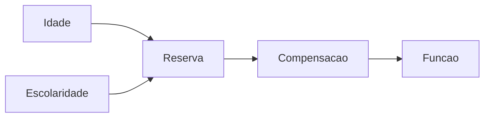

<!--
Este deck fica FORA de aulas/, então o build nunca o publica. Ele existe para você ver os layouts
renderizados em vez de lidos — abra com `npm run ref`.

Quando criar um layout ou componente novo, acrescente um slide aqui. Um catálogo desatualizado é
pior do que catálogo nenhum: ele ensina errado com autoridade.
-->

---
layout: agenda
kicker: O que tem aqui
title: O caminho do catálogo
items:
  - { topic: "Aberturas e pontuação", desc: "cover, lead, section, end, statement, bigtype, quote" }
  - { topic: "Conteúdo", desc: "default, define, columns, panels, vs, steps, agenda, reference, timeline" }
  - { topic: "Números e dados", desc: "stats, metric, fact, chart, diagram, compare" }
  - { topic: "Imagem e mídia", desc: "image, showcase, bleed, embed, logos, feature" }
  - { topic: "Código", desc: "code, code-explain, two-cols" }
  - { topic: "Componentes", desc: "os 17 que se compõem no corpo de um slide" }
---

---
layout: section
index: "01"
kicker: Parte um
title: Aberturas e pontuação
subtitle: Os slides que abrem, dividem e pontuam — não os que ensinam.
---

---
layout: cover
kicker: Neuropsicologia II · FASM
title: A capa, com <em>ênfase</em> no título
subtitle: Kicker, título e subtítulo centrados. A porta do deck.
---

<!-- Use quando quiser a abertura clássica e simétrica. Para algo mais dramático, `lead`. -->

---
layout: lead
index: "01"
kicker: A alternativa dramática
title: O título ancorado <em>embaixo</em>, e muito ar.
subtitle: O espaço em branco é o elemento de composição, não sobra.
---

<!-- É o layout de abertura das duas aulas. `index` vira o numeral gigante e apagado à direita. -->

---
layout: section
index: "02"
kicker: Divisória
title: A divisória de parte
subtitle: Também é o que alimenta a trilha de progresso no topo dos slides seguintes.
---

<!-- Agrupe a aula em 3 a 6 sections. A trilha aparece sozinha quando existem pelo menos duas. -->

---
layout: statement
kicker: A pausa
title: Uma frase grande, centrada, e nada competindo com ela.
---

O corpo é opcional — cabe uma linha de apoio ou um componente solto.

<!-- O slide de respiro. Bom depois de um bloco denso, para deixar a tese assentar. -->

---
layout: bigtype
kicker: A virada
title: Quando a frase <em>é</em> o slide.
subtitle: Tipo em sangria, ajustado para caber sozinho.
---

<!-- Momento de pontuação, para virar a página do argumento. Não use dois seguidos. -->

---
layout: quote
quote: O objetivo é distinguir os padrões de mudança <em>típicos</em> da velhice daqueles que apenas a acompanham.
author: Um manual qualquer de gerontologia
---

<!-- As aspas são desenhadas fora da coluna de texto, então a primeira linha continua alinhada. -->

---
layout: end
title: E o fechamento
subtitle: O espelho da capa, com uma régua curta acima do título.
contact: neuropsicologia@fasm.edu.br
---

---
layout: section
index: "03"
kicker: Parte dois
title: Conteúdo
subtitle: Os layouts que carregam o argumento da aula.
---

---
layout: default
kicker: O uso geral
title: A tela em branco do tema
---

- O corpo é markdown puro: listas, parágrafos, ênfase
- Os marcadores usam o quadrado do tema, não a bolinha do navegador
- A medida de leitura é limitada a ~64 caracteres — acima disso o olho perde a linha

<Callout icon="lucide:lightbulb">
É aqui que se compõem os componentes. Um deck só de campos de layout sai igual a todos os outros.
</Callout>

<!-- `class: dropcap` dá capitular ao primeiro parágrafo. `wide: true` solta a medida de leitura. -->

---
layout: define
kicker: O conceito
term: Senescência
definition: O envelhecimento <span class="accent2">normal</span> — a perda gradual de reserva que acontece em todo mundo que vive o bastante.
points:
  - Universal e determinada geneticamente na espécie
  - Distinta de senilidade, que é processo patológico
  - Começa logo após a maturidade sexual
---

<!-- O layout mais usado num curso que passa horas distinguindo um termo do outro. -->

---
layout: columns
kicker: Listas paralelas
title: Duas ou três colunas com cabeça própria
columns:
  - { title: "O que declina", items: ["Velocidade de processamento", "Memória episódica", "Função executiva complexa"] }
  - { title: "O que se mantém", items: ["Vocabulário", "Conhecimento acumulado", "Regulação emocional"] }
---

<!-- Use quando as listas se comparam item a item. Se cada bloco se lê sozinho, prefira `panels`. -->

---
layout: panels
kicker: Subtemas fechados
title: De dois a quatro cartões
panels:
  - { icon: "lucide:heart-pulse", title: "Cardiovascular", items: ["Enrijecimento arterial", "Queda do débito"] }
  - { icon: "lucide:wind", title: "Respiratório", items: ["Menor reserva ventilatória", "Sensibilidade à hipoxia"] }
  - { icon: "lucide:filter", title: "Renal", items: ["Menor depuração de fármacos"] }
  - { icon: "lucide:brain", title: "Nervoso", items: ["Lentificação", "Compensação frontal"] }
---

<!-- A grade se ajusta sozinha: 2 lado a lado, 3 em fila, 4 em dois por dois. -->

---
layout: vs
kicker: O confronto
title: Dois lados com o mesmo peso gráfico
left: { title: "Envelhecimento normal", items: ["Perda gradual e previsível", "Preserva a autonomia", "Compensa com estratégia"] }
right: { title: "Processo patológico", items: ["Perda acelerada", "Compromete a funcionalidade", "Não responde à compensação"] }
label: "×"
---

<!-- Os dois painéis são idênticos de propósito: dar mais peso a um responderia a pergunta. -->

---
layout: steps
kicker: A sequência
title: Um processo em etapas
steps:
  - { title: "Anamnese", desc: "queixa, história, medicação em uso", icon: "lucide:clipboard-list" }
  - { title: "Rastreio", desc: "instrumento breve para decidir a profundidade", icon: "lucide:filter" }
  - { title: "Bateria", desc: "os domínios que a hipótese pede", icon: "lucide:layers" }
  - { title: "Devolutiva", desc: "o que muda na vida da pessoa", icon: "lucide:message-circle" }
---

<!-- O fio vertical entre os numerais é o que diz "isto é sequência". Para ordem sem causa, `agenda`. -->

---
layout: reference
kicker: A folha de consulta
title: Termos e siglas
groups:
  - { title: "Rastreio", items: [{ term: "MEEM", desc: "Mini-Exame do Estado Mental" }, { term: "MoCA", desc: "Montreal Cognitive Assessment" }] }
  - { title: "Funcionalidade", items: [{ term: "AVD", desc: "atividades de vida diária" }, { term: "AIVD", desc: "atividades instrumentais" }] }
  - { title: "Reserva", items: [{ term: "RC", desc: "reserva cognitiva" }, { term: "RCe", desc: "reserva cerebral" }] }
---

<!-- É o slide que a turma fotografa. Aceita `groups` (com título) ou `items` (lista corrida). -->

---
layout: timeline
kicker: A sequência datada
title: Como a psicologia passou a olhar a velhice
events:
  - { date: "1920", title: "Higiene mental", desc: "a velhice como problema de saúde pública" }
  - { date: "1950", title: "Ciclo de vida", desc: "estágios com início, meio e fim" }
  - { date: "1970", title: "Curso de vida", desc: "a coorte e o contexto histórico entram" }
  - { date: "1980", title: "Lifespan", desc: "ganhos e perdas em toda idade" }
---

<!-- A distância entre marcadores é sempre igual: conta ORDEM, não duração. -->

---
layout: section
index: "04"
kicker: Parte três
title: Números e dados
---

---
layout: stats
kicker: Os números
title: De dois a quatro em destaque
stats:
  - { value: 15, unit: "%", label: "da população brasileira acima de 60 anos", icon: "lucide:users", tone: info }
  - { value: 0.5, unit: "%/ano", label: "de perda de volume cerebral após os 70", icon: "lucide:trending-down", tone: warn }
  - { value: "1,8", unit: " mi", label: "recrutas testados por Yerkes em 1921" }
---

<!-- Número cru em `value`, símbolo em `unit`: separados, o tema dá tamanho próprio a cada um. -->

---
layout: metric
kicker: O número que carrega o slide
value: "63"
unit: "%"
label: dos idosos com queixa de memória <em>não</em> preenchem critério para demência ao final da investigação.
---

<!-- Assimétrico: o contexto tem espaço para ser uma frase, não uma etiqueta. -->

---
layout: fact
kicker: O irmão centrado
value: "38"
unit: "mL/ano"
label: de queda do VEF1 depois dos 65 anos
---

---
layout: chart
kicker: Os dados, desenhados
title: Redução do volume cerebral por década
note: "Traçado <strong>esquemático</strong> a partir das taxas do capítulo — não são dados de um estudo único."
chart:
  type: line
  height: "270px"
  unit: "%"
  categories: ["30", "40", "50", "60", "70", "80"]
  series:
    - { name: "Volume cerebral (relativo)", data: [100, 98, 96, 93, 90, 86] }
---

<!-- A `note` é onde se diz a fonte — ou que o traçado é didático. Num deck de aula isso é obrigatório. -->

---
layout: chart
kicker: Várias séries
title: Para onde vai o desenvolvimento
note: "Proporções esquemáticas: área empilhada só faz sentido quando as séries somam um todo."
chart:
  type: area
  height: "270px"
  unit: "%"
  categories: [Infância, Adolescência, Vida adulta, Velhice, Quarta idade]
  series:
    - { name: Crescimento, data: [70, 55, 32, 15, 8] }
    - { name: Manutenção, data: [25, 35, 48, 50, 42] }
    - { name: Regulação de perdas, data: [5, 10, 20, 35, 50] }
---

---
layout: diagram
kicker: A estrutura
title: O fluxo da reserva
note: O nó em destaque é onde a intervenção entra.
highlight: [Reserva]
---



<!-- Sempre que a ideia for estrutura ou fluxo, desenhe. Bullets descrevendo um fluxo são um fluxo pior. -->

---
layout: compare
kicker: Antes e depois
title: O que muda com a reabilitação
columns: ["Domínio", "Linha de base", "Após 12 semanas", "Δ"]
rows:
  - { metric: "Memória de trabalho", before: "z = −1,4", after: "z = −0,7", delta: "+0,7" }
  - { metric: "Velocidade", before: "z = −1,1", after: "z = −0,9", delta: "+0,2" }
  - { metric: "AIVD", before: "12/24", after: "18/24", delta: "+6" }
---

---
layout: section
index: "05"
kicker: Parte quatro
title: Imagem, mídia e listas visuais
---

---
layout: feature
kicker: Sem cartão
title: Células de ícone, título e descrição
columns: 3
features:
  - { icon: "lucide:eye", title: "Visão", desc: "presbiopia contamina a medida cognitiva" }
  - { icon: "lucide:ear", title: "Audição", desc: "presbiacusia idem" }
  - { icon: "lucide:footprints", title: "Marcha", desc: "lentidão como marcador de fragilidade" }
  - { icon: "lucide:pill", title: "Fármacos", desc: "rebaixamento iatrogênico" }
  - { icon: "lucide:heart", title: "Humor", desc: "depressão que imita demência" }
  - { icon: "lucide:users", title: "Suporte", desc: "rede protege a funcionalidade" }
---

<!-- Mais leve que `panels`: sem borda, separado só pelo espaço. Bom para 3 a 6 itens curtos. -->

---
layout: image
side: right
image: /exemplo-figura.svg
kicker: Texto e figura
title: A imagem ao lado do argumento
---

- O markdown do corpo é a coluna de texto
- `side: left` troca os lados
- A figura fica contida, com fio de cabelo em volta

---
layout: showcase
side: right
image: /exemplo-paisagem.svg
kicker: Herói assimétrico
title: Quando a imagem <em>é</em> o assunto
subtitle: Proporção fixa 43/57, para que dois showcase seguidos não pulem de largura.
---

---
layout: bleed
image: /exemplo-hero.svg
duotone: true
kicker: Sangria
stat: "−80%"
title: Imagem inteira, texto por cima
subtitle: O véu de legibilidade não é opcional.
---

<!-- O único layout que sai do papel branco. O duotone resolve o ruído de uma foto colorida. -->

---
layout: logos
kicker: As fontes
title: De onde vêm os dados
columns: 4
logos:
  - { icon: "lucide:building-2", text: "IBGE" }
  - { icon: "lucide:globe", text: "OMS" }
  - { icon: "lucide:hospital", text: "Ministério da Saúde" }
  - { icon: "lucide:graduation-cap", text: "SABE / USP" }
---

---
layout: embed
kicker: Mídia
title: Vídeo ou iframe
iframe: https://example.org
---

<!-- O vídeo não toca sozinho: quem decide a hora é quem está falando. -->

---
layout: section
index: "06"
kicker: Parte cinco
title: Código e divisão livre
subtitle: Fazem parte do contrato; num curso de neuropsicologia, aparecem pouco.
---

---
layout: two-cols
kicker: Divisão genérica
title: Corpo à esquerda, `::right::` à direita
---

Cada coluna é tela livre — compõe-se componentes em qualquer uma das duas.

<Callout tone="info" icon="lucide:arrow-left-right">
Use quando nenhum layout fechado descreve a forma do conteúdo.
</Callout>

::right::

<Tags :items="['perda de peso', 'exaustão', 'fraqueza de preensão', 'lentidão', 'baixa atividade']" />

<Meter :value="38" label="Prevalência de fragilidade" tone="warn" />

---
layout: code
kicker: Código
title: Um bloco cercado no corpo
---

```js
// O tema usa a pilha de mono do sistema: o curso não tem slide de código,
// e uma fonte a mais no repositório custaria 200 KB por nada.
const reserva = (escolaridade, atividade) => escolaridade * 0.6 + atividade * 0.4
```

---
layout: code-explain
kicker: Passo a passo
title: Código com notas ao lado
notes:
  - "<strong>Entrada</strong> — os dois preditores que o modelo aceita."
  - "<strong>Peso</strong> — a escolaridade pesa mais na literatura."
  - "<strong>Saída</strong> — um índice, não um diagnóstico."
---

```js
function reservaCognitiva (escolaridade, atividade) {
  const peso = { escolaridade: 0.6, atividade: 0.4 }
  return escolaridade * peso.escolaridade + atividade * peso.atividade
}
```

---
layout: section
index: "07"
kicker: Parte seis
title: Componentes
subtitle: Compõem-se no corpo de qualquer layout que aceite corpo.
---

---
layout: default
kicker: O aparte
title: Callout — seis tons
---

<Callout icon="lucide:info">Tom `accent`, o padrão. A ressalva neutra.</Callout>

<Callout tone="good" icon="lucide:check">Tom `good`. O achado que se sustenta.</Callout>

<Callout tone="warn" icon="lucide:triangle-alert">Tom `warn`. A ressalva metodológica.</Callout>

<Callout tone="bad" icon="lucide:octagon-minus">Tom `bad`. O erro a não cometer.</Callout>

---
layout: default
kicker: A tabela que argumenta
title: Grid — com cabeçalho e destaque
---

<Grid :data="[['Sistema', 'Mecanismo', 'Repercussão cognitiva'], ['Cardiovascular', 'enrijecimento arterial', 'perfusão cerebral reduzida'], ['Renal e hepático', 'menor depuração', 'rebaixamento iatrogênico'], ['Sensorial', 'presbiopia e presbiacusia', 'contamina a MEDIDA da cognição']]" head highlight="row:4" />

<Callout icon="lucide:target">
O `highlight` é de base 1 e conta o cabeçalho. Aqui a linha 4 é a única em que a repercussão não é
sobre a cognição, mas sobre a medida dela — e é isso que o destaque diz sem uma palavra.
</Callout>

---
layout: default
kicker: Números soltos
title: Stat, StatCard e Meter
---

<div class="flex gap-12 items-start">
  <Stat value="15" unit="%" label="da população acima de 60" size="lg" />
  <Stat value="0,5" unit="%/ano" label="perda de volume após os 70" size="lg" tone="warn" />
</div>

<Meter :value="72" label="Escolaridade como preditor de reserva" />

<Meter :value="3" :max="5" display="3 / 5" tone="warn" label="Critérios de fragilidade presentes" />

---
layout: default
kicker: Texto e pessoas
title: Tags, Badge, Person e Kbd
---

<Tags :items="['Bühler', 'Jung', 'Havighurst', 'Erikson', 'Neugarten', 'Baltes', 'Carstensen']" />

O consenso sobre positividade é <Badge tone="good">estabelecido</Badge>, mas o mecanismo continua
<Badge tone="warn">em disputa</Badge>.

<Person name="Paul Baltes" role="Psicologia do desenvolvimento ao longo da vida" />

Pressione <Kbd>o</Kbd> para ver todos os slides, <Kbd>f</Kbd> para tela cheia.

---
layout: default
kicker: Figura e árvore
title: Figure, Terminal e FileTree
---

<div class="flex gap-8 items-start">

<Figure src="/exemplo-quadrado.svg" caption="Uma figura com legenda" credit="Adaptado de …" />

<FileTree :items="[{name:'aulas', children:[{name:'aula-01.md'},{name:'aula-02.md'},{name:'public'}]},{name:'theme'},{name:'site.config.json'}]" />

</div>

<Terminal title="bash" :lines="[{cmd:'npm run lint'},{out:'✓ 2 decks sem problemas'}]" />

---
layout: default
kicker: Fecho
title: O que <em>não</em> fazer
---

- Não escreva CSS, `<style>` ou HTML de layout — escolha o layout certo
- Não repita `title:` no bloco de abertura: quebra o deck inteiro
- Não compartilhe um `---` entre dois frontmatters
- Não passe de ~7 marcadores por slide

<Callout tone="good" icon="lucide:check">
<strong>Rode `npm run lint` antes de terminar.</strong> Os quatro erros acima, mais layout
inexistente, campo obrigatório ausente, tom e ícone inválidos — todos aparecem com arquivo e linha.
</Callout>

---
layout: end
title: Fim do catálogo
subtitle: O contrato escrito está em docs/fasm.md; os tokens, em theme/styles/tokens.css.
---
